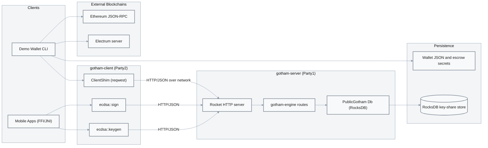

# System Architecture & Attack Surface

## Architecture Overview

Gotham City is a two-party ECDSA signing system composed of:

- **gotham-server (Party1)** – Rocket-based HTTP server that orchestrates key generation and signing rounds and persists Party1 key shares in RocksDB.
  - Entry in workspace: [`gotham-server/src/server.rs:21-39`](../../gotham-server/src/server.rs#L21-L39), [`gotham-server/src/public_gotham.rs:14-44`](../../gotham-server/src/public_gotham.rs#L14-L44).
- **gotham-client (Party2)** – Rust library that drives the MPC protocol against `gotham-server` and exposes FFI bindings for iOS/Android and a generic `ClientShim` wrapper over HTTP.
  - Entry in workspace: [`gotham-client/src/lib.rs:19-45`](../../gotham-client/src/lib.rs#L19-L45), [`gotham-client/src/ecdsa/keygen.rs:37-82`](../../gotham-client/src/ecdsa/keygen.rs#L37-L82), [`gotham-client/src/ecdsa/sign.rs:28-66`](../../gotham-client/src/ecdsa/sign.rs#L28-L66).
- **demo-wallet** – Rust CLI wallet that integrates Bitcoin and Ethereum flows on top of `gotham-client`.
  - Entry in workspace: [`demo-wallet/src/main.rs:11-20`](../../demo-wallet/src/main.rs#L11-L20), [`demo-wallet/src/bitcoin/mod.rs:114-121`](../../demo-wallet/src/bitcoin/mod.rs#L114-L121), [`demo-wallet/src/ethereum/commands.rs:128-138`](../../demo-wallet/src/ethereum/commands.rs#L128-L138).
- **integration-tests** – End-to-end tests that exercise keygen and signing via an in-process Rocket client.
  - Entry in workspace: [`integration-tests/tests/ecdsa.rs:107-151`](../../integration-tests/tests/ecdsa.rs#L107-L151).

The system relies on external crates `two-party-ecdsa` and `gotham-engine` for the cryptographic protocol and route handlers, and on external services (Electrum servers and Ethereum JSON-RPC endpoints) for blockchain interaction.

## Attack Surface Diagram

### Entry Points and Risk

| Entry Point | Component | Auth | Input Sources | Risk |
|-------------|-----------|------|---------------|------|
| HTTP `POST /ecdsa/keygen/*` | Rocket + gotham-engine | None by default; auth hook available but default-allow | JSON from `gotham-client` or any HTTP client | HIGH – keygen for long-lived keys without enforced auth |
| HTTP `POST /ecdsa/sign/*` | Rocket + gotham-engine | None by default; gated by `Db::granted()` which returns `true` | JSON messages including MPC protocol state and messages | CRITICAL – unauthorized signing if server is reachable from untrusted networks |
| FFI `get_client_master_key` | `gotham-client` FFI | Caller-defined | Raw C pointers from host app | MEDIUM – robustness and error handling at unsafe boundary |
| FFI `sign_message` | `gotham-client` FFI | Caller-defined | Raw C pointers from host app | MEDIUM – robustness and error handling at unsafe boundary |
| CLI commands (`demo-wallet`) | Demo wallet | CLI user | Local config files and environment variables | MEDIUM – misuse can leak key material via local files |

Attack surface details are further elaborated in `Findings.md` (F-001–F-005) and `Dependencies_Report.md` (F-007).

## Technology Stack

| Component | Technology | Version | Security Notes |
|-----------|-----------|---------|-----------------|
| **Server runtime** | Rust + Rocket | 0.5.0-rc.1 | Pre-1.0 release candidate; TLS and production hardening require explicit configuration. See [`gotham-server/Cargo.toml:17-38`](../../gotham-server/Cargo.toml#L17-L38) and [`gotham-server/Rocket.toml:1-5`](../../gotham-server/Rocket.toml#L1-L5). |
| **Client HTTP** | reqwest | 0.9.5 | Older `reqwest` used via workspace dependency; used for MPC protocol HTTP calls in `ClientShim`. See [`Cargo.toml:15`](../../Cargo.toml#L15) and [`gotham-client/src/lib.rs:81-95`](../../gotham-client/src/lib.rs#L81-L95). |
| **Persistence** | RocksDB | 0.21.0 | Used as plaintext key-value store for Party1 key shares; no encryption-at-rest enabled in code. See [`gotham-server/src/public_gotham.rs:14-16`](../../gotham-server/src/public_gotham.rs#L14-L16). |
| **Crypto protocol** | two-party-ecdsa | Git (ZenGo-X) | Core 2P-ECDSA implementation; treated as a trusted external dependency in this audit. See [`Cargo.toml:25`](../../Cargo.toml#L25). |
| **Wallets** | demo-wallet | clap, ethers, electrumx-client | Demo code for Bitcoin and Ethereum integration; not hardened for production use. See [`demo-wallet/Cargo.toml`](../../demo-wallet/Cargo.toml). |

## Data Flow Analysis

### Sensitive Data Handling

- **Server key shares (Party1)**:
  - Generated and used inside `gotham-engine` via `PublicGotham`’s `Db` implementation.
  - Persisted directly into RocksDB with composite keys derived from `customerId`, `id`, and MPC struct names.
  - Evidence: [`gotham-server/src/public_gotham.rs:58-67`](../../gotham-server/src/public_gotham.rs#L58-L67).
- **Client key shares (Party2)**:
  - Created by `ecdsa::get_master_key` and wrapped in `PrivateShare` within the demo wallet.
  - Stored as JSON on disk using `serde_json::to_string_pretty` in `BitcoinWallet::save_to`.
  - Evidence: [`gotham-client/src/ecdsa/keygen.rs:37-82`](../../gotham-client/src/ecdsa/keygen.rs#L37-L82), [`demo-wallet/src/bitcoin/mod.rs:114-121`](../../demo-wallet/src/bitcoin/mod.rs#L114-L121), [`demo-wallet/src/bitcoin/mod.rs:245-250`](../../demo-wallet/src/bitcoin/mod.rs#L245-L250).
- **Escrow backup secrets**:
  - Escrow private/public key pair generated and saved in `escrow-sk.json`.
  - Evidence: [`demo-wallet/src/bitcoin/escrow.rs:31-37`](../../demo-wallet/src/bitcoin/escrow.rs#L31-L37).
- **Blockchain data and balances**:
  - Retrieved via Electrum (`electrumx_client`) and Ethereum JSON-RPC (`ethers`).
  - Evidence: [`demo-wallet/src/bitcoin/commands.rs:147-157`](../../demo-wallet/src/bitcoin/commands.rs#L147-L157), [`demo-wallet/src/ethereum/commands.rs:144-193`](../../demo-wallet/src/ethereum/commands.rs#L144-L193).

### Trust Boundaries

1. **Client ↔ Server (MPC boundary)**
   - Transport: HTTP JSON requests from `gotham-client` (or demo wallet) to Rocket.
   - Expectations: TLS termination in front of the server for production; not enforced in code.
   - Evidence: [`gotham-client/src/lib.rs:81-95`](../../gotham-client/src/lib.rs#L81-L95), [`gotham-server/src/server.rs:21-39`](../../gotham-server/src/server.rs#L21-L39).

2. **Server ↔ Storage (Party1 key shares)**
   - RocksDB opened with default options and paths derived from configuration.
   - No explicit encryption or access control in the application layer.
   - Evidence: [`gotham-server/src/public_gotham.rs:34-44`](../../gotham-server/src/public_gotham.rs#L34-L44).

3. **Client ↔ Local Filesystem (Party2 shares and escrow)**
   - Wallet JSON and escrow secrets are written using `fs::write` with default permissions.
   - Evidence: [`demo-wallet/src/bitcoin/mod.rs:245-250`](../../demo-wallet/src/bitcoin/mod.rs#L245-L250), [`demo-wallet/src/bitcoin/escrow.rs:31-37`](../../demo-wallet/src/bitcoin/escrow.rs#L31-L37).

4. **Wallet ↔ External Blockchains**
   - Uses `electrumx-client` and `ethers` for read/write operations to Bitcoin and Ethereum networks.
   - These interactions are outside the Gotham City trust boundary but affect overall user risk.

## Deployment Model

- **Server**:
  - Rocket-based HTTP service, configured via `Rocket.toml` with debug profile binding to `0.0.0.0:8000`.
  - Evidence: [`gotham-server/Rocket.toml:1-5`](../../gotham-server/Rocket.toml#L1-L5).
  - Production TLS, reverse proxy configuration, and rate limiting are not implemented in this repo and must be provided by the deployment environment.

- **Client / Wallet**:
  - demo-wallet is a CLI application using `settings.toml` and environment variables (prefix `GOTHAM_`) for configuration.
  - Evidence: [`demo-wallet/src/main.rs:54-67`](../../demo-wallet/src/main.rs#L54-L67).

- **Assumptions**:
  - HTTPS is used in production between client and server.
  - Server host is hardened and access-controlled at the network layer.
  - Client devices protect local wallet and escrow files using OS facilities.

These assumptions are partially contradicted by the default configuration and plaintext storage patterns, and are the basis for several findings in `Findings.md` (F-001–F-003) and recommendations in `Recommendations.md`.
