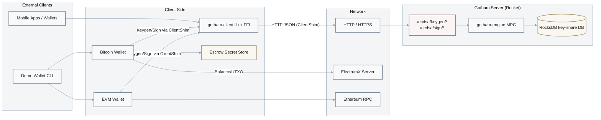

# System Architecture & Attack Surface

## Architecture Overview

**Purpose**: Document system design, trust boundaries, and entry points for audit context.

Gotham City is a Rust workspace implementing a two-party ECDSA (2P-ECDSA) signing system, consisting of:

- **Gotham Server (`gotham-server`)** – Rocket-based HTTP API that orchestrates 2P-ECDSA key generation and signing via the external `gotham-engine` crate and stores protocol state and key shares in RocksDB.
- **Gotham Client (`gotham-client`)** – Rust library and FFI bindings (iOS/Android) that act as the client party in the 2P-ECDSA protocol, exposing keygen and recovery functions to mobile applications and higher-level wallets.
- **Demo Wallet (`demo-wallet`)** – CLI wallet supporting Bitcoin and EVM chains using Gotham client for signing:
  - Bitcoin: uses `electrumx-client` to query balances and broadcast transactions.
  - EVM: uses `ethers` to construct and broadcast Ethereum and ERC-20 transactions.
- **Integration Tests (`integration-tests`)** – Rust tests that spin up an in-process Rocket server and drive full 2P-ECDSA keygen and signing flows using `ClientShim`.

High-level flow:

1. Client initiates **key generation** against the Gotham server via HTTP (`/ecdsa/keygen/*`).
2. Server and client run the 4-round 2P-ECDSA keygen protocol (plus chain-code derivation) via `gotham-engine`.
3. Server persists its share and session state to RocksDB; client persists its share to local storage (for example, JSON files in the demo wallet).
4. For signing, client calls `/ecdsa/sign/*` endpoints, passing appropriate MPC messages; server performs its side of the protocol and returns partial signatures.
5. Client combines results to produce a standard ECDSA signature.

## Attack Surface Diagram

- **CRITICAL (red)**: Gotham server HTTP API (`/ecdsa/*`) – subject of F-001 (missing authorization).
- **HIGH (amber)**: RocksDB key-share DB and client escrow store – subjects of F-002 and F-003.

## Technology Stack

| Component | Technology | Version | Security Notes |
|-----------|-----------|---------|-----------------|
| **Runtime** | Rust | 1.70+ (per wiki) | Modern memory-safe language; unsafe used for FFI only. |
| **Web Framework** | Rocket | 0.5.0-rc.1 | Pre-release version; consider tracking security advisories and upgrading to stable. |
| **Database** | RocksDB | 0.21.0 crate | Used for key-share storage; no encryption at rest by default (F-002). |
| **MPC / Crypto** | `two-party-ecdsa`, `secp256k1`, `gotham-engine` | Git + crates.io | Protocol correctness largely delegated to external crates; not audited in this review. |
| **HTTP Client** | `reqwest` | 0.9.5 | Old version; potential CVEs; see dependency recommendations. |
| **Bitcoin Integration** | `bitcoin`, `electrumx-client` | — | Used for P2WPKH signing and Electrum-based balance/broadcast. |
| **EVM Integration** | `ethers` | — | Used for RPC-based ETH/ ERC-20 operations. |

## Data Flow Analysis

### Sensitive Data Handling

- **Server key shares**:
  - Generated via `gotham-engine` during keygen.
  - Persisted as JSON-serialized `Value` objects in RocksDB under identifiers derived from `customerId` and session IDs.
  - Location: [`gotham-server/src/public_gotham.rs:58-87`](../../gotham-server/src/public_gotham.rs#L58-L87).
- **Client key shares**:
  - Generated by `gotham-client` `ecdsa::get_master_key` and stored within `PrivateShare` in `BitcoinWallet` / `GothamWallet`.
  - Persisted unencrypted in wallet JSON files (demo wallet).
  - Location: [`demo-wallet/src/bitcoin/mod.rs:114-120`](../../demo-wallet/src/bitcoin/mod.rs#L114-L120), [`demo-wallet/src/bitcoin/mod.rs:245-260`](../../demo-wallet/src/bitcoin/mod.rs#L245-L260).
- **Escrow secrets**:
  - Escrow secret FE/GE pair generated and stored as JSON.
  - Location: [`demo-wallet/src/bitcoin/escrow.rs:32-37`](../../demo-wallet/src/bitcoin/escrow.rs#L32-L37), [`demo-wallet/src/bitcoin/escrow.rs:42-45`](../../demo-wallet/src/bitcoin/escrow.rs#L42-L45).
- **Transactions**:
  - Bitcoin: Transactions assembled locally and broadcast via Electrum; server never sees raw blockchain transactions, only MPC messages.
  - EVM: Transactions constructed and signed either via Gotham MPC signer or a local `LocalWallet`, then sent to an Ethereum RPC endpoint.

### Trust Boundaries

1. **Client ↔ Gotham Server**
   - Boundary: HTTP / HTTPS between client applications (CLI, mobile) and Rocket server.
   - Risk: Missing application-layer authentication/authorization (`Db::granted` always `true`, F-001). Transport-layer security (TLS) is expected to be provided by deployment (reverse proxy or Rocket TLS), not enforced in code.

2. **Gotham Server ↔ RocksDB**
   - Boundary: Local filesystem where key-share DB is stored.
   - Risk: Plaintext key-share storage (F-002); compromise of host or volume compromises server shares.

3. **Client Wallet ↔ Local Filesystem**
   - Boundary: Wallet, escrow, and backup JSON files.
   - Risk: Plaintext storage of client shares and escrow secrets (F-003); compromise of user machine or backup environment can expose keys.

4. **Wallet ↔ External Services**
   - **Bitcoin**: ElectrumX endpoint configured via `electrum_server_url` in settings.
   - **Ethereum**: RPC endpoint configured via `rpc_url` in settings.
   - Risk: No built-in certificate pinning or endpoint validation beyond what underlying libraries provide; secure configuration is deployment responsibility.

## Deployment Model

- **Server**:
  - Launched via Rocket using `get_server()`:
    - Location: [`gotham-server/src/server.rs:21-39`](../../gotham-server/src/server.rs#L21-L39), [`gotham-server/src/main.rs:6-8`](../../gotham-server/src/main.rs#L6-L8).
  - Default config (`Rocket.toml`): listens on `0.0.0.0:8000` with normal logging.
    - Location: [`gotham-server/Rocket.toml`](../../gotham-server/Rocket.toml).
  - No built-in TLS configuration; intended to sit behind an HTTPS terminator or proxy in production.

- **Configuration Management**:
  - Server configuration via `Settings.toml` and environment variables:
    - `db` (backing store), `db_name`, AWS-related fields for non-local deployments.
    - Location: [`gotham-server/Settings.toml`](../../gotham-server/Settings.toml).
  - Client and wallet configuration via `settings.toml` (demo wallet) and environment variables.
  - Secrets such as server shares, client shares, and escrow keys are currently stored in plaintext JSON or RocksDB records and are not centrally managed or rotated.

Overall, the architecture cleanly separates protocol logic (in `gotham-engine` and `two-party-ecdsa`) from orchestration (Gotham server/client) and user-facing flows (demo wallet). However, security of **authorization and key storage** is delegated almost entirely to deployers and higher-level applications, which is the source of the primary findings in this audit.
