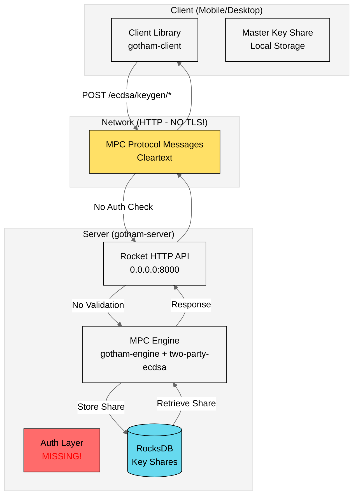
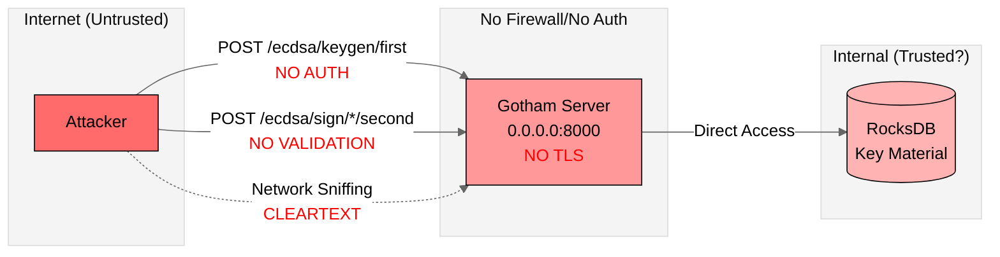
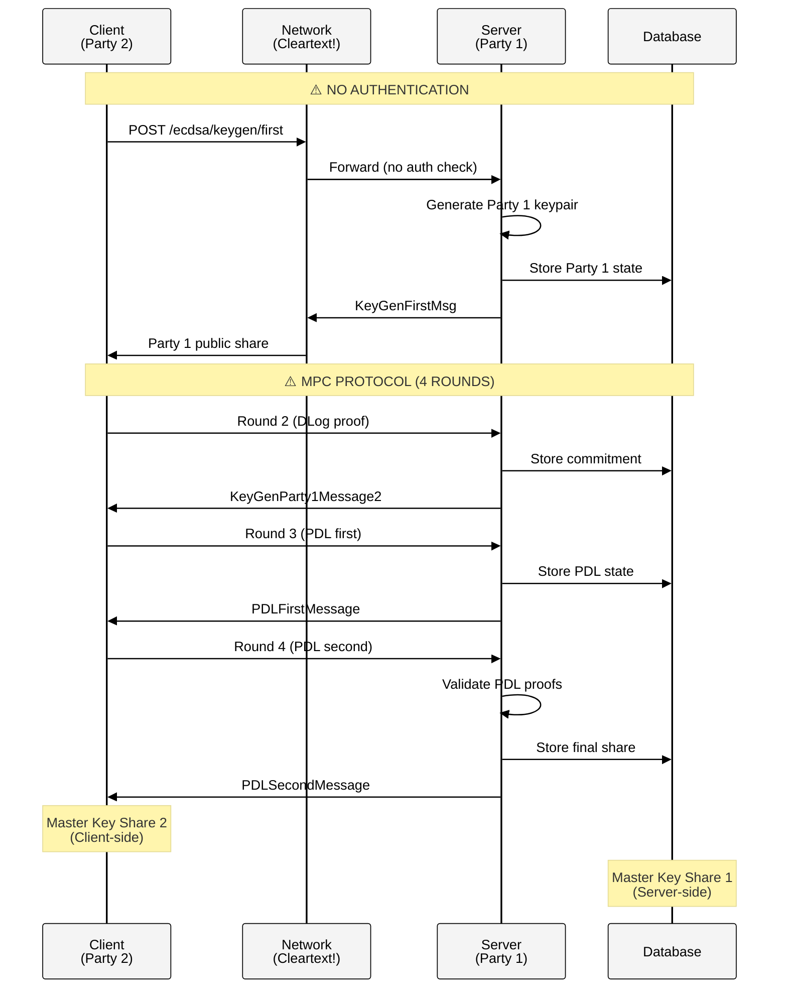
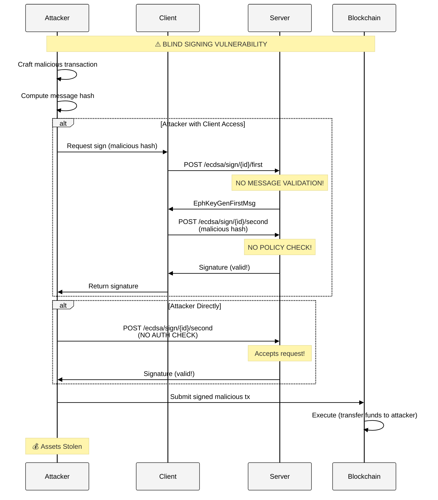

# System Architecture & Threat Model

## Table of Contents

- [Architecture Overview](#architecture-overview)
- [Component Description](#component-description)
- [Attack Surface Analysis](#attack-surface-analysis)
- [Trust Boundaries](#trust-boundaries)
- [Threat Model](#threat-model)
- [Data Flow Analysis](#data-flow-analysis)

---

## Architecture Overview

### High-Level Architecture



### Component Stack

| Layer | Component | Technology | Risk Level |
|-------|-----------|------------|------------|
| **Client** | Gotham Client | Rust Library | MEDIUM |
| **Protocol** | HTTP Transport | **NO TLS** ⚠️ | **CRITICAL** |
| **Server** | Rocket Web Framework | 0.5.0-rc.1 | MEDIUM |
| **Auth** | **NONE** ⚠️ | **MISSING** | **CRITICAL** |
| **MPC Engine** | gotham-engine + two-party-ecdsa | External deps | HIGH |
| **Storage** | RocksDB | Embedded DB | MEDIUM |
| **Crypto** | secp256k1 | Rust bindings | LOW |

---

## Component Description

### 1. Gotham Client (`gotham-client`)

**Purpose**: Client-side MPC participant

**Key Files**:
- `src/lib.rs`: HTTP client and request handling
- `src/ecdsa/keygen.rs`: Key generation protocol
- `src/ecdsa/sign.rs`: Signing protocol
- `src/ecdsa/rotate.rs`: Key rotation protocol
- `src/ecdsa/recover.rs`: Key recovery protocol

**Security Characteristics**:
- ✅ Local key share storage (client-controlled)
- ✅ Sends bearer token (but server doesn't validate)
- ❌ No TLS enforcement (accepts cleartext)
- ❌ No server certificate validation
- ❌ No input validation on server responses

**Trust Assumptions**:
- Client device is secure
- Local storage is protected
- User is legitimate owner

**Threat Exposure**:
- Mobile device compromise
- Memory dumps exposing key shares
- Malicious applications reading storage

### 2. Gotham Server (`gotham-server`)

**Purpose**: Server-side MPC participant & coordinator

**Key Files**:
- `src/server.rs`: Rocket server configuration & routes
- `src/public_gotham.rs`: MPC operations & database interface
- `Rocket.toml`: Server configuration
- `Settings.toml`: Application settings

**Security Characteristics**:
- ❌ **NO AUTHENTICATION** (F-001)
- ❌ **NO TLS** (F-003)
- ❌ Binds to 0.0.0.0 (F-008)
- ❌ No rate limiting (F-005)
- ❌ No input validation (F-004)
- ❌ Panics on errors (F-006)

**Trust Assumptions** (VIOLATED):
- ❌ Only authorized clients connect → **FALSE, no auth**
- ❌ Network is secure → **FALSE, no TLS**
- ❌ Requests are rate-limited → **FALSE, no limits**

**Threat Exposure**:
- **CRITICAL**: Unauthorized key generation
- **CRITICAL**: Unauthorized transaction signing
- **CRITICAL**: Network eavesdropping
- **HIGH**: Denial of service

### 3. MPC Engine (`gotham-engine` + `two-party-ecdsa`)

**Purpose**: Implement Lindell'17 two-party ECDSA protocol

**Key Protocols**:
1. **Key Generation** (4 rounds):
   - Round 1: DLog proof exchange
   - Round 2: Commitment & public share
   - Round 3: PDL (Paillier with DLog) first message
   - Round 4: PDL second message validation
   
2. **Signing** (2 rounds):
   - Round 1: Ephemeral key generation
   - Round 2: Signature computation

**Security Characteristics**:
- ✅ Implements Lindell'17 protocol (peer-reviewed)
- ✅ Zero-knowledge proofs for key shares
- ✅ Paillier homomorphic encryption
- ⚠️ Security depends on correct implementation (not verified in this audit)
- ❌ No protection against replay attacks
- ❌ No session management or timeout

**Trust Assumptions**:
- Cryptographic library implementations are correct
- Protocol is executed exactly as specified
- No timing side-channels

**Threat Exposure**:
- Protocol implementation bugs (requires formal verification)
- Side-channel attacks (timing, power analysis)
- Replay attacks (no nonce/timestamp validation)

### 4. Storage Layer (RocksDB)

**Purpose**: Persist MPC session state and key shares

**Security Characteristics**:
- ✅ Local file-based storage
- ❌ No encryption at rest
- ❌ Database keys vulnerable to collision (F-007)
- ❌ Path traversal risk (F-004)

**Stored Data**:
- Party 1 key shares (server-side)
- MPC protocol intermediate state
- Session identifiers
- Commitment values

**Threat Exposure**:
- File system access → key material exposure
- Database corruption → lost funds
- Key collision → cross-user leakage

---

## Attack Surface Analysis

### Entry Points & Risk Assessment

| Entry Point | Method | Auth | Input Sources | Risk Level | Related Findings |
|-------------|--------|------|---------------|------------|------------------|
| `/ecdsa/keygen/first` | POST | ❌ None | JSON body | **CRITICAL** | F-001, F-003 |
| `/ecdsa/keygen/{id}/second` | POST | ❌ None | JSON body, path param | **CRITICAL** | F-001, F-003 |
| `/ecdsa/keygen/{id}/third` | POST | ❌ None | JSON body, path param | **CRITICAL** | F-001, F-003 |
| `/ecdsa/keygen/{id}/fourth` | POST | ❌ None | JSON body, path param | **CRITICAL** | F-001, F-003 |
| `/ecdsa/keygen/{id}/chaincode/first` | POST | ❌ None | JSON body, path param | **CRITICAL** | F-001, F-003 |
| `/ecdsa/keygen/{id}/chaincode/second` | POST | ❌ None | JSON body, path param | **CRITICAL** | F-001, F-003 |
| `/ecdsa/sign/{id}/first` | POST | ❌ None | JSON body, path param | **CRITICAL** | F-001, F-002, F-003 |
| `/ecdsa/sign/{id}/second` | POST | ❌ None | JSON body, path param, **message hash** | **CRITICAL** | F-001, F-002, F-003 |

**Total Attack Surface**: 8 unauthenticated endpoints accepting arbitrary cryptographic operations.

### Attack Surface Diagram



---

## Trust Boundaries

### Current Trust Boundaries (BROKEN)

```
┌────────────────────────────────────────────────────────────┐
│                        INTERNET                             │
│  Anyone can call any endpoint                               │
│                                                              │
│  ┌──────────────────────────────────────────────────────┐  │
│  │         Gotham Server (NO TRUST BOUNDARY!)            │  │
│  │  ┌────────────┐  ┌────────────┐  ┌────────────────┐  │  │
│  │  │   Keygen   │  │    Sign    │  │   Database     │  │  │
│  │  │  Endpoints │  │  Endpoints │  │   (RocksDB)    │  │  │
│  │  └────────────┘  └────────────┘  └────────────────┘  │  │
│  └──────────────────────────────────────────────────────┘  │
└────────────────────────────────────────────────────────────┘

⚠️ NO BOUNDARY ENFORCEMENT!
   - No authentication
   - No authorization
   - No network encryption
   - No input validation
```

### Recommended Trust Boundaries

```
┌─────────────────────────────────────────────────────────────┐
│                      INTERNET (Untrusted)                    │
└────────────────────┬────────────────────────────────────────┘
                     │
            [BOUNDARY 1: TLS + Authentication]
                     │
┌────────────────────▼─────────────────────────────────────────┐
│              Authenticated Clients (Trusted)                 │
└────────────────────┬─────────────────────────────────────────┘
                     │
            [BOUNDARY 2: Authorization + Rate Limiting]
                     │
┌────────────────────▼─────────────────────────────────────────┐
│          Gotham Server Application Layer (Trusted)           │
│  ┌──────────────────────────────────────────────────────┐    │
│  │  Authorization Engine (Policy Enforcement)           │    │
│  └────────────┬─────────────────────────────────────────┘    │
└───────────────┼──────────────────────────────────────────────┘
                │
       [BOUNDARY 3: Input Validation + Sanitization]
                │
┌───────────────▼──────────────────────────────────────────────┐
│           MPC Engine (Cryptographic Core)                    │
└────────────────────────────────────────────────────────────┘
                │
       [BOUNDARY 4: Encrypted Storage]
                │
┌───────────────▼──────────────────────────────────────────────┐
│            Database (Encrypted at Rest)                      │
└──────────────────────────────────────────────────────────────┘
```

---

## Threat Model

### Threat Actors

| Actor | Capability | Motivation | Likelihood |
|-------|------------|------------|------------|
| **Script Kiddie** | Low skill, automated tools | Opportunistic theft | **HIGH** |
| **Professional Hacker** | High skill, custom exploits | Targeted theft | MEDIUM |
| **Nation-State** | Very high skill, 0-days | Surveillance, disruption | LOW |
| **Insider** | System access, knowledge | Theft, sabotage | LOW |
| **Malicious User** | Valid credentials | Theft, fraud | MEDIUM |

### Attack Trees

#### Attack Goal: Steal Cryptocurrency Assets

```
Steal Assets
├── [CRITICAL] Generate Keys Without Authorization (F-001)
│   ├── Network Access → POST /ecdsa/keygen/first → Key Material
│   └── Likelihood: **HIGH** | Impact: **CRITICAL**
│
├── [CRITICAL] Sign Malicious Transaction (F-002 + F-001)
│   ├── Network Access → POST /ecdsa/sign/{id}/second → Signature
│   └── Likelihood: **HIGH** | Impact: **CRITICAL**
│
├── [CRITICAL] Man-in-the-Middle Attack (F-003)
│   ├── Network Position → Intercept MPC Messages → Derive Keys
│   └── Likelihood: **MEDIUM** | Impact: **CRITICAL**
│
├── [HIGH] Denial of Service (F-005)
│   ├── Flood Endpoints → Server Unavailable → Ransom
│   └── Likelihood: **HIGH** | Impact: **HIGH**
│
└── [HIGH] Database Compromise (F-004 + F-007)
    ├── Path Traversal → Read DB Files → Extract Keys
    └── Likelihood: **MEDIUM** | Impact: **HIGH**
```

### STRIDE Analysis

| Threat Category | Current State | Findings |
|-----------------|---------------|----------|
| **Spoofing** | ❌ VULNERABLE | No identity verification (F-001) |
| **Tampering** | ❌ VULNERABLE | No message integrity checks (F-003) |
| **Repudiation** | ❌ VULNERABLE | No audit logging (F-013) |
| **Information Disclosure** | ❌ VULNERABLE | Cleartext transmission (F-003), error leakage (F-010) |
| **Denial of Service** | ❌ VULNERABLE | No rate limiting (F-005), panics (F-006) |
| **Elevation of Privilege** | ❌ VULNERABLE | No authorization (F-001), always grants (F-002) |

**Overall Assessment**: **System is vulnerable to ALL STRIDE categories.**

---

## Data Flow Analysis

### Key Generation Flow



### Transaction Signing Flow



### Data-at-Rest

| Data Element | Location | Encryption | Risk |
|--------------|----------|------------|------|
| **Party 1 Key Share** | RocksDB files | ❌ None | **CRITICAL** |
| **MPC Session State** | RocksDB files | ❌ None | **HIGH** |
| **Commitment Values** | RocksDB files | ❌ None | **MEDIUM** |
| **Session IDs** | RocksDB files | ❌ None | **LOW** |

### Data-in-Transit

| Data Element | Protocol | Encryption | Risk |
|--------------|----------|------------|------|
| **EC Public Keys** | HTTP | ❌ Cleartext | **CRITICAL** |
| **Zero-Knowledge Proofs** | HTTP | ❌ Cleartext | **CRITICAL** |
| **Paillier Ciphertexts** | HTTP | ❌ Cleartext | **CRITICAL** |
| **Partial Signatures** | HTTP | ❌ Cleartext | **CRITICAL** |
| **Message Hashes** | HTTP | ❌ Cleartext | **CRITICAL** |

---

## Security Architecture Recommendations

### Immediate (Phase 1)

1. **Add TLS Termination**:
   ```
   Client → [TLS] → Reverse Proxy (Nginx) → [localhost] → Gotham Server
   ```

2. **Implement Authentication**:
   ```
   Client → Bearer JWT → Nginx (validate) → Gotham Server (verify)
   ```

3. **Add Authorization Layer**:
   ```rust
   Request → Auth Guard → Policy Engine → MPC Operation
   ```

### Short-Term (Phase 2)

1. **Network Segmentation**:
   ```
   DMZ: Reverse Proxy (public)
   Private: Gotham Server (internal)
   Backend: Database (internal)
   ```

2. **Input Validation**:
   ```
   Request → Schema Validation → Sanitization → Business Logic
   ```

3. **Audit Logging**:
   ```
   All Operations → Structured Logs → SIEM → Alerting
   ```

### Long-Term (Phase 3)

1. **Defense in Depth**:
   - WAF (Web Application Firewall)
   - IDS/IPS (Intrusion Detection/Prevention)
   - DDoS protection
   - HSM integration for key storage

2. **Zero Trust Architecture**:
   - Mutual TLS (mTLS)
   - Per-request authorization
   - Continuous verification
   - Least privilege access

3. **Formal Security Verification**:
   - Protocol security proof
   - Implementation verification
   - Security testing automation
   - Regular penetration testing

---

## Conclusion

**Current Architecture Assessment: CRITICALLY INSECURE**

The Gotham City implementation uses **sound cryptographic protocols** (Lindell'17) but lacks **all essential operational security controls**. The architecture effectively has:

- ❌ No trust boundaries
- ❌ No authentication or authorization
- ❌ No encryption in transit
- ❌ No input validation
- ❌ No rate limiting
- ❌ No monitoring or logging

**Bottom Line**: The cryptography is strong, but the system is **architecturally defenseless** against even basic attacks.

**Required Action**: Complete architectural overhaul per Phase 1 recommendations before **ANY** production deployment.
