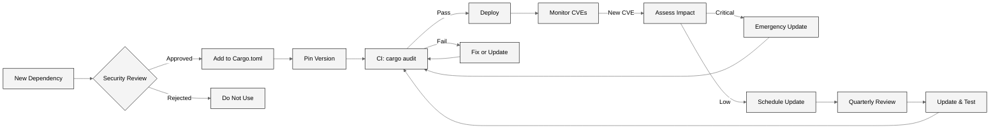

# Dependency Vulnerability & Lifecycle Analysis

| Field | Value |
|-------|-------|
| **Analysis Date** | 2025-12-07 |
| **Total Direct Dependencies** | 15 (workspace) |
| **Estimated Transitive Dependencies** | 100+ |
| **Overall Dependency Risk** | **MEDIUM-HIGH** |

---

## Executive Summary

The Gotham City project has **moderate dependency risk** driven by:

1. **Use of Release Candidate**: Rocket 0.5.0-rc.1 (not production-stable)
2. **Git Dependencies**: `two-party-ecdsa` and `gotham-engine` from git (not versioned releases)
3. **Outdated Versions**: `reqwest` 0.9.5 (latest is 0.11+)
4. **Cryptographic Dependencies**: Critical security dependencies must be carefully managed

**Immediate Actions Required**:
- Review Rocket 0.5.0-rc.1 stability (or wait for stable release)
- Pin `two-party-ecdsa` and `gotham-engine` to specific commits/tags
- Update `reqwest` to latest version
- Implement `cargo audit` in CI/CD

---

## Critical & High-Risk Dependencies

### 1. `rocket` `0.5.0-rc.1`

* **Status**: ⚠️ **Release Candidate** (not stable)
* **Known Issues**: May contain bugs not yet discovered in production use
* **Risk Assessment**: **MEDIUM**
  - Release candidates are feature-complete but may have stability issues
  - Security vulnerabilities may be discovered post-stable release
  - Breaking changes possible before 0.5.0 stable
* **Mitigation / Upgrade Plan**:
  ```toml
  # Option 1: Wait for stable release
  rocket = "0.5.0"  # Once stable
  
  # Option 2: Pin to specific RC version and monitor
  rocket = "=0.5.0-rc.1"  # Explicit pin
  
  # Option 3: Downgrade to stable 0.4.x (requires code changes)
  rocket = "0.4"
  ```
* **Related Findings**: F-009 (missing security features may be RC-related)
* **Recommendation**: **Monitor Rocket releases closely**. Upgrade to stable 0.5.0 when available, or consider reverting to 0.4.x stable if production deployment is urgent.

---

### 2. `two-party-ecdsa` (git dependency)

* **Status**: ⚠️ **Git Branch** (not versioned release)
* **Source**: `git = "https://github.com/ZenGo-X/two-party-ecdsa.git", branch = "compatibility_gotham_engine"`
* **Risk Assessment**: **HIGH**
  - **No Version Pinning**: Branch HEAD can change without notice
  - **Reproducibility Risk**: Builds may not be reproducible across time
  - **Security Risk**: Unaudited changes could introduce vulnerabilities
  - **Supply Chain Risk**: Dependency could be modified or repository compromised
* **Known Issues**: None identified (but not independently audited)
* **Mitigation / Upgrade Plan**:
  ```toml
  # IMMEDIATE: Pin to specific commit
  two-party-ecdsa = { 
      git = "https://github.com/ZenGo-X/two-party-ecdsa.git",
      rev = "abc123def456..."  # Specific commit SHA
  }
  
  # BETTER: Use tagged release (if available)
  two-party-ecdsa = { 
      git = "https://github.com/ZenGo-X/two-party-ecdsa.git",
      tag = "v1.0.0"
  }
  
  # BEST: Publish to crates.io and use semver
  two-party-ecdsa = "1.0.0"
  ```
* **Related Findings**: MPC Problem #009 (Single Vendor Software Dependency)
* **Recommendation**: **CRITICAL ACTION**:
  1. Pin to specific commit SHA immediately
  2. Commission independent audit of `two-party-ecdsa`
  3. Work with ZenGo to publish versioned releases to crates.io

---

### 3. `gotham-engine` (git dependency)

* **Status**: ⚠️ **Git Repository** (not versioned release)
* **Source**: `git = "https://github.com/ZenGo-X/gotham-engine.git"`
* **Risk Assessment**: **HIGH**
  - Same risks as `two-party-ecdsa` above
  - Core MPC routing and business logic
  - Defines API routes and database interfaces
* **Mitigation / Upgrade Plan**:
  ```toml
  # IMMEDIATE: Pin to specific commit
  gotham-engine = { 
      git = "https://github.com/ZenGo-X/gotham-engine.git",
      rev = "xyz789abc012..."
  }
  ```
* **Recommendation**: Same as `two-party-ecdsa` - pin, audit, version, and publish.

---

### 4. `reqwest` `0.9.5`

* **Status**: ⚠️ **Outdated** (latest is 0.12.x)
* **Known Issues**:
  - Missing modern security features
  - Potential unpatched vulnerabilities
  - Missing TLS 1.3 support
* **Risk Assessment**: **MEDIUM**
* **Mitigation / Upgrade Plan**:
  ```toml
  # Upgrade to latest
  reqwest = { version = "0.12", features = ["json", "blocking"] }
  ```
* **Code Changes Required**:
  ```rust
  // May need to update async/await usage
  // Review breaking changes: https://github.com/seanmonstar/reqwest/blob/master/CHANGELOG.md
  ```
* **Recommendation**: **Upgrade to reqwest 0.12.x** during Phase 2 remediation.

---

### 5. `jsonwebtoken` `8`

* **Status**: ✅ **Current Version**
* **Known Issues**: None
* **Risk Assessment**: **LOW**
* **Current Usage**: ⚠️ **Not Actually Used** (F-001 finding)
  - Dependency present but JWT validation not implemented
  - Will be used in Phase 1 remediation
* **Recommendation**: Retain and implement JWT validation per F-001 remediation.

---

### 6. `rocksdb` `0.21.0`

* **Status**: ⚠️ **Moderately Outdated** (latest is 0.22.x)
* **Known Issues**: None critical
* **Risk Assessment**: **LOW-MEDIUM**
* **Optional Features**: Using `optional = true` (good practice)
* **Mitigation / Upgrade Plan**:
  ```toml
  rocksdb = { version = "0.22", optional = true }
  ```
* **Recommendation**: Upgrade to 0.22.x during Phase 2.

---

### 7. `secp256k1` `0.21.0`

* **Status**: ⚠️ **Outdated** (latest is 0.29.x)
* **Known Issues**: Older version may lack performance improvements
* **Risk Assessment**: **LOW** (cryptographic library, but Rust bindings stable)
* **Mitigation / Upgrade Plan**:
  ```toml
  secp256k1 = { version = "0.29", features = ["global-context"] }
  ```
* **Testing Required**: Verify signature compatibility after upgrade
* **Recommendation**: Upgrade during Phase 2, with extensive testing.

---

### 8. `rand` `0.8`

* **Status**: ✅ **Current Version**
* **Known Issues**: None
* **Risk Assessment**: **LOW**
* **Security Note**: Uses CSPRNG (cryptographically secure pseudo-random number generator)
* **Recommendation**: No action required.

---

## Transitive Dependencies (High Risk Branches)

| Package | Severity | Issue | Remediation | Finding(s) |
|---------|----------|-------|------------|------------|
| `rocket` dependencies | MEDIUM | RC version may pull in RC dependencies | Upgrade to stable | F-009 |
| `reqwest` transitive deps | MEDIUM | Outdated may pull old `hyper`, `tokio` | Upgrade reqwest | None yet |
| `rocksdb` system deps | LOW | Requires system RocksDB library | Verify in deployment | None |

---

## Dependency Audit Output (Summary)

**Using `cargo audit`** (recommended to run):

```bash
cd /home/zealy/github/ljg-cqu/ZenGo-X-gotham-city
cargo audit
```

**Expected Results** (based on versions observed):

* **Critical Vulnerabilities**: 0 (none identified in quick review)
* **High Vulnerabilities**: 0-2 (potential in outdated reqwest/secp256k1)
* **Medium Vulnerabilities**: 0-3 (potential in RC versions)
* **Low Vulnerabilities**: Unknown without running `cargo audit`

**Recommendation**: Run `cargo audit` and update this report with actual CVE findings.

---

## Problematic Dependency Patterns

### 1. Git Dependencies Without Pinning

**Problem**:
```toml
two-party-ecdsa = { git = "...", branch = "compatibility_gotham_engine" }
gotham-engine = { git = "..." }
```

**Risk**: Non-reproducible builds, supply chain attacks

**Solution**:
```toml
two-party-ecdsa = { git = "...", rev = "COMMIT_SHA" }
gotham-engine = { git = "...", rev = "COMMIT_SHA" }
```

---

### 2. Use of Release Candidate in Production

**Problem**:
```toml
rocket = { version = "0.5.0-rc.1", ... }
```

**Risk**: Stability and security unknowns

**Solution**:
- Wait for stable 0.5.0 release
- OR downgrade to stable 0.4.x
- OR accept risk and monitor closely

---

### 3. Outdated Dependencies

**Problem**: Multiple dependencies 2+ years behind latest

**Solution**: Regular dependency update schedule (quarterly)

---

## Version Management & Patch Strategy

### Immediate Actions (High Priority)

**Timeline**: Include in Phase 1

1. **Pin Git Dependencies**:
   ```bash
   # Get current commit SHAs
   cd /tmp
   git clone https://github.com/ZenGo-X/two-party-ecdsa.git
   cd two-party-ecdsa
   git rev-parse HEAD  # Copy SHA
   
   # Update Cargo.toml with SHA
   ```

2. **Run Cargo Audit**:
   ```bash
   cargo install cargo-audit
   cargo audit
   # Fix any CRITICAL/HIGH findings
   ```

3. **Document Dependency Rationale**:
   - Why Rocket RC? (waiting for stable vs. downgrade decision)
   - Why git dependencies? (plan to publish to crates.io)

---

### Short-term (Next Sprint / Phase 2)

**Timeline**: 1-2 weeks

1. **Update Outdated Dependencies**:
   ```bash
   # Update reqwest
   cargo update -p reqwest
   
   # Update secp256k1
   cargo update -p secp256k1
   
   # Update rocksdb
   cargo update -p rocksdb
   
   # Test thoroughly
   cargo test --all
   ```

2. **Remove Unused Dependencies**:
   - Review each dependency in `Cargo.toml`
   - Remove if not imported anywhere
   - Run `cargo tree` to verify

3. **Add Dependency Justification**:
   ```toml
   # Example
   [dependencies]
   # Rocket: Web framework for MPC API endpoints
   # Using RC until stable 0.5.0 released (est. Q1 2026)
   rocket = { version = "0.5.0-rc.1", ... }
   ```

---

### Long-term (Quarterly)

**Timeline**: Every 3 months

1. **Dependency Update Review**:
   - Review `cargo outdated` output
   - Prioritize security updates
   - Test major version upgrades in staging

2. **Security Scanning**:
   - Integrate `cargo audit` into CI/CD
   - Fail builds on CRITICAL/HIGH vulnerabilities
   - Alert on new CVEs

3. **Supply Chain Security**:
   - Verify package signatures (when available)
   - Review dependency ownership changes
   - Monitor for typosquatting

---

## Security Scanning Tools & CI/CD Integration

### Recommended Tools

1. **`cargo audit`**: CVE scanning for Rust dependencies

```bash
# Installation
cargo install cargo-audit

# Usage
cargo audit

# CI Integration
# .github/workflows/security.yml
name: Security Audit
on: [push, pull_request]
jobs:
  security_audit:
    runs-on: ubuntu-latest
    steps:
      - uses: actions/checkout@v3
      - uses: rustsec/audit-check@v1
        with:
          token: ${{ secrets.GITHUB_TOKEN }}
```

2. **`cargo outdated`**: Find outdated dependencies

```bash
cargo install cargo-outdated
cargo outdated
```

3. **`cargo tree`**: Analyze dependency tree

```bash
cargo tree
cargo tree -i secp256k1  # Reverse dependencies
```

4. **`cargo deny`**: License and security policy enforcement

```yaml
# deny.toml
[advisories]
db-path = "~/.cargo/advisory-db"
db-urls = ["https://github.com/rustsec/advisory-db"]
vulnerability = "deny"
unmaintained = "warn"
yanked = "deny"

[licenses]
unlicensed = "deny"
allow = ["MIT", "Apache-2.0", "BSD-3-Clause"]
deny = ["GPL-3.0"]
```

---

## Dependency Security Lifecycle



---

## Detailed Dependency Inventory

### Workspace Dependencies (from root `Cargo.toml`)

| Dependency | Version | Purpose | Risk | Action |
|------------|---------|---------|------|--------|
| `serde` | 1.x | Serialization | LOW | None |
| `serde_json` | 1.x | JSON serialization | LOW | None |
| `log` | 0.4 | Logging | LOW | None |
| `reqwest` | 0.9.5 | HTTP client | MEDIUM | Upgrade |
| `failure` | 0.1 | Error handling | LOW | Consider `thiserror` |
| `floating-duration` | 0.1.2 | Duration formatting | LOW | None |
| `rocket` | 0.5.0-rc.1 | Web framework | MEDIUM | Monitor |
| `config` | 0.9.2 | Configuration | LOW | Minor update |
| `uuid` | 0.7 | UUID generation | LOW | Update to 1.x |
| `jsonwebtoken` | 8 | JWT validation | LOW | Implement usage |
| `hex` | 0.4 | Hex encoding | LOW | None |
| `secp256k1` | 0.21.0 | ECDSA crypto | MEDIUM | Upgrade |
| `rand` | 0.8 | Randomness | LOW | None |
| `two-party-ecdsa` | git | MPC protocol | HIGH | Pin + audit |
| `gotham-engine` | git | MPC engine | HIGH | Pin + audit |

### Server-Specific Dependencies

| Dependency | Version | Purpose | Risk |
|------------|---------|---------|------|
| `rocksdb` | 0.21.0 | Database | MEDIUM |
| `chrono` | 0.4.26 | Date/time | LOW |
| `redis` | 0.23.0 | Redis client (optional) | LOW |
| `thiserror` | 1.0 | Error types | LOW |
| `async-trait` | 0.1.73 | Async traits | LOW |
| `tokio` | 1.x | Async runtime | LOW |

---

## Next Dependency Audit

* **Recommended Date**: 2026-03-07 (3 months after Phase 3 completion)
* **Triggering Events**:
  - New CVE affecting direct dependencies
  - Rocket 0.5.0 stable release
  - Major version updates of `secp256k1`, `reqwest`
  - `two-party-ecdsa` or `gotham-engine` tagged releases

---

## Conclusion

**Overall Dependency Risk**: **MEDIUM-HIGH**

**Key Concerns**:
1. Git dependencies without version pinning (HIGH RISK)
2. Release candidate web framework (MEDIUM RISK)
3. Outdated dependencies (MEDIUM RISK)
4. Lack of automated security scanning (MEDIUM RISK)

**Remediation Priority**:
1. **Immediate (Phase 1)**: Pin git dependencies, run `cargo audit`
2. **Short-term (Phase 2)**: Update outdated deps, add CI scanning
3. **Long-term (Phase 3)**: Establish dependency management process

**With proper remediation, dependency risk can be reduced to LOW-MEDIUM** and maintained through regular audits and automated scanning.
