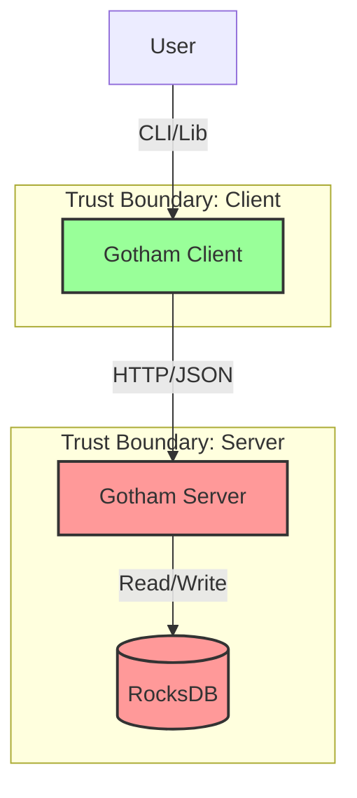

# Architecture & Attack Surface

## System Overview

Gotham City is a Two-Party ECDSA signing system consisting of a server (Party1) and a client (Party2). It implements the Lindell 17 protocol for threshold signatures.

### Components

1.  **Gotham Server (Party1)**:
    -   Rust/Rocket web server.
    -   Stores Party1 key shares in RocksDB.
    -   Exposes REST API for MPC rounds.
    -   **Trust Boundary**: Publicly exposed API (HTTP).

2.  **Gotham Client (Party2)**:
    -   Rust library / CLI wallet.
    -   Stores Party2 key shares in local JSON file.
    -   Initiates MPC rounds.
    -   **Trust Boundary**: Client device / Local storage.

3.  **MPC Protocol**:
    -   Key Generation: 4 rounds.
    -   Signing: 2 rounds.
    -   Relies on `two-party-ecdsa` crate.

## Attack Surface

### Key Risks

1.  **Network Interception**: Communication between Client and Server is unencrypted (HTTP), allowing MitM attacks.
2.  **Server Compromise**: Server stores key shares in plaintext. Full compromise leads to theft of Party1 shares.
3.  **Client Compromise**: Client stores key shares in plaintext. Malware can steal Party2 shares.
4.  **Authorization**: Server lacks authorization checks, allowing any user to trigger signing if they can reach the API.
