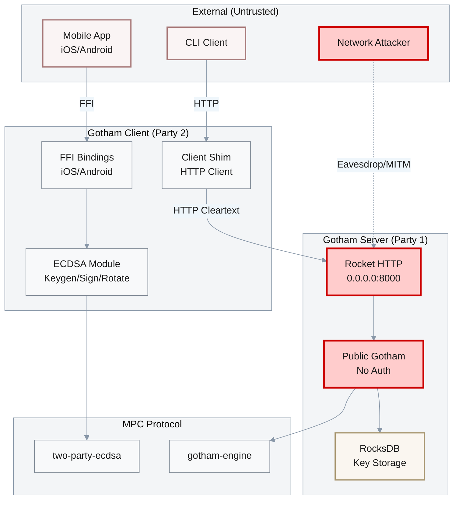

# System Architecture & Attack Surface

## Architecture Overview

**Gotham City** is a two-party ECDSA threshold signature implementation based on the Lindell'17 protocol. It consists of:

1. **gotham-server**: Rocket-based REST API server (Party 1)
2. **gotham-client**: Rust client library with mobile bindings (Party 2)
3. **gotham-engine**: Core MPC protocol implementation (dependency)
4. **two-party-ecdsa**: Cryptographic primitives (dependency)
5. **demo-wallet**: Example Bitcoin/Ethereum wallet implementation

The system implements a 2-of-2 threshold signature scheme where both parties must cooperate to generate ECDSA signatures.

---

## Attack Surface Diagram



**Legend**:
- Red borders: Critical vulnerability areas
- Dashed lines: Attack vectors

---

## Technology Stack

| Component | Technology | Version | Security Notes |
|-----------|-----------|---------|----------------|
| **Runtime** | Rust | 2021 Edition | Memory-safe, but panic handling issues |
| **Framework** | Rocket | 0.5.x | No TLS configured, binds 0.0.0.0 |
| **Database** | RocksDB | 0.21.0 | Local embedded DB, no encryption |
| **Crypto** | two-party-ecdsa | workspace | Lindell'17 implementation |
| **HTTP Client** | reqwest | workspace | No TLS verification in client |
| **JSON** | serde_json | workspace | Deserialization without validation |
| **Auth (Unused)** | jsonwebtoken | workspace | Present but not implemented |

---

## Entry Points

### Server Endpoints (No Authentication)

| Endpoint Pattern | Method | Function | Risk |
|------------------|--------|----------|------|
| `/ecdsa/keygen/first` | POST | Initiate key generation | CRITICAL - No auth |
| `/ecdsa/keygen/{id}/second` | POST | Continue keygen | CRITICAL - No auth |
| `/ecdsa/keygen/{id}/third` | POST | Continue keygen | CRITICAL - No auth |
| `/ecdsa/keygen/{id}/fourth` | POST | Complete keygen | CRITICAL - No auth |
| `/ecdsa/keygen/{id}/chaincode/*` | POST | Chain code setup | CRITICAL - No auth |
| `/ecdsa/sign/{id}/first` | POST | Initiate signing | CRITICAL - No auth |
| `/ecdsa/sign/{id}/second` | POST | Complete signing | CRITICAL - Blind signing |
| `/ecdsa/rotate/{id}/*` | POST | Key rotation | CRITICAL - No ZK verification |

### Client FFI Entry Points

| Function | Platform | Risk |
|----------|----------|------|
| `get_client_master_key` | iOS (C FFI) | HIGH - Panic on error |
| `sign_message` | iOS (C FFI) | HIGH - No input validation |
| `Java_*_getClientMasterKey` | Android (JNI) | HIGH - Panic on error |
| `Java_*_signMessage` | Android (JNI) | HIGH - No input validation |

---

## Data Flow Analysis

### Key Generation Flow

```
Client                          Server
   |                              |
   |---(1) POST /keygen/first---->|  No auth check
   |<---(id, party1_first_msg)---|
   |                              |
   |---(2) POST /keygen/{id}/second-->|  No session validation
   |<---(party1_second_msg)------|
   |                              |
   |---(3-4) Additional rounds--->|  No integrity checks
   |<---------------------------|
   |                              |
   [MasterKey2 generated]         [Party1 key stored in RocksDB]
```

**Vulnerabilities in Flow**:
1. No authentication at any step
2. No session binding/validation
3. Cleartext transmission
4. No rate limiting

### Signing Flow

```
Client                          Server
   |                              |
   |---(1) sign_first_message---->|  Blindly processes
   |<---(eph_first_msg)----------|
   |                              |
   |---(2) SignSecondMsgRequest-->|  NO TRANSACTION VALIDATION
   |    {message, party2_sign}    |  Signs ANY message blindly
   |<---(signature)--------------|
```

**Critical Vulnerability**: Server signs whatever message client requests without any validation (R1-F-002).

---

## Trust Boundaries

### Boundary 1: Network (BROKEN)

| Aspect | Expected | Actual | Finding |
|--------|----------|--------|---------|
| Transport | TLS 1.2+ | HTTP Cleartext | R1-F-003 |
| Authentication | JWT/OAuth | None | R1-F-001 |
| Authorization | Role-based | None | R1-F-001 |

### Boundary 2: Client-Server (BROKEN)

| Aspect | Expected | Actual | Finding |
|--------|----------|--------|---------|
| Session Validation | Stateful | Stateless | R2-F-005 |
| Message Integrity | Signed/MAC | None | R2-F-003 |
| Transaction Approval | User confirms | None | R1-F-002 |

### Boundary 3: FFI (WEAK)

| Aspect | Expected | Actual | Finding |
|--------|----------|--------|---------|
| Error Handling | Result types | Panic | R2-F-006, R2-F-010 |
| Input Validation | Bounds checks | Minimal | R2-F-006 |
| Memory Safety | Safe | Unsafe blocks | R2-F-006 |

---

## Deployment Model

### Current Configuration (INSECURE)

```toml
# gotham-server/Rocket.toml
[debug]
address = "0.0.0.0"   # Binds to all interfaces (R1-F-008)
port = 8000           # No TLS (R1-F-003)
keep_alive = 5
log = "normal"
```

**Issues**:
1. Binds to all network interfaces
2. No production configuration
3. No TLS/HTTPS settings
4. Debug-level logging only

### Recommended Configuration

```toml
[release]
address = "127.0.0.1"   # Localhost only, use reverse proxy
port = 8000
tls = { certs = "certs/server.crt", key = "certs/server.key" }
keep_alive = 30
log = "off"             # Use structured logging instead
```

---

## Component Dependencies

### Direct Dependencies (Security Relevant)

| Crate | Version | Purpose | Risk |
|-------|---------|---------|------|
| `rocket` | workspace | HTTP server | Network exposure |
| `rocksdb` | 0.21.0 | Key storage | Path injection |
| `serde_json` | workspace | Serialization | Deserialization attacks |
| `jsonwebtoken` | workspace | Auth (unused) | Wasted dependency |
| `reqwest` | workspace | HTTP client | No TLS verify |
| `two-party-ecdsa` | workspace | MPC crypto | Protocol vulnerabilities |
| `gotham-engine` | workspace | MPC logic | Business logic |

### Indirect Cryptographic Dependencies

```
two-party-ecdsa
├── curv (elliptic curve operations)
├── paillier (homomorphic encryption)
├── zk-paillier (ZK proofs)
└── kms (key management)
```

---

## Risk Heat Map

| Component | Auth | Crypto | Network | Data | Overall |
|-----------|------|--------|---------|------|---------|
| **Server Routes** | CRITICAL | - | CRITICAL | HIGH | **CRITICAL** |
| **Signing Logic** | CRITICAL | HIGH | HIGH | HIGH | **CRITICAL** |
| **Key Rotation** | HIGH | CRITICAL | HIGH | HIGH | **CRITICAL** |
| **Database** | HIGH | - | - | HIGH | HIGH |
| **FFI Bindings** | - | - | - | HIGH | HIGH |
| **Client HTTP** | MEDIUM | - | HIGH | MEDIUM | HIGH |

---

**Report Generated**: 2025-12-08 01:11 UTC+8  
**Architecture Status**: Unchanged across R1-R5  
**Security Posture**: CRITICAL - Multiple fundamental design flaws
