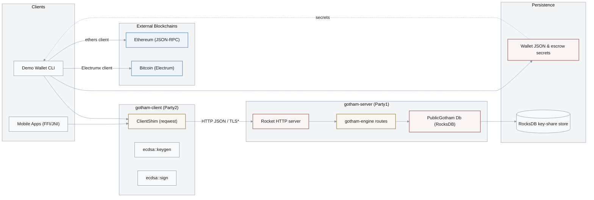

# System Architecture & Attack Surface

## Architecture Overview

Gotham City is a two-party ECDSA signing system composed of:

- **gotham-server (Party1)** – Rocket-based HTTP server that orchestrates key generation and signing rounds and persists Party1 key shares in RocksDB.
  - Entry points and routing: [`gotham-server/src/server.rs:21-39`](../../gotham-server/src/server.rs#L21-L39).
  - Party1 key-share storage and DB access: [`gotham-server/src/public_gotham.rs:14-44`](../../gotham-server/src/public_gotham.rs#L14-L44), [`gotham-server/src/public_gotham.rs:56-92`](../../gotham-server/src/public_gotham.rs#L56-L92).
- **gotham-client (Party2)** – Rust library that drives the MPC protocol against `gotham-server` and exposes FFI bindings for iOS/Android and a generic `ClientShim` wrapper over HTTP.
  - HTTP client wrapper: [`gotham-client/src/lib.rs:19-45`](../../gotham-client/src/lib.rs#L19-L45).
  - Keygen flow over HTTP: [`gotham-client/src/ecdsa/keygen.rs:37-82`](../../gotham-client/src/ecdsa/keygen.rs#L37-L82).
  - Signing flow over HTTP and FFI entrypoints: [`gotham-client/src/ecdsa/sign.rs:28-66`](../../gotham-client/src/ecdsa/sign.rs#L28-L66), [`gotham-client/src/ecdsa/sign.rs:96-178`](../../gotham-client/src/ecdsa/sign.rs#L96-L178).
- **demo-wallet** – Rust CLI wallet that integrates Bitcoin and Ethereum flows on top of `gotham-client`.
  - Entry: [`demo-wallet/src/main.rs`](../../demo-wallet/src/main.rs).
  - Bitcoin wallet structure and on-disk storage: [`demo-wallet/src/bitcoin/mod.rs:114-121`](../../demo-wallet/src/bitcoin/mod.rs#L114-L121), [`demo-wallet/src/bitcoin/mod.rs:215-220`](../../demo-wallet/src/bitcoin/mod.rs#L215-L220), [`demo-wallet/src/bitcoin/mod.rs:245-250`](../../demo-wallet/src/bitcoin/mod.rs#L245-L250).
  - Bitcoin CLI flows: [`demo-wallet/src/bitcoin/commands.rs`](../../demo-wallet/src/bitcoin/commands.rs).
  - Ethereum CLI flows: [`demo-wallet/src/ethereum/commands.rs`](../../demo-wallet/src/ethereum/commands.rs).
- **integration-tests** – End-to-end tests that exercise keygen and signing via an in-process Rocket client.
  - HTTP-level MPC flows: [`integration-tests/tests/ecdsa.rs:17-158`](../../integration-tests/tests/ecdsa.rs#L17-L158).

The system relies on external crates `two-party-ecdsa` and `gotham-engine` for the cryptographic protocol and Rocket route handlers, and on external services (Electrum servers and Ethereum JSON-RPC endpoints) for blockchain interaction.

## Attack Surface Diagram

> **Note**: TLS is assumed in front of `gotham-server` for production but is not enforced by the code in this repository.

## Technology Stack

| Component | Technology | Version | Security Notes |
|-----------|-----------|---------|----------------|
| **Runtime** | Rust | 2021 edition | Memory safety benefits, but FFI boundaries must be hardened. |
| **Web Framework** | Rocket | 0.5.0-rc.1 | Pre-1.0; relies on correct configuration, including TLS and binding. |
| **HTTP Client** | reqwest | 0.9.5 | Older pre-1.0 line; should be upgraded and audited. |
| **Database** | RocksDB | 0.21.0 | Used for Party1 key shares; no encryption-at-rest in application code. |
| **MPC/crypto** | two-party-ecdsa, gotham-engine | Git dependencies | Treated as external; this audit focuses on integration. |
| **Wallet tooling** | electrumx-client, ethers | Various | Used for network I/O to Bitcoin/Ethereum. |

## Data Flow Analysis

### Sensitive Data Handling

- **Party1 key shares and protocol state**:
  - Persisted in RocksDB via `PublicGotham` using JSON-serialized structures.
  - Evidence: [`gotham-server/src/public_gotham.rs:14-16`](../../gotham-server/src/public_gotham.rs#L14-L16), [`gotham-server/src/public_gotham.rs:56-67`](../../gotham-server/src/public_gotham.rs#L56-L67).
- **Party2 key shares and wallet state**:
  - Stored in wallet JSON files with full MPC private-share material and derivation state.
  - Evidence: [`demo-wallet/src/bitcoin/mod.rs:206-213`](../../demo-wallet/src/bitcoin/mod.rs#L206-L213), [`demo-wallet/src/bitcoin/mod.rs:215-220`](../../demo-wallet/src/bitcoin/mod.rs#L215-L220), [`demo-wallet/src/bitcoin/mod.rs:245-250`](../../demo-wallet/src/bitcoin/mod.rs#L245-L250).
- **Escrow backup secrets**:
  - Escrow private/public key pair generated and saved in `escrow/escrow-sk.json`.
  - Evidence: [`demo-wallet/src/bitcoin/escrow.rs:31-37`](../../demo-wallet/src/bitcoin/escrow.rs#L31-L37).
- **Blockchain data and balances**:
  - Retrieved via Electrum (`electrumx_client`) and Ethereum JSON-RPC (`ethers`).
  - Evidence: [`demo-wallet/src/bitcoin/commands.rs`](../../demo-wallet/src/bitcoin/commands.rs), [`demo-wallet/src/ethereum/commands.rs`](../../demo-wallet/src/ethereum/commands.rs).

### Trust Boundaries

1. **Client ↔ Server (MPC boundary)**
   - Transport: HTTP JSON requests from `gotham-client` (or demo wallet) to Rocket.
   - Expectations: TLS termination and network-level access control for production; not enforced in code.
   - Evidence: [`gotham-client/src/lib.rs:37-67`](../../gotham-client/src/lib.rs#L37-L67), [`gotham-server/src/server.rs:21-39`](../../gotham-server/src/server.rs#L21-L39).

2. **Server ↔ Storage (Party1 key shares)**
   - RocksDB opened with default options and DB path derived from configuration.
   - No explicit encryption or RBAC in the application layer.
   - Evidence: [`gotham-server/src/public_gotham.rs:34-44`](../../gotham-server/src/public_gotham.rs#L34-L44).

3. **Client ↔ Local Filesystem (Party2 shares and escrow)**
   - Wallet JSON and escrow secrets written using `fs::write` with default permissions.
   - Evidence: [`demo-wallet/src/bitcoin/mod.rs:215-220`](../../demo-wallet/src/bitcoin/mod.rs#L215-L220), [`demo-wallet/src/bitcoin/escrow.rs:31-37`](../../demo-wallet/src/bitcoin/escrow.rs#L31-L37).

4. **Wallet ↔ External Blockchains**
   - Uses `electrumx-client` and `ethers` for read/write operations to Bitcoin and Ethereum networks.
   - These interactions are outside the Gotham City trust boundary but affect overall user risk.

## Deployment Model

- **Server**:
  - Rocket-based HTTP service, configured via `Rocket.toml` with a `[debug]` profile binding to `0.0.0.0:8000` without TLS.
  - Evidence: [`gotham-server/Rocket.toml:1-5`](../../gotham-server/Rocket.toml#L1-L5).
  - Production TLS, reverse proxy configuration, and rate limiting are not implemented in this repo and must be provided by the deployment environment.

- **Client / Wallet**:
  - `demo-wallet` is a CLI application using `settings.toml` and environment variables for configuration.
  - Evidence: [`demo-wallet/src/main.rs`](../../demo-wallet/src/main.rs).

- **Assumptions**:
  - HTTPS is used in production between client and server.
  - Server host is hardened and access-controlled at the network layer.
  - Client devices protect local wallet and escrow files using OS facilities.

These assumptions are partially contradicted by the default configuration and plaintext storage patterns and are the basis for several findings in `Findings.md` (F-001–F-003) and recommendations in `Recommendations.md`.
