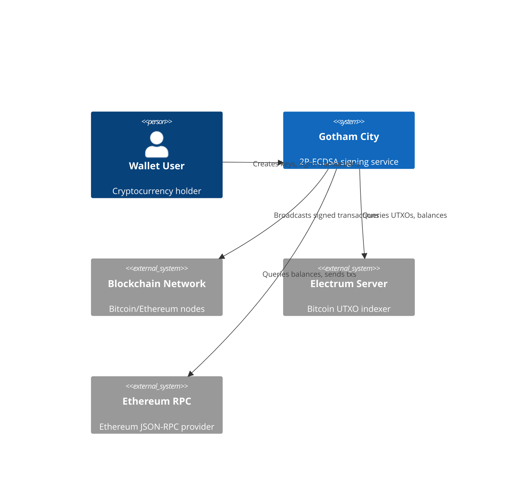
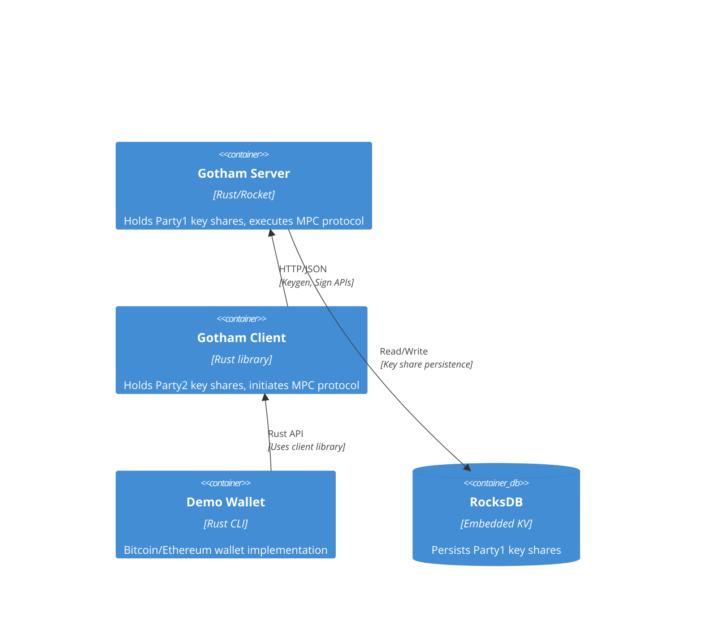

# Architecture

## Context (C4 L1)

**Boundary**: Gotham City provides two-party ECDSA key generation and signing services. External blockchain networks and wallet applications interact with the system but are outside its boundary.



| Actor | Type | Interaction | Evidence |
|-------|------|-------------|----------|
| Wallet User | User | Creates 2P key shares, requests signatures via client | [`gotham-client/src/lib.rs:26-34`](../gotham-client/src/lib.rs#L26-L34) |
| Electrum Server | External | Bitcoin UTXO queries for balance/tx construction | [`demo-wallet/src/bitcoin/mod.rs:269-374`](../demo-wallet/src/bitcoin/mod.rs#L269-L374) |
| Ethereum RPC | External | Balance queries, transaction broadcasting | [`demo-wallet/src/ethereum/mod.rs:279-312`](../demo-wallet/src/ethereum/mod.rs#L279-L312) |
| Mobile Apps | External | iOS/Android apps via FFI bindings | [`gotham-client/src/ecdsa/keygen.rs:128-155`](../gotham-client/src/ecdsa/keygen.rs#L128-L155) |

---

## Containers (C4 L2)

**Pattern**: Client-Server with RESTful API — chosen over gRPC (simplicity, mobile compatibility) and WebSocket (stateless request model)

**Trade-offs**:
- **Benefits**: Simple HTTP integration, stateless server design, easy mobile FFI
- **Costs**: No streaming, per-request overhead for multi-round protocols

**Limitations**: Not recommended for real-time bidirectional communication



| Container | Tech | Purpose | Evidence |
|-----------|------|---------|----------|
| gotham-server | Rust, Rocket 0.5.0-rc.1 | MPC protocol server (Party1) | [`gotham-server/src/server.rs:21-39`](../gotham-server/src/server.rs#L21-L39) |
| gotham-client | Rust library | MPC protocol client (Party2) | [`gotham-client/src/lib.rs:19-24`](../gotham-client/src/lib.rs#L19-L24) |
| demo-wallet | Rust CLI (clap) | Bitcoin/Ethereum wallet demo | [`demo-wallet/src/main.rs:11-19`](../demo-wallet/src/main.rs#L11-L19) |
| integration-tests | Rust test crate | End-to-end protocol tests | [`integration-tests/tests/ecdsa.rs:107-151`](../integration-tests/tests/ecdsa.rs#L107-L151) |

| Attribute | Mechanism | Baseline | Target | Evidence |
|-----------|-----------|----------|--------|----------|
| Keygen Latency | 4-round protocol | 762ms | <1s | [`README.md:90`](../README.md#L90) |
| Sign Latency | 2-round protocol | 151ms | <200ms | [`README.md:91`](../README.md#L91) |
| Availability | Single server | N/A | Depends on deployment | N/A |

---

## Structure

```
gotham-city/
├── gotham-server/           # MPC server (Party1)
│   ├── src/
│   │   ├── main.rs          # Entry point
│   │   ├── server.rs        # Rocket routes setup
│   │   ├── public_gotham.rs # DB trait implementation
│   │   └── tests.rs         # Unit tests
│   ├── Cargo.toml
│   └── Settings.toml        # Server configuration
├── gotham-client/           # MPC client library (Party2)
│   ├── src/
│   │   ├── lib.rs           # Client shim, HTTP client
│   │   ├── ecdsa/           # ECDSA protocol implementations
│   │   │   ├── keygen.rs    # Key generation
│   │   │   ├── sign.rs      # Transaction signing
│   │   │   ├── recover.rs   # Key recovery
│   │   │   └── rotate.rs    # Key rotation
│   │   └── utilities/       # Helper functions
│   └── Cargo.toml
├── demo-wallet/             # CLI wallet demonstration
│   ├── src/
│   │   ├── main.rs          # CLI entry point
│   │   ├── bitcoin/         # Bitcoin wallet logic
│   │   └── ethereum/        # Ethereum wallet logic
│   └── Cargo.toml
├── integration-tests/       # E2E tests
│   ├── tests/
│   │   └── ecdsa.rs         # Protocol integration tests
│   └── Cargo.toml
├── white-paper/             # Academic documentation
└── Cargo.toml               # Workspace definition
```

| Directory | Purpose | Entry Point |
|-----------|---------|-------------|
| gotham-server/src/ | MPC server implementation | [`main.rs:1`](../gotham-server/src/main.rs#L1) |
| gotham-client/src/ | Client library for MPC protocol | [`lib.rs:1`](../gotham-client/src/lib.rs#L1) |
| gotham-client/src/ecdsa/ | ECDSA keygen/sign/recover modules | [`mod.rs:9-16`](../gotham-client/src/ecdsa/mod.rs#L9-L16) |
| demo-wallet/src/bitcoin/ | Bitcoin wallet implementation | [`mod.rs:1`](../demo-wallet/src/bitcoin/mod.rs#L1) |
| demo-wallet/src/ethereum/ | Ethereum wallet implementation | [`mod.rs:1`](../demo-wallet/src/ethereum/mod.rs#L1) |
| integration-tests/tests/ | E2E protocol verification | [`ecdsa.rs:107`](../integration-tests/tests/ecdsa.rs#L107) |

---

## Workspace Dependencies

The project uses a Cargo workspace with shared dependencies:

| Dependency | Version | Purpose | Evidence |
|------------|---------|---------|----------|
| two-party-ecdsa | Git (ZenGo-X) | Core 2P-ECDSA protocol | [`Cargo.toml:25`](../Cargo.toml#L25) |
| gotham-engine | Git (ZenGo-X) | Server-side MPC routes | [`Cargo.toml:26`](../Cargo.toml#L26) |
| rocket | 0.5.0-rc.1 | HTTP server framework | [`Cargo.toml:18`](../Cargo.toml#L18) |
| secp256k1 | 0.21.0 | Elliptic curve operations | [`Cargo.toml:23`](../Cargo.toml#L23) |
| serde | 1.x | JSON serialization | [`Cargo.toml:12`](../Cargo.toml#L12) |
| reqwest | 0.9.5 | HTTP client | [`Cargo.toml:15`](../Cargo.toml#L15) |
