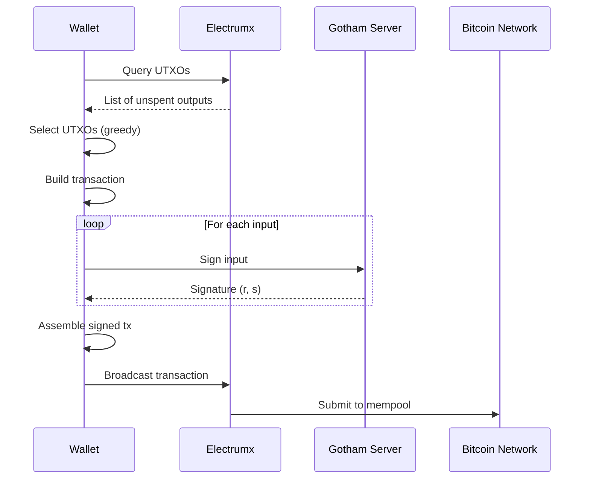

# Bitcoin Wallet [IMPORTANT]

**Location**: [`demo-wallet/src/bitcoin/mod.rs`](../demo-wallet/src/bitcoin/mod.rs)

**Priority**: IMPORTANT — Demonstrates practical Bitcoin integration; reference implementation for wallet developers

**Purpose**: Full Bitcoin wallet implementation using 2P-ECDSA for transaction signing. Supports P2WPKH (SegWit) addresses, UTXO selection, and Electrum server integration.

**Design**: HD wallet with greedy UTXO selection
- Rationale: Follows BIP32/BIP84 standards for compatibility with standard wallet recovery
- Alternative considered: Full node integration (rejected for deployment complexity)

**Limitations**:
- NOT recommended for high-value transactions without fee estimation improvements
- NOT suitable for privacy-focused use cases (no coin control, no CoinJoin)

## Wallet Structure

```rust
pub struct BitcoinWallet {
    pub id: String,
    pub network: String,                                    // "bitcoin" | "testnet"
    pub private_share: PrivateShare,                       // 2P key share
    pub last_derived_pos: u32,                             // HD derivation index
    pub addresses_derivation_map: HashMap<String, AddressDerivation>,
}
```

Evidence: [`bitcoin/mod.rs:114-120`](../demo-wallet/src/bitcoin/mod.rs#L114-L120)

## Methods

| Method | Signature | Purpose | Evidence |
|--------|-----------|---------|----------|
| `BitcoinWallet::new` | `(&ClientShim<C>, &str) -> Self` | Creates new wallet with 2P keygen | [`mod.rs:123-136`](../demo-wallet/src/bitcoin/mod.rs#L123-L136) |
| `send` | `(&mut self, &String, f32, &ClientShim<C>, &mut dyn Electrumx) -> String` | Sends BTC transaction | [`mod.rs:263-374`](../demo-wallet/src/bitcoin/mod.rs#L263-L374) |
| `get_new_bitcoin_address` | `(&mut self) -> Address` | Derives new P2WPKH address | [`mod.rs:376-391`](../demo-wallet/src/bitcoin/mod.rs#L376-L391) |
| `get_balance` | `(&mut self, &mut dyn Electrumx) -> GetWalletBalanceResponse` | Queries total balance | [`mod.rs:403-415`](../demo-wallet/src/bitcoin/mod.rs#L403-L415) |
| `backup` | `(&self, Escrow, &str)` | Creates encrypted backup | [`mod.rs:143-167`](../demo-wallet/src/bitcoin/mod.rs#L143-L167) |
| `save_to` / `load_from` | File operations | Wallet persistence | [`mod.rs:245-261`](../demo-wallet/src/bitcoin/mod.rs#L245-L261) |

## Transaction Flow



## Transaction Signing Process

| Step | Action | Evidence |
|------|--------|----------|
| 1 | Select UTXOs using greedy algorithm | [`mod.rs:418-447`](../demo-wallet/src/bitcoin/mod.rs#L418-L447) |
| 2 | Build transaction with inputs/outputs | [`mod.rs:278-320`](../demo-wallet/src/bitcoin/mod.rs#L278-L320) |
| 3 | For each input, compute sighash (BIP143) | [`mod.rs:336-343`](../demo-wallet/src/bitcoin/mod.rs#L336-L343) |
| 4 | Sign sighash using 2P-ECDSA | [`mod.rs:344-352`](../demo-wallet/src/bitcoin/mod.rs#L344-L352) |
| 5 | Serialize signature to DER format | [`mod.rs:354-362`](../demo-wallet/src/bitcoin/mod.rs#L354-L362) |
| 6 | Attach witness data to input | [`mod.rs:363-367`](../demo-wallet/src/bitcoin/mod.rs#L363-L367) |
| 7 | Broadcast via Electrum | [`mod.rs:370-373`](../demo-wallet/src/bitcoin/mod.rs#L370-L373) |

## Address Derivation

Uses BIP32-style derivation path `m/0/{pos}`:

```rust
fn derive_new_key(private_share: &PrivateShare, pos: u32) -> (u32, MasterKey2) {
    let last_pos: u32 = pos + 1;
    let last_child_master_key = private_share
        .master_key
        .get_child(vec![BigInt::from(0), BigInt::from(last_pos)]);
    (last_pos, last_child_master_key)
}
```

Evidence: [`mod.rs:522-530`](../demo-wallet/src/bitcoin/mod.rs#L522-L530)

## Backup & Recovery

| Feature | Implementation | Evidence |
|---------|----------------|----------|
| Backup | Centipede verifiable encryption to escrow public key | [`mod.rs:143-167`](../demo-wallet/src/bitcoin/mod.rs#L143-L167) |
| Verify | Zero-knowledge proof verification | [`mod.rs:169-192`](../demo-wallet/src/bitcoin/mod.rs#L169-L192) |
| Recovery | Decrypt segments with escrow private key (commented out) | [`mod.rs:196-243`](../demo-wallet/src/bitcoin/mod.rs#L196-L243) |

## CLI Commands

| Command | Description | Evidence |
|---------|-------------|----------|
| `bitcoin create` | Create new wallet | [`commands.rs`](../demo-wallet/src/bitcoin/commands.rs) |
| `bitcoin address` | Generate new address | [`commands.rs`](../demo-wallet/src/bitcoin/commands.rs) |
| `bitcoin balance` | Query wallet balance | [`commands.rs`](../demo-wallet/src/bitcoin/commands.rs) |
| `bitcoin send` | Send BTC | [`commands.rs`](../demo-wallet/src/bitcoin/commands.rs) |
