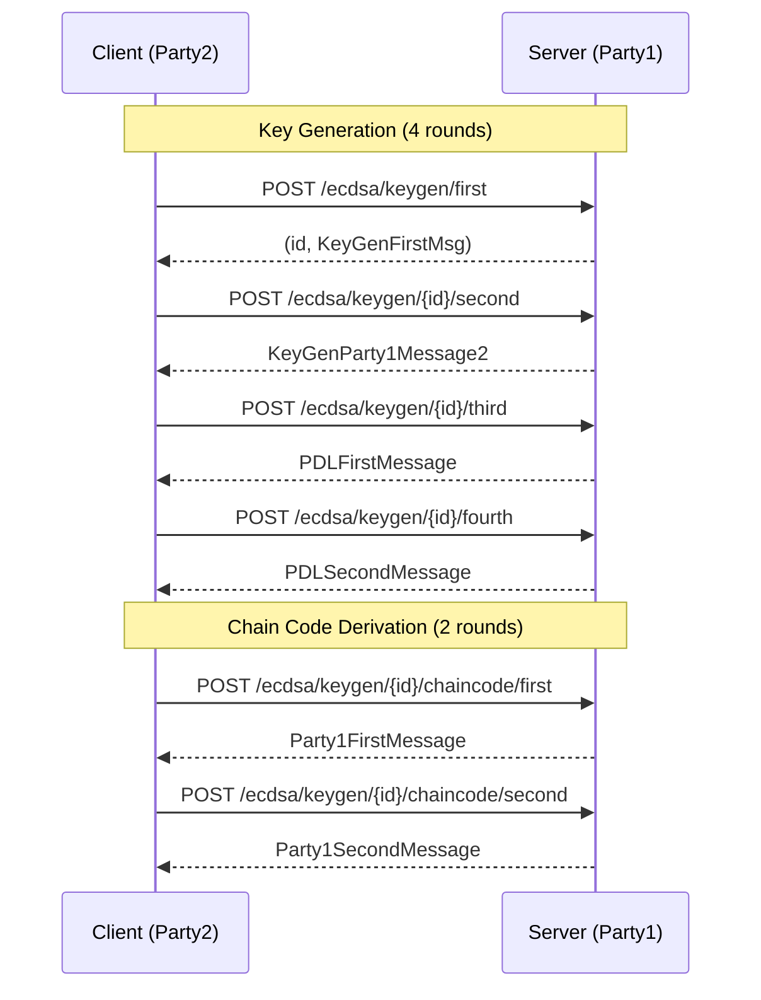

# ECDSA Key Generation [CRITICAL]

**Location**: [`gotham-client/src/ecdsa/keygen.rs:37-121`](../gotham-client/src/ecdsa/keygen.rs#L37-L121)

**Priority**: CRITICAL — Core functionality for wallet creation; all signing depends on key generation

**Purpose**: Implements the client-side (Party2) of Lindell's two-party ECDSA key generation protocol. Produces a `PrivateShare` containing the client's master key share and session ID.

**Design**: 4-round interactive protocol with zero-knowledge proofs
- Rationale: Lindell17 protocol provides provable security under standard cryptographic assumptions
- Alternative considered: Threshold Schnorr (rejected due to Bitcoin ECDSA requirement)

**Limitations**:
- NOT recommended for offline-first applications (requires server connectivity)
- NOT suitable when deterministic key generation is required (protocol uses random nonces)

## Protocol Flow



## Methods

| Method | Signature | Purpose | Evidence |
|--------|-----------|---------|----------|
| `get_master_key` | `(&ClientShim<C>) -> PrivateShare` | Executes full keygen protocol | [`keygen.rs:37-121`](../gotham-client/src/ecdsa/keygen.rs#L37-L121) |
| `get_client_master_key` | `(*const c_char, *const c_char) -> *mut c_char` | FFI wrapper for iOS | [`keygen.rs:128-155`](../gotham-client/src/ecdsa/keygen.rs#L128-L155) |
| `Java_...getClientMasterKey` | JNI signature | FFI wrapper for Android | [`keygen.rs:160-241`](../gotham-client/src/ecdsa/keygen.rs#L160-L241) |

## Key Generation Steps

| Step | Action | Evidence |
|------|--------|----------|
| 1 | Client requests keygen initiation, receives session ID and Party1's first message | [`keygen.rs:40-41`](../gotham-client/src/ecdsa/keygen.rs#L40-L41) |
| 2 | Client generates Party2's first message with DLog proof | [`keygen.rs:43-44`](../gotham-client/src/ecdsa/keygen.rs#L43-L44) |
| 3 | Client sends proof, receives Party1's ECDH commitment and Paillier keys | [`keygen.rs:47-54`](../gotham-client/src/ecdsa/keygen.rs#L47-L54) |
| 4 | Client verifies Paillier correctness via PDL (Proof of Discrete Log) protocol | [`keygen.rs:56-80`](../gotham-client/src/ecdsa/keygen.rs#L56-L80) |
| 5 | Chain code derivation for HD wallet support | [`keygen.rs:82-106`](../gotham-client/src/ecdsa/keygen.rs#L82-L106) |
| 6 | Client assembles final MasterKey2 from all protocol outputs | [`keygen.rs:108-120`](../gotham-client/src/ecdsa/keygen.rs#L108-L120) |

## Output Structure

```rust
pub struct PrivateShare {
    pub id: String,           // Session ID for future signing
    pub master_key: MasterKey2, // Client's master key share
}
```

Evidence: [`gotham-client/src/ecdsa/types.rs`](../gotham-client/src/ecdsa/types.rs)

## Cryptographic Primitives Used

| Primitive | Purpose | Evidence |
|-----------|---------|----------|
| DLog Proof | Proves knowledge of discrete log | [`keygen.rs:45`](../gotham-client/src/ecdsa/keygen.rs#L45) |
| Paillier Encryption | Homomorphic encryption for MPC | [`keygen.rs:56-57`](../gotham-client/src/ecdsa/keygen.rs#L56-L57) |
| PDL Proof | Proves Paillier ciphertext encodes correct value | [`keygen.rs:65-80`](../gotham-client/src/ecdsa/keygen.rs#L65-L80) |
| DH Key Exchange | Chain code derivation | [`keygen.rs:82-106`](../gotham-client/src/ecdsa/keygen.rs#L82-L106) |
