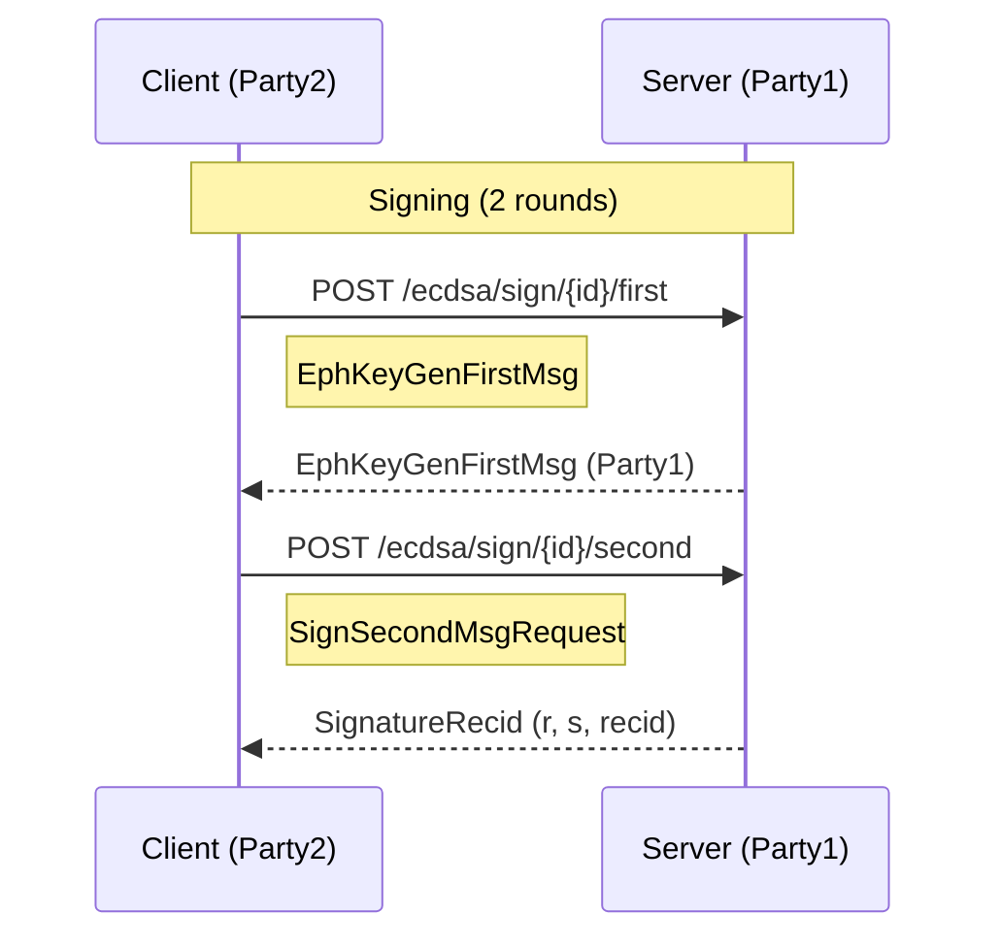

# ECDSA Signing [CRITICAL]

**Location**: [`gotham-client/src/ecdsa/sign.rs:28-66`](../gotham-client/src/ecdsa/sign.rs#L28-L66)

**Priority**: CRITICAL — Core functionality for transaction signing; enables cryptocurrency transfers

**Purpose**: Implements the client-side (Party2) of Lindell's two-party ECDSA signing protocol. Produces a standard ECDSA signature (r, s, recid) compatible with Bitcoin and Ethereum.

**Design**: 2-round interactive protocol
- Rationale: Minimizes round trips while maintaining security
- Alternative considered: Non-interactive signing (rejected; requires trusted dealer setup)

**Limitations**:
- NOT recommended for high-frequency trading (151ms latency per signature)
- NOT suitable for batch signing without parallelization

## Protocol Flow



## Methods

| Method | Signature | Purpose | Evidence |
|--------|-----------|---------|----------|
| `sign` | `(&ClientShim<C>, BigInt, &MasterKey2, BigInt, BigInt, &str) -> Result<SignatureRecid>` | Executes full signing protocol | [`sign.rs:28-66`](../gotham-client/src/ecdsa/sign.rs#L28-L66) |
| `get_signature` | `(&ClientShim<C>, BigInt, SignMessage, BigInt, BigInt, &str) -> Result<SignatureRecid>` | Sends second message, receives signature | [`sign.rs:68-94`](../gotham-client/src/ecdsa/sign.rs#L68-L94) |
| `sign_message` | FFI C function | iOS FFI wrapper | [`sign.rs:102-178`](../gotham-client/src/ecdsa/sign.rs#L102-L178) |
| `Java_...signMessage` | JNI function | Android FFI wrapper | [`sign.rs:183-339`](../gotham-client/src/ecdsa/sign.rs#L183-L339) |

## Signing Steps

| Step | Action | Evidence |
|------|--------|----------|
| 1 | Client generates ephemeral key pair and commitment | [`sign.rs:36-37`](../gotham-client/src/ecdsa/sign.rs#L36-L37) |
| 2 | Client sends ephemeral public key to server | [`sign.rs:39-44`](../gotham-client/src/ecdsa/sign.rs#L39-L44) |
| 3 | Client computes partial signature using server's ephemeral key | [`sign.rs:46-51`](../gotham-client/src/ecdsa/sign.rs#L46-L51) |
| 4 | Server combines partial signatures, returns final (r, s, recid) | [`sign.rs:53-65`](../gotham-client/src/ecdsa/sign.rs#L53-L65) |

## Input Parameters

| Parameter | Type | Purpose | Evidence |
|-----------|------|---------|----------|
| `message` | `BigInt` | Hash of transaction to sign | [`sign.rs:30`](../gotham-client/src/ecdsa/sign.rs#L30) |
| `mk` | `&MasterKey2` | Client's master key share | [`sign.rs:31`](../gotham-client/src/ecdsa/sign.rs#L31) |
| `x_pos` | `BigInt` | HD derivation path x-coordinate | [`sign.rs:32`](../gotham-client/src/ecdsa/sign.rs#L32) |
| `y_pos` | `BigInt` | HD derivation path y-coordinate | [`sign.rs:33`](../gotham-client/src/ecdsa/sign.rs#L33) |
| `id` | `&str` | Session ID from keygen | [`sign.rs:34`](../gotham-client/src/ecdsa/sign.rs#L34) |

## Request/Response Structures

```rust
// Second message request
pub struct SignSecondMsgRequest {
    pub message: BigInt,
    pub party_two_sign_message: party2::SignMessage,
    pub x_pos_child_key: BigInt,
    pub y_pos_child_key: BigInt,
}
```

Evidence: [`sign.rs:20-26`](../gotham-client/src/ecdsa/sign.rs#L20-L26)

## HD Key Derivation for Signing

The signing function supports hierarchical deterministic (HD) key derivation:

```rust
let child_master_key = mk.get_child(vec![x_pos.clone(), y_pos.clone()]);
```

This allows signing with any derived child key without regenerating the key share.

Evidence: [`sign.rs:151`](../gotham-client/src/ecdsa/sign.rs#L151) (FFI example)
