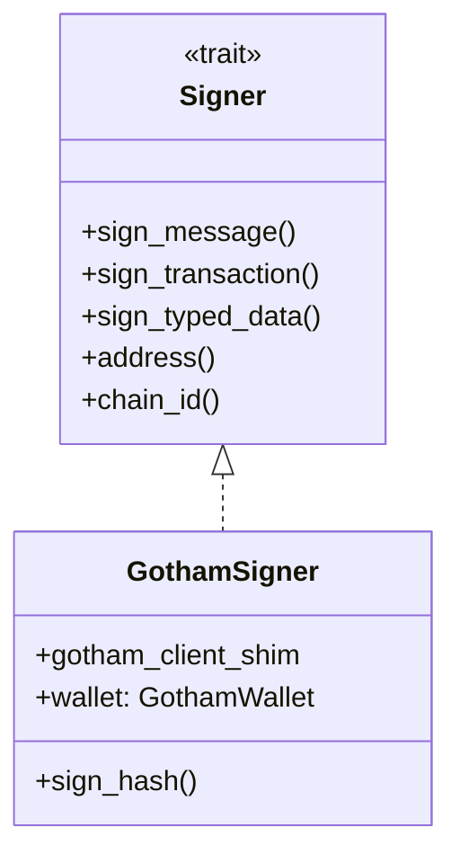

# Ethereum Wallet [IMPORTANT]

**Location**: [`demo-wallet/src/ethereum/mod.rs`](../demo-wallet/src/ethereum/mod.rs)

**Priority**: IMPORTANT — Demonstrates EVM chain integration; reference for DeFi and ERC-20 applications

**Purpose**: Ethereum wallet implementation using 2P-ECDSA with ethers-rs integration. Supports native ETH transfers, ERC-20 token transfers, and EIP-155/EIP-712 signing.

**Design**: ethers-rs `Signer` trait implementation
- Rationale: Leverages mature ethers-rs ecosystem for transaction construction and RPC
- Alternative considered: web3.js (rejected for Rust-native tooling preference)

**Limitations**:
- NOT recommended for MEV-sensitive transactions (no private mempool support)
- NOT suitable for gas-intensive operations without gas estimation tuning

## Wallet Structure

```rust
pub struct GothamWallet {
    pub private_share: PrivateShare,  // 2P key share
    pub hd_path: Vec<u32>,            // Derivation path [x, y]
    pub chain_id: u64,                // EIP-155 chain ID
    pub address: Address,             // Derived Ethereum address
}
```

Evidence: [`ethereum/mod.rs:21-34`](../demo-wallet/src/ethereum/mod.rs#L21-L34)

## Methods

| Method | Signature | Purpose | Evidence |
|--------|-----------|---------|----------|
| `GothamWallet::new` | `(&ClientShim<C>, Vec<u32>, u64) -> Self` | Creates wallet with 2P keygen | [`mod.rs:37-67`](../demo-wallet/src/ethereum/mod.rs#L37-L67) |
| `GothamSigner::sign_hash` | `(&self, H256) -> Result<Signature>` | Signs arbitrary hash | [`mod.rs:103-135`](../demo-wallet/src/ethereum/mod.rs#L103-L135) |
| `sign_transaction` | `async fn(&TypedTransaction) -> Result<Signature>` | Signs EIP-155 transaction | [`mod.rs:155-179`](../demo-wallet/src/ethereum/mod.rs#L155-L179) |
| `sign_typed_data` | `async fn(&T: Eip712) -> Result<Signature>` | Signs EIP-712 typed data | [`mod.rs:181-189`](../demo-wallet/src/ethereum/mod.rs#L181-L189) |
| `transfer_erc20` | `async fn(...)` | Transfers ERC-20 tokens | [`mod.rs:231-269`](../demo-wallet/src/ethereum/mod.rs#L231-L269) |
| `send_transaction` | `async fn(...)` | Sends native ETH | [`mod.rs:279-312`](../demo-wallet/src/ethereum/mod.rs#L279-L312) |

## Address Derivation

Ethereum address is derived from the public key:

```rust
// Uncompressed public key (65 bytes, starts with 0x04)
let pk = pk.serialize_uncompressed();

// Keccak256 of public key bytes (excluding 0x04 prefix)
let hash = H256(keccak256(&pk[1..]));

// Last 20 bytes = Ethereum address
let address = Address::from_slice(&hash[12..]);
```

Evidence: [`mod.rs:53-59`](../demo-wallet/src/ethereum/mod.rs#L53-L59)

## Signer Implementation

Implements ethers-rs `Signer` trait for seamless integration:



Evidence: [`mod.rs:142-203`](../demo-wallet/src/ethereum/mod.rs#L142-L203)

## Transaction Signing Process

| Step | Action | Evidence |
|------|--------|----------|
| 1 | Set chain_id if not present | [`mod.rs:156-159`](../demo-wallet/src/ethereum/mod.rs#L156-L159) |
| 2 | Compute sighash (RLP encoded tx) | [`mod.rs:170`](../demo-wallet/src/ethereum/mod.rs#L170) |
| 3 | Sign hash using 2P-ECDSA | [`mod.rs:172`](../demo-wallet/src/ethereum/mod.rs#L172) |
| 4 | Apply EIP-155 v value transformation | [`mod.rs:176`](../demo-wallet/src/ethereum/mod.rs#L176) |

### EIP-155 v Calculation

```rust
signature.v = (chain_id * 2 + 35) + signature.v;
```

Evidence: [`mod.rs:176`](../demo-wallet/src/ethereum/mod.rs#L176)

## ERC-20 Support

Built-in ERC-20 ABI binding using ethers `abigen!`:

```rust
abigen!(
    ERC20Contract,
    r#"[
        function name() public view returns (string)
        function symbol() public view returns (string)
        function decimals() public view returns (uint8)
        function balanceOf(address _owner) public view returns (uint256 balance)
        function transfer(address _to, uint256 _value) public returns (bool success)
        ...
    ]"#,
);
```

Evidence: [`mod.rs:205-220`](../demo-wallet/src/ethereum/mod.rs#L205-L220)

## CLI Commands

| Command | Description | Evidence |
|---------|-------------|----------|
| `evm create` | Create new wallet | [`commands.rs`](../demo-wallet/src/ethereum/commands.rs) |
| `evm address` | Show wallet address | [`commands.rs`](../demo-wallet/src/ethereum/commands.rs) |
| `evm balance` | Query ETH/ERC-20 balance | [`commands.rs`](../demo-wallet/src/ethereum/commands.rs) |
| `evm send` | Send native ETH | [`commands.rs`](../demo-wallet/src/ethereum/commands.rs) |
| `evm transfer` | Transfer ERC-20 tokens | [`commands.rs`](../demo-wallet/src/ethereum/commands.rs) |

## Configuration

| Option | Type | Description | Evidence |
|--------|------|-------------|----------|
| `rpc_url` | String | Ethereum RPC endpoint | [`main.rs:45`](../demo-wallet/src/main.rs#L45) |
| `chain_id` | u64 | EIP-155 chain ID | [`main.rs:49`](../demo-wallet/src/main.rs#L49) |
| `wallet_file` | String | Wallet JSON path | [`main.rs:44`](../demo-wallet/src/main.rs#L44) |
