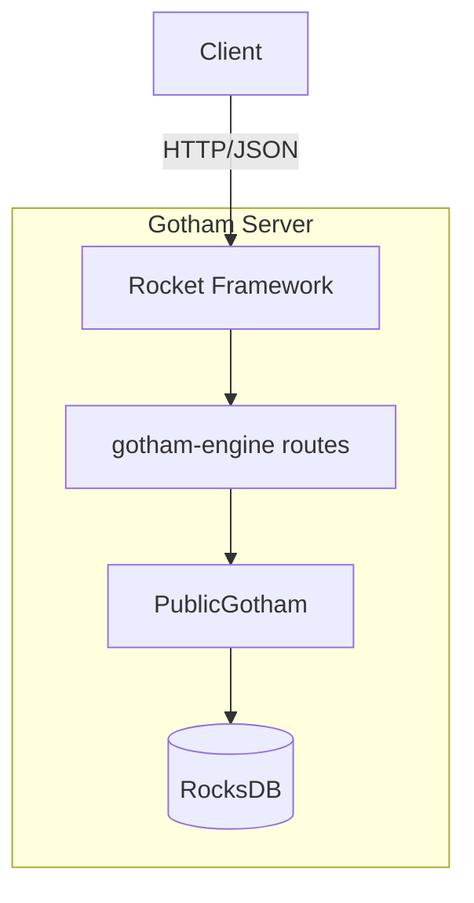

# Gotham Server [CRITICAL]

**Location**: [`gotham-server/src/`](../gotham-server/src/)

**Priority**: CRITICAL — Core infrastructure; all key generation and signing depends on server availability

**Purpose**: RESTful server implementing Party1 of the 2P-ECDSA protocol. Persists key shares in RocksDB, exposes Rocket HTTP endpoints for MPC protocol rounds.

**Design**: Stateless request handling with persistent key storage
- Rationale: Enables horizontal scaling (with shared DB), simple deployment
- Alternative considered: gRPC (rejected for mobile compatibility), WebSocket (rejected for stateless model)

**Limitations**:
- NOT recommended for multi-tenant production without additional auth layer
- NOT suitable for deployments requiring distributed key storage (single RocksDB instance)

## Server Architecture



## Methods

| Method | Signature | Purpose | Evidence |
|--------|-----------|---------|----------|
| `get_server` | `() -> Rocket<Build>` | Creates configured Rocket instance | [`server.rs:21-39`](../gotham-server/src/server.rs#L21-L39) |
| `PublicGotham::new` | `() -> Self` | Initializes RocksDB connection | [`public_gotham.rs:34-44`](../gotham-server/src/public_gotham.rs#L34-L44) |
| `Db::insert` | `async fn(&DbIndex, &dyn MPCStruct, &dyn Value) -> Result<()>` | Stores key share data | [`public_gotham.rs:58-68`](../gotham-server/src/public_gotham.rs#L58-L68) |
| `Db::get` | `async fn(&DbIndex, &dyn MPCStruct) -> Result<Option<Box<dyn Value>>>` | Retrieves key share data | [`public_gotham.rs:70-91`](../gotham-server/src/public_gotham.rs#L70-L91) |

## Exposed Routes

All routes are defined in the `gotham-engine` crate and mounted at root:

| Route | Method | Purpose | Evidence |
|-------|--------|---------|----------|
| `/ecdsa/keygen/first` | POST | Initiate keygen, return session ID | [`server.rs:28`](../gotham-server/src/server.rs#L28) |
| `/ecdsa/keygen/{id}/second` | POST | Process keygen round 2 | [`server.rs:29`](../gotham-server/src/server.rs#L29) |
| `/ecdsa/keygen/{id}/third` | POST | Process keygen round 3 | [`server.rs:30`](../gotham-server/src/server.rs#L30) |
| `/ecdsa/keygen/{id}/fourth` | POST | Process keygen round 4 | [`server.rs:31`](../gotham-server/src/server.rs#L31) |
| `/ecdsa/keygen/{id}/chaincode/first` | POST | Chain code round 1 | [`server.rs:32`](../gotham-server/src/server.rs#L32) |
| `/ecdsa/keygen/{id}/chaincode/second` | POST | Chain code round 2 | [`server.rs:33`](../gotham-server/src/server.rs#L33) |
| `/ecdsa/sign/{id}/first` | POST | Initiate signing | [`server.rs:34`](../gotham-server/src/server.rs#L34) |
| `/ecdsa/sign/{id}/second` | POST | Complete signing, return signature | [`server.rs:35`](../gotham-server/src/server.rs#L35) |

## Database Schema

Key shares are stored in RocksDB with composite keys:

```
Key format: {customerId}_{sessionId}_{tableName}
Value: JSON-serialized protocol state
```

Evidence: [`public_gotham.rs:52-54`](../gotham-server/src/public_gotham.rs#L52-L54)

## Configuration

| Variable | Source | Default | Evidence |
|----------|--------|---------|----------|
| `db_name` | Settings.toml | `"db"` | [`public_gotham.rs:37`](../gotham-server/src/public_gotham.rs#L37) |
| Server port | Rocket.toml | 8000 | [`Rocket.toml`](../gotham-server/Rocket.toml) |

## Error Handlers

| Error | Handler | Response | Evidence |
|-------|---------|----------|----------|
| 500 | `internal_error` | "Internal server error" | [`server.rs:6-9`](../gotham-server/src/server.rs#L6-L9) |
| 400 | `bad_request` | "Bad request" | [`server.rs:11-14`](../gotham-server/src/server.rs#L11-L14) |
| 404 | `not_found` | "Unknown route '{uri}'" | [`server.rs:16-19`](../gotham-server/src/server.rs#L16-L19) |

## Security Considerations

The `PublicGotham` implementation has a permissive `granted` function:

```rust
fn granted(&self, message: &str, customer_id: &str) -> Result<bool, DatabaseError> {
    Ok(true)  // Always grants - NO AUTHORIZATION
}
```

Evidence: [`public_gotham.rs:93-95`](../gotham-server/src/public_gotham.rs#L93-L95)

**WARNING**: Production deployments MUST implement proper authorization logic.
