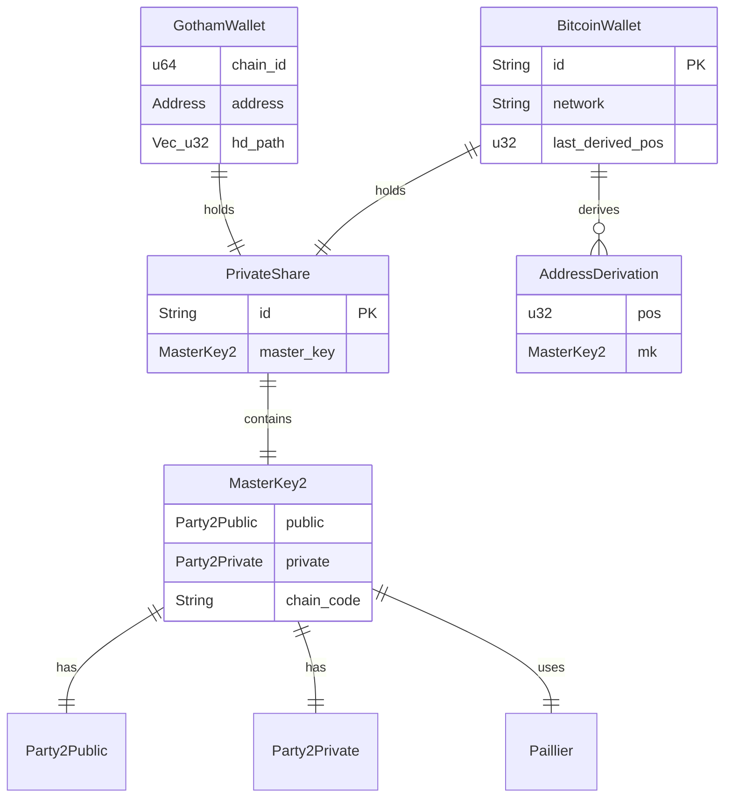

# Data & APIs

## Data Model



| Entity | Purpose | Key Attributes | Evidence |
|--------|---------|----------------|----------|
| PrivateShare | Client's 2P key share | id, master_key | [`gotham-client/src/ecdsa/types.rs`](../gotham-client/src/ecdsa/types.rs) |
| MasterKey2 | Client's master key with HD support | public, private, chain_code | `two-party-ecdsa` crate |
| BitcoinWallet | Bitcoin wallet state | id, network, addresses_derivation_map | [`demo-wallet/src/bitcoin/mod.rs:114-120`](../demo-wallet/src/bitcoin/mod.rs#L114-L120) |
| GothamWallet | Ethereum wallet state | private_share, hd_path, chain_id, address | [`demo-wallet/src/ethereum/mod.rs:21-34`](../demo-wallet/src/ethereum/mod.rs#L21-L34) |
| AddressDerivation | Derived address metadata | pos, mk | [`demo-wallet/src/bitcoin/mod.rs:108-111`](../demo-wallet/src/bitcoin/mod.rs#L108-L111) |

---

## API Contract

### Key Generation Endpoints

| Priority | Method | Endpoint | Request | Response | Auth | Errors | Evidence |
|----------|--------|----------|---------|----------|------|--------|----------|
| CRITICAL | POST | `/ecdsa/keygen/first` | `{}` | `(String, KeyGenFirstMsg)` | None | 500 | [`server.rs:28`](../gotham-server/src/server.rs#L28) |
| CRITICAL | POST | `/ecdsa/keygen/{id}/second` | `DLogProof` | `KeyGenParty1Message2` | None | 400, 500 | [`server.rs:29`](../gotham-server/src/server.rs#L29) |
| CRITICAL | POST | `/ecdsa/keygen/{id}/third` | `PDLFirstMessage` | `PDLFirstMessage` | None | 400, 500 | [`server.rs:30`](../gotham-server/src/server.rs#L30) |
| CRITICAL | POST | `/ecdsa/keygen/{id}/fourth` | `PDLSecondMessage` | `PDLSecondMessage` | None | 400, 500 | [`server.rs:31`](../gotham-server/src/server.rs#L31) |
| CRITICAL | POST | `/ecdsa/keygen/{id}/chaincode/first` | `{}` | `Party1FirstMessage` | None | 500 | [`server.rs:32`](../gotham-server/src/server.rs#L32) |
| CRITICAL | POST | `/ecdsa/keygen/{id}/chaincode/second` | `DLogProof` | `Party1SecondMessage` | None | 400, 500 | [`server.rs:33`](../gotham-server/src/server.rs#L33) |

### Signing Endpoints

| Priority | Method | Endpoint | Request | Response | Auth | Errors | Evidence |
|----------|--------|----------|---------|----------|------|--------|----------|
| CRITICAL | POST | `/ecdsa/sign/{id}/first` | `EphKeyGenFirstMsg` | `EphKeyGenFirstMsg` | None | 400, 500 | [`server.rs:34`](../gotham-server/src/server.rs#L34) |
| CRITICAL | POST | `/ecdsa/sign/{id}/second` | `SignSecondMsgRequest` | `SignatureRecid` | None | 400, 500 | [`server.rs:35`](../gotham-server/src/server.rs#L35) |

---

## Request/Response Schemas

### Key Generation First Message Response

```json
[
  "session-uuid-string",
  {
    "pk_commitment": "hex-encoded-commitment",
    "zk_pok_commitment": "hex-encoded-proof"
  }
]
```

Evidence: [`tests.rs:24-26`](../gotham-server/src/tests.rs#L24-L26)

### Sign Second Message Request

```rust
pub struct SignSecondMsgRequest {
    pub message: BigInt,              // Transaction hash to sign
    pub party_two_sign_message: party2::SignMessage,
    pub x_pos_child_key: BigInt,      // HD derivation x
    pub y_pos_child_key: BigInt,      // HD derivation y
}
```

Evidence: [`gotham-client/src/ecdsa/sign.rs:20-26`](../gotham-client/src/ecdsa/sign.rs#L20-L26)

### Signature Response

```rust
pub struct SignatureRecid {
    pub r: BigInt,     // ECDSA r component
    pub s: BigInt,     // ECDSA s component  
    pub recid: u8,     // Recovery ID (0-3)
}
```

Evidence: [`tests.rs:243-248`](../gotham-server/src/tests.rs#L243-L248)

---

## Client Library API

### ClientShim

```rust
pub struct ClientShim<C: Client> {
    pub client: C,
    pub auth_token: Option<String>,
    pub endpoint: String,
}

impl ClientShim<reqwest::Client> {
    pub fn new(endpoint: String, auth_token: Option<String>) -> Self;
}

impl<C: Client> ClientShim<C> {
    pub fn post<V>(&self, path: &str) -> Option<V>;
    pub fn postb<T, V>(&self, path: &str, body: T) -> Option<V>;
}
```

Evidence: [`gotham-client/src/lib.rs:19-68`](../gotham-client/src/lib.rs#L19-L68)

### Client Trait

```rust
pub trait Client: Sized {
    fn post<V: DeserializeOwned, T: Serialize>(
        &self,
        endpoint: &str,
        uri: &str,
        bearer_token: Option<String>,
        body: T,
    ) -> Option<V>;
}
```

Evidence: [`gotham-client/src/lib.rs:71-79`](../gotham-client/src/lib.rs#L71-L79)

### ECDSA Module Public API

```rust
pub use keygen::get_master_key;
pub use sign::sign;
pub use types::PrivateShare;
```

Evidence: [`gotham-client/src/ecdsa/mod.rs:14-16`](../gotham-client/src/ecdsa/mod.rs#L14-L16)

---

## Consumer Integration Guide

### Installation

```toml
# Cargo.toml
[dependencies]
gotham-client = { path = "gotham-client" }
# Or from Git:
# gotham-client = { git = "https://github.com/ZenGo-X/gotham-city.git" }
```

### Quick Integration

```rust
use gotham_client::{ClientShim, ecdsa};
use two_party_ecdsa::curv::BigInt;

// 1. Create client pointing to Gotham server
let client = ClientShim::new("http://localhost:8000".to_string(), None);

// 2. Generate key shares
let private_share = ecdsa::get_master_key(&client);

// 3. Derive child key for specific address
let x_pos = BigInt::from(0u32);
let y_pos = BigInt::from(1u32);
let child_key = private_share.master_key.get_child(vec![x_pos.clone(), y_pos.clone()]);

// 4. Sign a message hash
let message_hash = BigInt::from_hex("0x...");
let signature = ecdsa::sign(&client, message_hash, &child_key, x_pos, y_pos, &private_share.id)?;

println!("r: {}, s: {}, recid: {}", signature.r, signature.s, signature.recid);
```

Evidence: [`integration-tests/tests/ecdsa.rs:107-150`](../integration-tests/tests/ecdsa.rs#L107-L150)

### Use Cases

| Use Case | API | Example | Evidence |
|----------|-----|---------|----------|
| Create wallet | `ecdsa::get_master_key(&client)` | Key generation | [`keygen.rs:37`](../gotham-client/src/ecdsa/keygen.rs#L37) |
| Derive address | `mk.get_child(vec![x, y])` | HD derivation | [`keygen.rs:108`](../gotham-client/src/ecdsa/keygen.rs#L108) |
| Sign transaction | `ecdsa::sign(&client, msg, &mk, x, y, &id)` | Transaction signing | [`sign.rs:28`](../gotham-client/src/ecdsa/sign.rs#L28) |
| Custom HTTP client | `ClientShim::new_with_client(...)` | Testing, mocking | [`lib.rs:38-44`](../gotham-client/src/lib.rs#L38-L44) |

### Configuration Options

| Option | Type | Default | Description | Evidence |
|--------|------|---------|-------------|----------|
| `endpoint` | String | Required | Gotham server URL | [`lib.rs:23`](../gotham-client/src/lib.rs#L23) |
| `auth_token` | Option<String> | None | Bearer token for auth | [`lib.rs:22`](../gotham-client/src/lib.rs#L22) |

### FFI Bindings

For mobile integration (iOS/Android):

| Platform | Function | Evidence |
|----------|----------|----------|
| iOS (C) | `get_client_master_key(endpoint, auth_token)` | [`keygen.rs:128-155`](../gotham-client/src/ecdsa/keygen.rs#L128-L155) |
| iOS (C) | `sign_message(endpoint, auth_token, msg, mk, x, y, id)` | [`sign.rs:102-178`](../gotham-client/src/ecdsa/sign.rs#L102-L178) |
| Android (JNI) | `Java_com_zengo_components_kms_gotham_ECDSA_getClientMasterKey` | [`keygen.rs:160-241`](../gotham-client/src/ecdsa/keygen.rs#L160-L241) |
| Android (JNI) | `Java_com_zengo_components_kms_gotham_ECDSA_signMessage` | [`sign.rs:183-339`](../gotham-client/src/ecdsa/sign.rs#L183-L339) |
