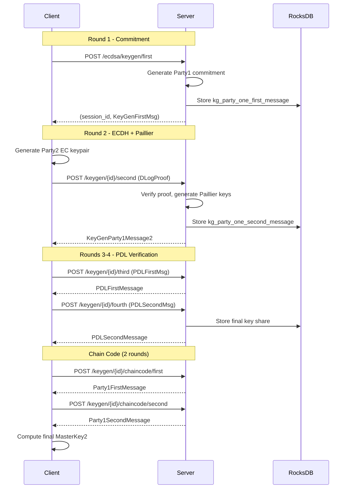
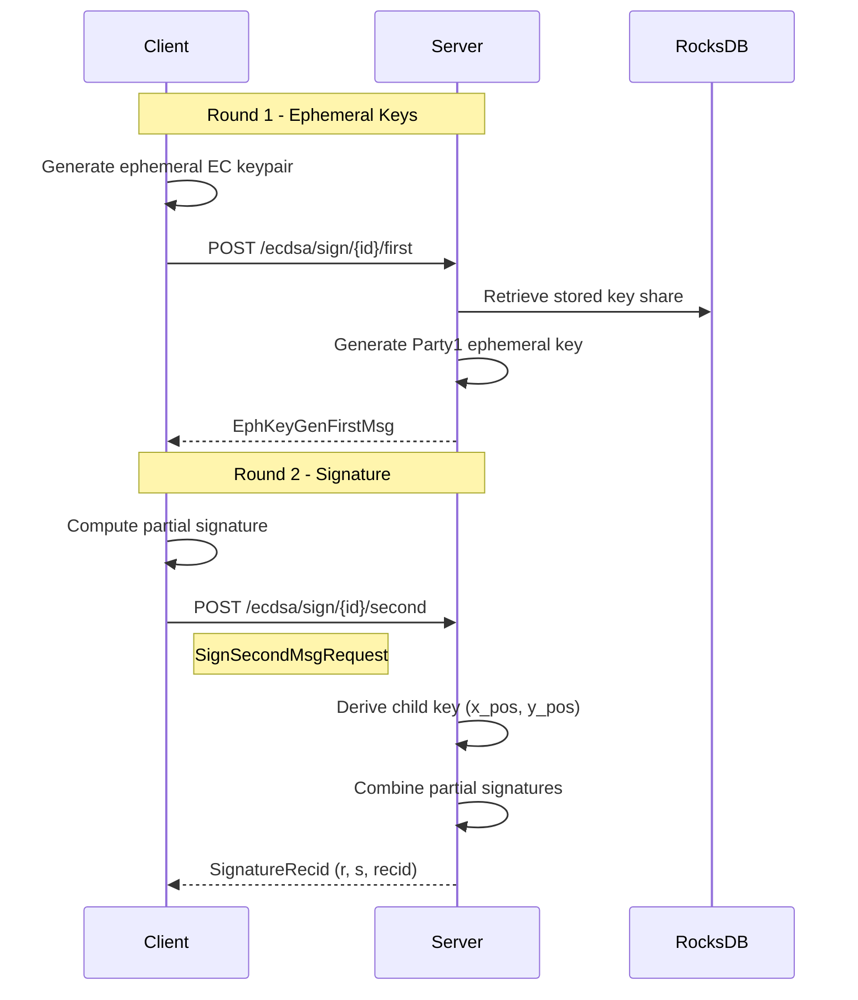
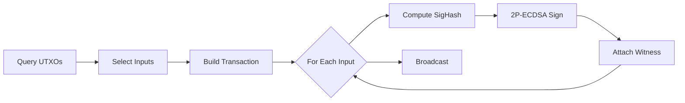
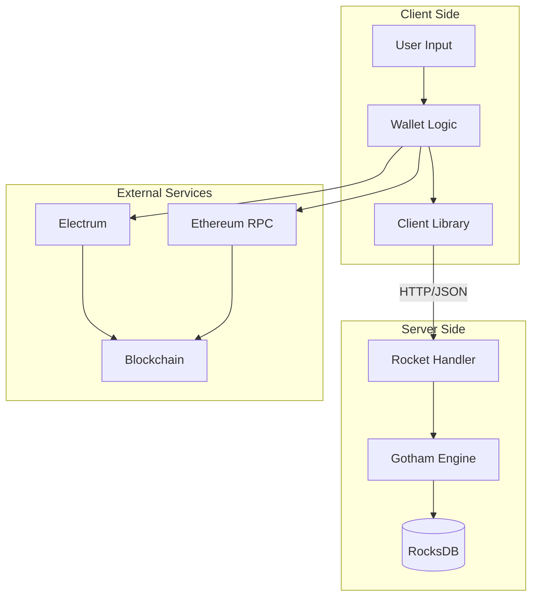

# Implementation

## Key Generation Process [CRITICAL]

**Entry Point**: [`gotham-client/src/ecdsa/keygen.rs:37`](../gotham-client/src/ecdsa/keygen.rs#L37)  
**Trigger**: Client application initiates wallet creation  
**Performance**: p95 = 762ms (localhost, M2 MacBook)  
**Traffic Share**: Primary operation for new wallet creation



| Step | Action | Evidence |
|------|--------|----------|
| 1 | Client requests session, server generates commitment | [`keygen.rs:40-41`](../gotham-client/src/ecdsa/keygen.rs#L40-L41) |
| 2 | Client generates EC keypair with DLog proof | [`keygen.rs:43-44`](../gotham-client/src/ecdsa/keygen.rs#L43-L44) |
| 3 | Server verifies proof, returns ECDH + Paillier keys | [`keygen.rs:47-57`](../gotham-client/src/ecdsa/keygen.rs#L47-L57) |
| 4 | PDL protocol verifies Paillier correctness | [`keygen.rs:59-80`](../gotham-client/src/ecdsa/keygen.rs#L59-L80) |
| 5 | Chain code derivation for HD support | [`keygen.rs:82-106`](../gotham-client/src/ecdsa/keygen.rs#L82-L106) |
| 6 | Client assembles MasterKey2 | [`keygen.rs:108-120`](../gotham-client/src/ecdsa/keygen.rs#L108-L120) |

**Edge Cases**:
- Network timeout: Client must retry full protocol (no partial resumption)
- Server restart: Session lost, requires new keygen
- Invalid proof: Server returns 400, client must regenerate

---

## Signing Process [CRITICAL]

**Entry Point**: [`gotham-client/src/ecdsa/sign.rs:28`](../gotham-client/src/ecdsa/sign.rs#L28)  
**Trigger**: Transaction signing request  
**Performance**: p95 = 151ms (localhost, M2 MacBook)  
**Traffic Share**: Most frequent operation (multiple signs per wallet)



| Step | Action | Evidence |
|------|--------|----------|
| 1 | Client generates ephemeral commitment | [`sign.rs:36-37`](../gotham-client/src/ecdsa/sign.rs#L36-L37) |
| 2 | Server returns its ephemeral public key | [`sign.rs:40-44`](../gotham-client/src/ecdsa/sign.rs#L40-L44) |
| 3 | Client computes partial signature | [`sign.rs:46-51`](../gotham-client/src/ecdsa/sign.rs#L46-L51) |
| 4 | Server combines, returns final (r, s, recid) | [`sign.rs:53-65`](../gotham-client/src/ecdsa/sign.rs#L53-L65) |

**Edge Cases**:
- Invalid session ID: Server returns 400 (key not found)
- Concurrent signing: Safe - each sign uses fresh ephemeral keys
- Message replay: Not prevented at protocol level (application responsibility)

---

## Bitcoin Transaction Process [IMPORTANT]

**Entry Point**: [`demo-wallet/src/bitcoin/mod.rs:263`](../demo-wallet/src/bitcoin/mod.rs#L263)  
**Trigger**: `bitcoin send` CLI command  
**Performance**: Depends on input count (151ms × inputs + network latency)



| Stage | Input | Transform | Output | Evidence |
|-------|-------|-----------|--------|----------|
| UTXO Query | Wallet addresses | Electrum API call | List<GetListUnspentResponse> | [`mod.rs:449-458`](../demo-wallet/src/bitcoin/mod.rs#L449-L458) |
| Selection | Amount, UTXOs | Greedy algorithm | Selected UTXOs | [`mod.rs:418-447`](../demo-wallet/src/bitcoin/mod.rs#L418-L447) |
| Build | UTXOs, recipient | Transaction construction | Unsigned Transaction | [`mod.rs:278-320`](../demo-wallet/src/bitcoin/mod.rs#L278-L320) |
| Sign | Transaction, keys | BIP143 + 2P-ECDSA | Witness data | [`mod.rs:324-368`](../demo-wallet/src/bitcoin/mod.rs#L324-L368) |
| Broadcast | Signed tx | Electrum broadcast | TXID | [`mod.rs:370-373`](../demo-wallet/src/bitcoin/mod.rs#L370-L373) |

---

## Data Flow



---

## Cross-Cutting Concerns

| Concern | Implementation | Evidence |
|---------|----------------|----------|
| Error: Network | `failure::Error` with retryable classification | [`gotham-client/src/lib.rs:17`](../gotham-client/src/lib.rs#L17) |
| Error: Protocol | Explicit `Result` returns, panic on crypto failure | [`sign.rs:43-44`](../gotham-client/src/ecdsa/sign.rs#L43-L44) |
| Error: DB | `DatabaseError` type in gotham-engine | [`public_gotham.rs:63`](../gotham-server/src/public_gotham.rs#L63) |
| Serialization | serde JSON for all wire formats | [`Cargo.toml:12-13`](../Cargo.toml#L12-L13) |
| Logging | `log` crate with `info!` for timing | [`lib.rs:53`](../gotham-client/src/lib.rs#L53) |
| Timing | `floating_duration::TimeFormat` for benchmarks | [`keygen.rs:118`](../gotham-client/src/ecdsa/keygen.rs#L118) |

### Error Handling Strategy

| Error Type | Handling | Recovery |
|------------|----------|----------|
| HTTP 400 | Return `None` from client | Application retry with corrected input |
| HTTP 500 | Return `None` from client | Application retry |
| Network timeout | reqwest default timeout | Application retry |
| Crypto proof failure | `expect()` panic | Bug - should not occur with valid keys |
| DB read failure | Return error to handler | 500 response |

### Logging Patterns

```rust
// Request timing (client)
info!("(req {}, took: {:?})", path, TimeFormat(start.elapsed()));

// Keygen completion
println!("(id: {}) Took: {:?}", id, TimeFormat(start.elapsed()));

// Wallet operations (debug level)
debug!("(wallet id: {}) Saved wallet to disk", self.id);
```

Evidence: 
- [`lib.rs:53`](../gotham-client/src/lib.rs#L53)
- [`keygen.rs:118`](../gotham-client/src/ecdsa/keygen.rs#L118)
- [`bitcoin/mod.rs:250`](../demo-wallet/src/bitcoin/mod.rs#L250)

### State Management

| Component | State Location | Persistence | Evidence |
|-----------|----------------|-------------|----------|
| Server key shares | RocksDB | Durable | [`public_gotham.rs:41`](../gotham-server/src/public_gotham.rs#L41) |
| Client key shares | In-memory / JSON file | Application-managed | [`bitcoin/mod.rs:245-261`](../demo-wallet/src/bitcoin/mod.rs#L245-L261) |
| Session state | Server DB (keyed by session ID) | Durable | [`public_gotham.rs:52-54`](../gotham-server/src/public_gotham.rs#L52-L54) |
| Derived addresses | Client wallet JSON | Application-managed | [`bitcoin/mod.rs:119`](../demo-wallet/src/bitcoin/mod.rs#L119) |
