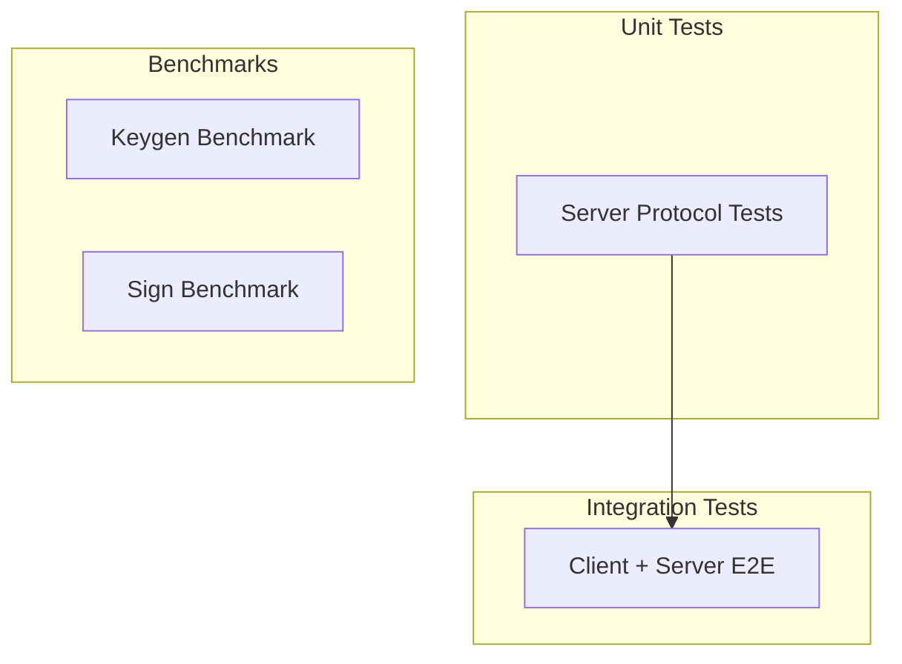
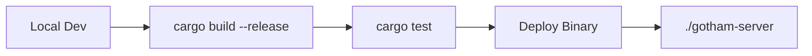

# Operations

## Dependencies

### Workspace Dependencies

| Package | Version | Purpose | Risk | Evidence |
|---------|---------|---------|------|----------|
| two-party-ecdsa | Git (ZenGo-X) | Core 2P-ECDSA protocol | High - cryptographic core | [`Cargo.toml:25`](../Cargo.toml#L25) |
| gotham-engine | Git (ZenGo-X) | Server MPC routes | High - protocol handlers | [`Cargo.toml:26`](../Cargo.toml#L26) |
| rocket | 0.5.0-rc.1 | HTTP server | Medium - RC version | [`Cargo.toml:18`](../Cargo.toml#L18) |
| secp256k1 | 0.21.0 | Elliptic curve | Low - well-audited | [`Cargo.toml:23`](../Cargo.toml#L23) |
| serde | 1.x | Serialization | Low - stable | [`Cargo.toml:12`](../Cargo.toml#L12) |
| reqwest | 0.9.5 | HTTP client | Medium - older version | [`Cargo.toml:15`](../Cargo.toml#L15) |

### Server Dependencies (gotham-server)

| Package | Version | Purpose | Evidence |
|---------|---------|---------|----------|
| rocksdb | (via gotham-engine) | Key-value storage | [`public_gotham.rs:15`](../gotham-server/src/public_gotham.rs#L15) |
| config | 0.9.2 | Configuration management | [`Cargo.toml:19`](../Cargo.toml#L19) |
| tokio | (via rocket) | Async runtime | [`server.rs:4`](../gotham-server/src/server.rs#L4) |

### Demo Wallet Dependencies

| Package | Version | Purpose | Evidence |
|---------|---------|---------|----------|
| bitcoin | (latest) | Bitcoin primitives | [`demo-wallet/src/bitcoin/mod.rs:10-16`](../demo-wallet/src/bitcoin/mod.rs#L10-L16) |
| ethers | (latest) | Ethereum integration | [`demo-wallet/src/ethereum/mod.rs:11-15`](../demo-wallet/src/ethereum/mod.rs#L11-L15) |
| clap | (latest) | CLI parsing | [`demo-wallet/src/main.rs:3`](../demo-wallet/src/main.rs#L3) |
| electrumx_client | (latest) | Bitcoin UTXO queries | [`demo-wallet/src/bitcoin/mod.rs:17`](../demo-wallet/src/bitcoin/mod.rs#L17) |

---

## Configuration

### Server Configuration

| Variable | Type | Default | Required | Evidence |
|----------|------|---------|----------|----------|
| `db_name` | String | `"db"` | N | [`public_gotham.rs:37`](../gotham-server/src/public_gotham.rs#L37) |

**Settings.toml** (gotham-server):
```toml
db_name = "gotham_db"
```

Evidence: [`gotham-server/Settings.toml`](../gotham-server/Settings.toml)

**Rocket.toml** (server config):
```toml
[default]
port = 8000
```

Evidence: [`gotham-server/Rocket.toml`](../gotham-server/Rocket.toml)

### Client Configuration

| Variable | Type | Default | Required | Evidence |
|----------|------|---------|----------|----------|
| `gotham_server_url` | String | `http://127.0.0.1:8000` | N | [`main.rs:66-68`](../demo-wallet/src/main.rs#L66-L68) |
| `wallet_file` | String | `wallet.json` | N | [`main.rs:70-72`](../demo-wallet/src/main.rs#L70-L72) |

### Demo Wallet Configuration

| Variable | Type | Default | Required | Evidence |
|----------|------|---------|----------|----------|
| `rpc_url` | String | - | Y (EVM) | [`main.rs:45`](../demo-wallet/src/main.rs#L45) |
| `chain_id` | u64 | - | N (EVM) | [`main.rs:49`](../demo-wallet/src/main.rs#L49) |
| `electrum_server_url` | String | - | Y (Bitcoin) | [`main.rs:51`](../demo-wallet/src/main.rs#L51) |

**Environment Variables**:
```bash
# Override settings via environment
export GOTHAM_GOTHAM_SERVER_URL="http://prod-server:8000"
export GOTHAM_WALLET_FILE="/path/to/wallet.json"
```

Evidence: [`main.rs:60`](../demo-wallet/src/main.rs#L60)

---

## Testing

| Type | Command | Coverage | Evidence |
|------|---------|----------|----------|
| Unit | `cargo test -p server-lib` | Core protocol | [`gotham-server/src/tests.rs`](../gotham-server/src/tests.rs) |
| Integration | `cargo test -p integration-tests` | E2E flow | [`integration-tests/tests/ecdsa.rs`](../integration-tests/tests/ecdsa.rs) |
| Benchmark | `cargo bench --bench keygen_bench` | Performance | [`README.md:90`](../README.md#L90) |
| Benchmark | `cargo bench --bench sign_bench` | Performance | [`README.md:91`](../README.md#L91) |

### Test Architecture



| Layer | Scope | Mocking Strategy | Fixtures | Evidence |
|-------|-------|------------------|----------|----------|
| Unit | Server protocol handling | Rocket test client | In-memory RocksDB | [`tests.rs:221-250`](../gotham-server/src/tests.rs#L221-L250) |
| Integration | Full keygen + sign | RocketClient wrapper | Fresh DB per test | [`ecdsa.rs:195-219`](../integration-tests/tests/ecdsa.rs#L195-L219) |
| Benchmark | Keygen latency | None (real server) | N/A | [`benches/`](../gotham-server/benches/) |

### Running Tests

```bash
# All tests
cargo test --workspace

# Server unit tests only
cargo test -p server-lib

# Integration tests (requires server)
cargo test -p integration-tests

# With logging
RUST_LOG=debug cargo test

# Specific test
cargo test unit_test_key_gen_and_sign
```

### Test Data Strategy

- **Unit tests**: Generate fresh keys per test, use deterministic RNG where possible
- **Integration tests**: Each test creates isolated DB via `db_name` parameter
- **Fixtures**: None - all test data generated at runtime

Evidence: [`tests.rs:230-233`](../gotham-server/src/tests.rs#L230-L233)

---

## Deployment



| Stage | Trigger | Rollback | Evidence |
|-------|---------|----------|----------|
| Build | Manual / CI | Revert commit | N/A |
| Test | Post-build | Block deployment | N/A |
| Deploy | Manual | Replace binary | N/A |

### Build Commands

```bash
# Development
cargo build

# Release (optimized)
cargo build --release

# Server only
cargo build -p server-lib --release
```

### Launch Script

```bash
#!/bin/bash
# launch-server.sh
cd gotham-server && cargo run --release
```

Evidence: [`launch-server.sh`](../launch-server.sh)

### Docker Deployment (Recommended)

```dockerfile
# Example Dockerfile (not included in repo)
FROM rust:1.70 as builder
WORKDIR /app
COPY . .
RUN cargo build --release -p server-lib

FROM debian:bookworm-slim
COPY --from=builder /app/target/release/gotham-server /usr/local/bin/
EXPOSE 8000
CMD ["gotham-server"]
```

---

## Migration & Evolution

### Database Migration

| Type | Strategy | Rollback | Evidence |
|------|----------|----------|----------|
| RocksDB schema | Manual migration scripts | Backup before migration | N/A |

**Note**: No automated migration system. Key share format changes require manual intervention.

### API Versioning

| Strategy | Implementation | Evidence |
|----------|----------------|----------|
| URL Path | Not implemented (single version) | [`server.rs:27-36`](../gotham-server/src/server.rs#L27-L36) |

**Deprecation Policy**: No formal policy. Breaking changes documented in CHANGELOG.

Evidence: [`CHANGELOG.md`](../CHANGELOG.md)

### Upgrade Path

1. **Server upgrade**: Stop server → backup DB → replace binary → restart
2. **Client upgrade**: Update dependency → rebuild → existing wallets remain compatible
3. **Protocol upgrade**: Requires coordinated client + server upgrade

---

## Operational Checklist

### Pre-Deployment

- [ ] Run full test suite: `cargo test --workspace`
- [ ] Run benchmarks to verify performance: `cargo bench`
- [ ] Backup existing RocksDB directory
- [ ] Verify Settings.toml configuration

### Post-Deployment

- [ ] Verify server responds: `curl http://localhost:8000/health` (returns 404 - expected)
- [ ] Test keygen: Run integration test against production server
- [ ] Monitor RocksDB disk usage
- [ ] Check server logs for errors

### Monitoring Points

| Metric | Source | Alert Threshold |
|--------|--------|-----------------|
| Request latency | Application logs | >2s for keygen, >500ms for sign |
| Error rate | HTTP 4xx/5xx | >1% |
| DB size | Filesystem | >80% disk |
| Process memory | OS metrics | >2GB |
