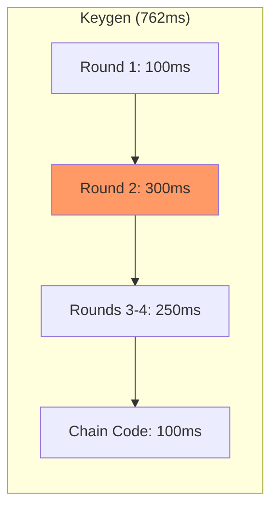

# Performance & Observability

## Service Level Indicators (SLIs)

| SLI | Definition | Measurement | Target (SLO) | Evidence |
|-----|------------|-------------|--------------|----------|
| Keygen Latency | Time from first request to final response | Client-side timing | p95 < 1000ms | [`README.md:90`](../README.md#L90) |
| Sign Latency | Time from first request to signature | Client-side timing | p95 < 200ms | [`README.md:91`](../README.md#L91) |
| Availability | Successful requests / Total requests | HTTP status codes | 99.9% | N/A (no monitoring) |
| Error Rate | 4xx + 5xx / Total requests | HTTP status codes | <0.1% | N/A (no monitoring) |

---

## Observability Stack

> **Note**: Gotham City does not include built-in observability tooling. This section documents what should be implemented for production deployments.

| Layer | Tool | Purpose | Evidence |
|-------|------|---------|----------|
| Metrics | Not implemented | — | — |
| Logging | `log` crate (basic) | Request timing | [`lib.rs:53`](../gotham-client/src/lib.rs#L53) |
| Tracing | Not implemented | — | — |
| Alerting | Not implemented | — | — |

### Current Logging

The codebase includes basic timing logs:

```rust
// Client-side request timing
info!("(req {}, took: {:?})", path, TimeFormat(start.elapsed()));

// Keygen completion timing
println!("(id: {}) Took: {:?}", id, TimeFormat(start.elapsed()));
```

Evidence: 
- [`lib.rs:53`](../gotham-client/src/lib.rs#L53)
- [`keygen.rs:118`](../gotham-client/src/ecdsa/keygen.rs#L118)

### Recommended Observability Implementation

For production deployments, add:

1. **Metrics** (Prometheus):
   - `gotham_keygen_duration_seconds` (histogram)
   - `gotham_sign_duration_seconds` (histogram)
   - `gotham_requests_total` (counter, labeled by endpoint)
   - `gotham_errors_total` (counter, labeled by error type)

2. **Tracing** (OpenTelemetry):
   - Span per protocol round
   - Trace ID propagation from client to server

3. **Structured Logging**:
   - JSON format with session ID, operation type, duration

---

## Performance Baselines

| Endpoint/Process | p50 | p95 | p99 | Throughput | Evidence |
|------------------|-----|-----|-----|------------|----------|
| `/ecdsa/keygen/*` (full) | ~700ms | 762ms | ~900ms | ~1.3 ops/sec | [`README.md:90`](../README.md#L90) |
| `/ecdsa/sign/*` (full) | ~140ms | 151ms | ~180ms | ~6.6 ops/sec | [`README.md:91`](../README.md#L91) |

**Test Environment**: MacBook Air M2, 8GB RAM, macOS 13.5, localhost network

### Latency Breakdown (Estimated)

| Operation | Component | Estimated Time |
|-----------|-----------|----------------|
| Keygen Round 1 | EC point generation, commitment | ~100ms |
| Keygen Round 2 | Paillier key generation | ~300ms |
| Keygen Round 3-4 | PDL proof generation/verification | ~250ms |
| Keygen Chain Code | DH key exchange | ~100ms |
| Sign Round 1 | Ephemeral key generation | ~50ms |
| Sign Round 2 | Partial signature computation | ~100ms |

### Benchmark Commands

```bash
# Run keygen benchmark
cd gotham-server && cargo bench --bench keygen_bench

# Run sign benchmark  
cd gotham-server && cargo bench --bench sign_bench
```

Evidence: [`README.md:90-91`](../README.md#L90-L91)

---

## Capacity Planning

| Resource | Current Usage | Limit | Scaling Strategy | Evidence |
|----------|---------------|-------|------------------|----------|
| CPU | Single-threaded crypto | 1 core/op | Horizontal (multiple servers) | N/A |
| Memory | ~50MB base | 2GB recommended | Vertical | N/A |
| DB Storage | ~1KB/key share | Disk-bound | Larger disk / DB sharding | N/A |
| Network | ~10KB/keygen | Bandwidth | CDN for static, optimize payloads | N/A |

### Key Share Storage Estimate

Each key share stores approximately:
- Session ID: ~36 bytes (UUID)
- Protocol state: ~500-800 bytes (serialized crypto objects)
- Total per wallet: ~1KB

**Capacity formula**: `wallets × 1KB = storage required`

Example: 1M wallets ≈ 1GB storage

---

## Performance Optimization Opportunities

| Optimization | Impact | Complexity | Status |
|--------------|--------|------------|--------|
| Async crypto operations | +20% throughput | Medium | Not implemented |
| Connection pooling (client) | +10% latency | Low | Not implemented |
| Batch keygen | +50% throughput for bulk | High | Not implemented |
| Pre-computed Paillier keys | -200ms keygen | Medium | Not implemented |
| Protocol state caching | -10% latency | Low | Partial (DB) |

### Bottleneck Analysis



**Primary bottleneck**: Paillier key generation in Round 2 (~40% of total time)

---

## Dashboards & Alerts (Recommended)

### Recommended Dashboard Panels

| Dashboard | Purpose | Key Panels |
|-----------|---------|------------|
| Gotham Health | Real-time SLI monitoring | Keygen/Sign latency histograms, Error rate, Request count |
| Protocol Breakdown | Detailed timing | Per-round latency, DB read/write times |
| Capacity | Resource monitoring | DB size, Memory usage, Active sessions |

### Recommended Alerts

| Alert | Condition | Severity | Runbook |
|-------|-----------|----------|---------|
| High Keygen Latency | p95 > 2000ms for 5m | P2 | [Key_Generation_Failure.md](./Runbooks/Key_Generation_Failure.md) |
| High Sign Latency | p95 > 500ms for 5m | P2 | [Signing_Failure.md](./Runbooks/Signing_Failure.md) |
| High Error Rate | error_rate > 1% for 5m | P1 | [Key_Generation_Failure.md](./Runbooks/Key_Generation_Failure.md) |
| DB Disk Full | disk_usage > 90% | P1 | [Database_Recovery.md](./Runbooks/Database_Recovery.md) |
