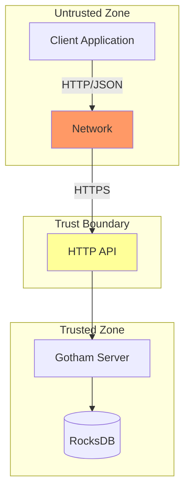

# Security

## Threat Model

**Attack Surface**:
- HTTP API endpoints (unauthenticated by default)
- RocksDB storage (local filesystem)
- Network communication (client ↔ server)

**Trust Boundaries**:
- Client application ↔ Gotham Server (HTTP)
- Gotham Server ↔ RocksDB (local)

**Top 3 Threats** (80/20):
1. **Key share theft** from server storage
2. **Man-in-the-middle** interception of protocol messages
3. **Denial of service** exhausting server resources



| Priority | Threat | Vector | Mitigation | Evidence |
|----------|--------|--------|------------|----------|
| CRITICAL | Key Share Theft | DB access, server compromise | Encryption at rest (not implemented), access controls | N/A |
| CRITICAL | MITM Attack | Network interception | HTTPS required (application responsibility) | N/A |
| CRITICAL | Unauthorized Signing | API access without auth | Authorization hook (permissive by default) | [`public_gotham.rs:93-95`](../gotham-server/src/public_gotham.rs#L93-L95) |
| IMPORTANT | Session Hijacking | Session ID prediction | UUID v4 (cryptographically random) | N/A |
| IMPORTANT | DoS Attack | Resource exhaustion | Rate limiting (not implemented) | N/A |
| IMPORTANT | Protocol Manipulation | Invalid crypto parameters | ZK proofs verify correctness | [`keygen.rs:75-80`](../gotham-client/src/ecdsa/keygen.rs#L75-L80) |
| OPTIONAL | Information Disclosure | Error messages | Generic error handlers | [`server.rs:6-19`](../gotham-server/src/server.rs#L6-L19) |

---

## Cryptographic Security

### Protocol Security

The 2P-ECDSA implementation is based on Lindell's Crypto17 paper with proven security:

| Property | Mechanism | Evidence |
|----------|-----------|----------|
| Unforgeability | Neither party alone can sign | Protocol design |
| Key Privacy | Server learns nothing about client's share | Paillier encryption |
| Correctness | Valid ECDSA signatures produced | ZK proofs |

**Reference**: [Fast Secure Two-Party ECDSA Signing](https://eprint.iacr.org/2017/552) (Lindell, 2017)

### Cryptographic Primitives

| Primitive | Implementation | Security Level | Evidence |
|-----------|----------------|----------------|----------|
| ECDSA | secp256k1 curve | 128-bit | [`Cargo.toml:23`](../Cargo.toml#L23) |
| Paillier | two-party-ecdsa crate | 2048-bit modulus | `two-party-ecdsa` |
| Random Generation | OS entropy (rand crate) | Cryptographically secure | [`Cargo.toml:24`](../Cargo.toml#L24) |

---

## Authentication & Authorization

### Current Implementation

| Mechanism | Implementation | Token Lifetime | Refresh Strategy | Evidence |
|-----------|----------------|----------------|------------------|----------|
| Bearer Token | Optional header | N/A | N/A | [`lib.rs:22`](../gotham-client/src/lib.rs#L22) |
| Authorization | Always grants (⚠️) | N/A | N/A | [`public_gotham.rs:93-95`](../gotham-server/src/public_gotham.rs#L93-L95) |

**⚠️ WARNING**: Default implementation has no authorization:

```rust
fn granted(&self, message: &str, customer_id: &str) -> Result<bool, DatabaseError> {
    Ok(true)  // ALWAYS GRANTS - PRODUCTION MUST OVERRIDE
}
```

Evidence: [`public_gotham.rs:93-95`](../gotham-server/src/public_gotham.rs#L93-L95)

### Recommended Authorization

For production, implement the `granted` function to:
1. Validate bearer token against identity provider
2. Check transaction authorization policy
3. Implement rate limiting per customer

| Resource | Permission Model | Enforcement Point | Evidence |
|----------|------------------|-------------------|----------|
| `/ecdsa/keygen/*` | Customer ID match | `Db::granted` | [`public_gotham.rs:93`](../gotham-server/src/public_gotham.rs#L93) |
| `/ecdsa/sign/*` | Customer ID + tx policy | `Db::granted` | [`public_gotham.rs:93`](../gotham-server/src/public_gotham.rs#L93) |

---

## Secrets Management

| Secret Type | Storage | Rotation | Access Control | Evidence |
|-------------|---------|----------|----------------|----------|
| Server key shares | RocksDB (plaintext) | N/A | Filesystem permissions | [`public_gotham.rs:41`](../gotham-server/src/public_gotham.rs#L41) |
| Client key shares | JSON file (plaintext) | N/A | Filesystem permissions | [`bitcoin/mod.rs:245-248`](../demo-wallet/src/bitcoin/mod.rs#L245-L248) |
| Auth tokens | Environment / config | Manual | Application config | [`lib.rs:22`](../gotham-client/src/lib.rs#L22) |

### Recommended Improvements

1. **Encryption at rest**: Encrypt RocksDB values with a master key
2. **Key rotation**: Implement key share rotation protocol (partially implemented)
3. **HSM integration**: Store server shares in hardware security module
4. **Secure enclave**: Run server in TEE (SGX, TrustZone)

---

## Key Backup & Recovery

The Bitcoin wallet includes an escrow backup system:

| Feature | Implementation | Evidence |
|---------|----------------|----------|
| Backup encryption | Centipede verifiable encryption | [`bitcoin/mod.rs:143-167`](../demo-wallet/src/bitcoin/mod.rs#L143-L167) |
| Backup verification | Zero-knowledge proof | [`bitcoin/mod.rs:169-192`](../demo-wallet/src/bitcoin/mod.rs#L169-L192) |
| Recovery | Escrow decryption (commented out) | [`bitcoin/mod.rs:196-243`](../demo-wallet/src/bitcoin/mod.rs#L196-L243) |

### Escrow Parameters

```rust
pub const SEGMENT_SIZE: usize = 8;
pub const NUM_SEGMENTS: usize = 32;
```

Evidence: [`bitcoin/escrow.rs`](../demo-wallet/src/bitcoin/escrow.rs)

---

## Incident Response

| Scenario | Detection | Response | Runbook |
|----------|-----------|----------|---------|
| Server key share compromise | External report / audit | Rotate all affected keys, notify users | [Database_Recovery.md](./Runbooks/Database_Recovery.md) |
| Client compromise | User report | Invalidate session, re-keygen | N/A |
| Protocol vulnerability | Security disclosure | Patch, rotate keys if needed | N/A |
| DoS attack | High latency / unavailability | Scale, rate limit, block IPs | N/A |

---

## Security Checklist

### Deployment Security

- [ ] Enable HTTPS (reverse proxy or Rocket TLS)
- [ ] Implement proper `granted()` authorization
- [ ] Set restrictive filesystem permissions on DB directory
- [ ] Enable firewall, restrict API access
- [ ] Regular security updates for dependencies

### Operational Security

- [ ] Regular backup of RocksDB (encrypted)
- [ ] Audit logs for all signing operations
- [ ] Key rotation schedule (if implemented)
- [ ] Incident response plan documented

### Code Security

- [ ] Dependency audit: `cargo audit`
- [ ] No hardcoded secrets
- [ ] Input validation on all endpoints
- [ ] Constant-time comparisons for crypto

---

## Compliance

> **Note**: Gotham City is provided as-is for educational/research purposes. Production deployments must implement additional controls for compliance.

| Standard | Requirement | Implementation | Evidence |
|----------|-------------|----------------|----------|
| SOC 2 | Access controls | Not implemented | — |
| PCI-DSS | Key management | Partial (key splitting) | Protocol design |
| GDPR | Data protection | Application responsibility | — |

**Disclaimer**: From [`README.md:107-108`](../README.md#L107-L108):
> USE AT YOUR OWN RISK, we are not responsible for software/hardware and/or any transactional issues that may occur while using Gotham city.
