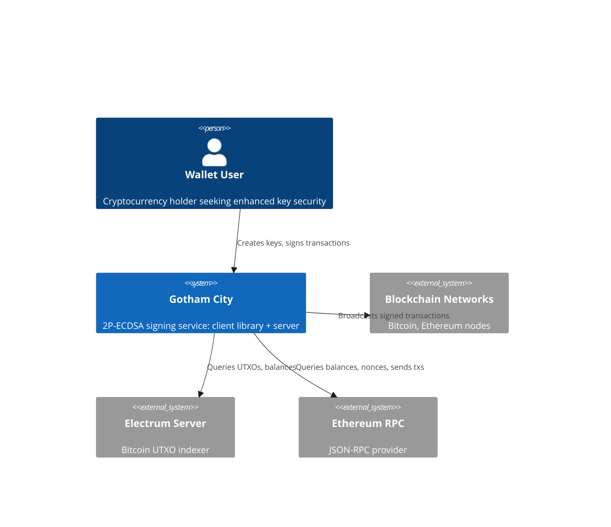
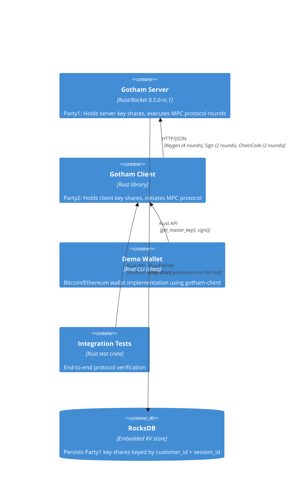
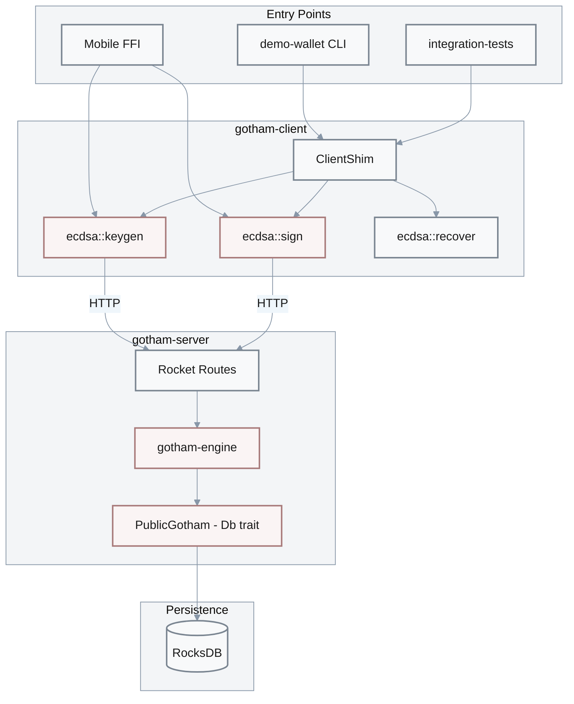
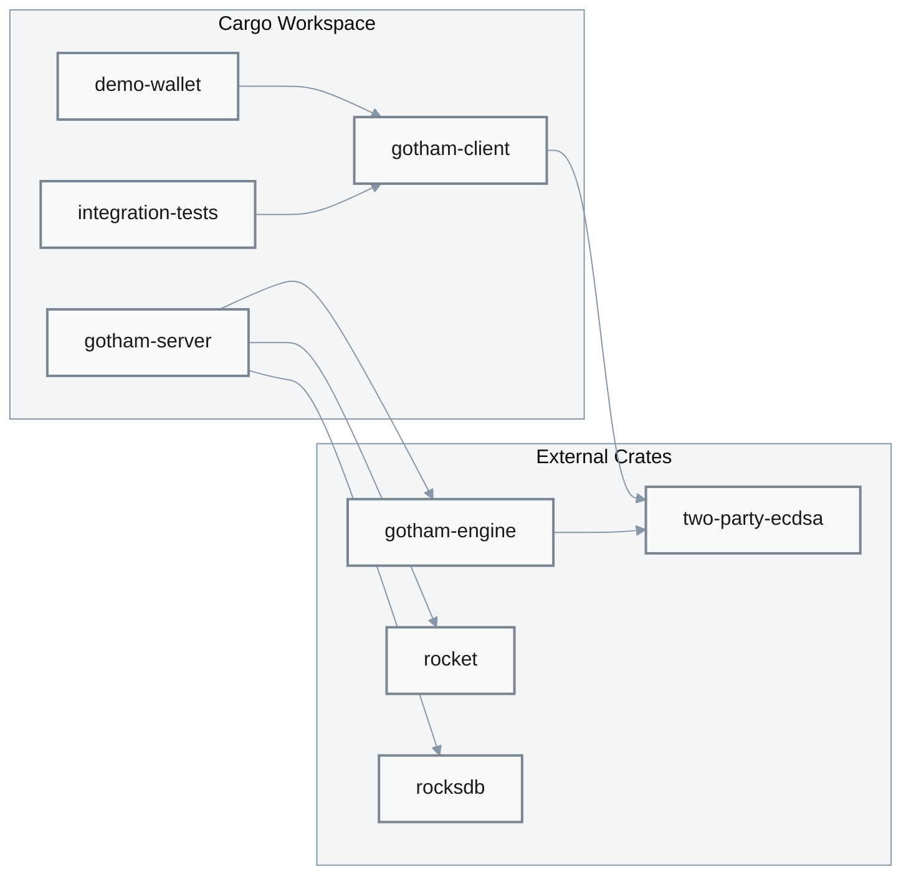
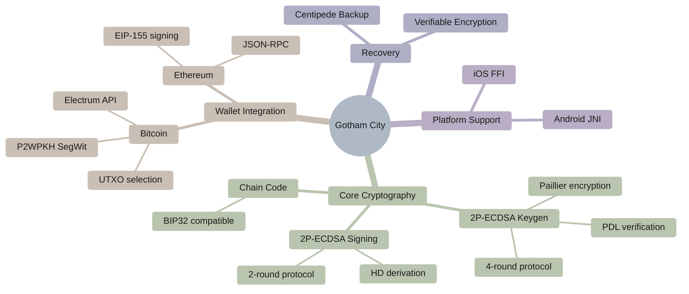

# Architecture

## Context (C4 L1)

**Boundary**: Gotham City provides two-party ECDSA key generation and signing services. External blockchain networks, wallet applications, and indexing services interact with the system but are outside its boundary.



| Actor | Type | Interaction | Evidence |
|-------|------|-------------|----------|
| Wallet User | User | Creates 2P key shares via client library, requests signatures | [`gotham-client/src/lib.rs:26-34`](../gotham-client/src/lib.rs#L26-L34) |
| Electrum Server | External | Bitcoin UTXO queries for balance and transaction construction | [`demo-wallet/src/bitcoin/`](../demo-wallet/src/bitcoin/) |
| Ethereum RPC | External | Balance queries, nonce retrieval, transaction broadcasting | [`demo-wallet/src/ethereum/`](../demo-wallet/src/ethereum/) |
| Mobile Apps | External | iOS/Android apps via FFI bindings (C ABI) | [`gotham-client/src/ecdsa/keygen.rs:128-155`](../gotham-client/src/ecdsa/keygen.rs#L128-L155) |
| Android Apps | External | JNI bindings for Android integration | [`gotham-client/src/ecdsa/keygen.rs:157-241`](../gotham-client/src/ecdsa/keygen.rs#L157-L241) |

---

## Containers (C4 L2)

**Pattern**: Client-Server with RESTful API — chosen over:
- **gRPC**: Simpler HTTP integration, better mobile FFI compatibility
- **WebSocket**: Stateless request model preferred for MPC rounds
- **Local-only**: Requires key share distribution for security model

**Trade-offs**:
- **Benefits**: Simple HTTP integration, stateless server design, easy mobile FFI, no streaming complexity
- **Costs**: Per-request overhead for multi-round protocols (4 rounds keygen, 2 rounds sign), no bidirectional communication

**Limitations**: Not recommended for real-time bidirectional communication or streaming use cases



| Container | Tech | Purpose | Evidence |
|-----------|------|---------|----------|
| gotham-server | Rust, Rocket 0.5.0-rc.1 | MPC protocol server (Party1) | [`gotham-server/src/server.rs:21-39`](../gotham-server/src/server.rs#L21-L39) |
| gotham-client | Rust library | MPC protocol client (Party2) | [`gotham-client/src/lib.rs:19-24`](../gotham-client/src/lib.rs#L19-L24) |
| demo-wallet | Rust CLI (clap) | Bitcoin/Ethereum wallet demo | [`demo-wallet/src/main.rs:11-19`](../demo-wallet/src/main.rs#L11-L19) |
| integration-tests | Rust test crate | End-to-end protocol tests | [`integration-tests/tests/ecdsa.rs`](../integration-tests/tests/ecdsa.rs) |

| Attribute | Mechanism | Baseline | Target | Evidence |
|-----------|-----------|----------|--------|----------|
| Keygen Latency (p95) | 4-round protocol + chain code | 762ms | <1s | [`README.md:90`](../README.md#L90) |
| Sign Latency (p95) | 2-round protocol | 151ms | <200ms | [`README.md:91`](../README.md#L91) |
| Availability | Single server instance | N/A | Deployment-dependent | N/A |

---

## Structure

```
gotham-city/
├── gotham-server/           # MPC server (Party1)
│   ├── src/
│   │   ├── main.rs          # Rocket server entry point
│   │   ├── server.rs        # Route registration, error catchers
│   │   ├── public_gotham.rs # Db trait implementation (RocksDB)
│   │   ├── mod.rs           # Module exports
│   │   └── tests.rs         # Unit tests
│   ├── Cargo.toml           # Server dependencies
│   ├── Settings.toml        # Server configuration (db_name, auth)
│   └── Rocket.toml          # Rocket framework config
├── gotham-client/           # MPC client library (Party2)
│   ├── src/
│   │   ├── lib.rs           # ClientShim, HTTP client wrapper
│   │   ├── ecdsa/           # ECDSA protocol implementations
│   │   │   ├── mod.rs       # Module exports
│   │   │   ├── keygen.rs    # 4-round key generation + FFI
│   │   │   ├── sign.rs      # 2-round signing + FFI
│   │   │   ├── recover.rs   # Key recovery via Centipede
│   │   │   ├── rotate.rs    # Key rotation protocol
│   │   │   └── types.rs     # PrivateShare type definition
│   │   └── utilities/       # Helper functions (error handling)
│   └── Cargo.toml
├── demo-wallet/             # CLI wallet demonstration
│   ├── src/
│   │   ├── main.rs          # CLI entry point (clap)
│   │   ├── bitcoin/         # Bitcoin wallet (Electrum, P2WPKH)
│   │   └── ethereum/        # Ethereum wallet (JSON-RPC, EIP-155)
│   └── Cargo.toml
├── integration-tests/       # E2E protocol tests
│   ├── tests/
│   │   └── ecdsa.rs         # Keygen + sign integration tests
│   └── Cargo.toml
├── white-paper/             # Academic documentation
│   └── white-paper.pdf      # Protocol description and security proofs
├── Cargo.toml               # Workspace definition
└── README.md                # Project overview and benchmarks
```

| Directory | Purpose | Entry Point |
|-----------|---------|-------------|
| `gotham-server/src/` | MPC server implementation | [`main.rs:1-5`](../gotham-server/src/main.rs#L1-L5) |
| `gotham-client/src/` | Client library for MPC protocol | [`lib.rs:1`](../gotham-client/src/lib.rs#L1) |
| `gotham-client/src/ecdsa/` | ECDSA keygen/sign/recover modules | [`mod.rs`](../gotham-client/src/ecdsa/mod.rs) |
| `demo-wallet/src/bitcoin/` | Bitcoin wallet implementation | [`main.rs:74-76`](../demo-wallet/src/main.rs#L74-L76) |
| `demo-wallet/src/ethereum/` | Ethereum wallet implementation | [`main.rs:75`](../demo-wallet/src/main.rs#L75) |
| `integration-tests/tests/` | E2E protocol verification | [`ecdsa.rs`](../integration-tests/tests/ecdsa.rs) |

---

## Constraints & Assumptions

| Type | Constraint | Rationale | Evidence |
|------|------------|-----------|----------|
| **Trust** | Both parties (client + server) required for signing | 2P-ECDSA security model | Protocol design |
| **Availability** | Server must be online for signing operations | No offline signing without server share | [`sign.rs:40-44`](../gotham-client/src/ecdsa/sign.rs#L40-L44) |
| **Persistence** | Server must persist Party1 key shares | Key recovery requires server share | [`public_gotham.rs:41`](../gotham-server/src/public_gotham.rs#L41) |
| **Performance** | p95 sign latency <200ms | Usability for interactive signing | [`README.md:91`](../README.md#L91) |
| **Transport** | HTTPS required for production | Protect MPC messages from MITM | Application responsibility |

**Trust Assumptions**:

| Assumption | Implication | Violation Impact | Evidence |
|------------|-------------|------------------|----------|
| Honest-but-curious adversary | Server follows protocol but may try to learn key | Malicious server could collude with attacker | Protocol security model |
| Secure transport (HTTPS) | Wire messages encrypted and authenticated | MITM could intercept key material | Application deployment |
| Server storage secure | RocksDB access controlled | Key share theft enables signing with compromised client | [`public_gotham.rs:41`](../gotham-server/src/public_gotham.rs#L41) |
| Client storage secure | Wallet JSON file protected | Key share theft enables signing with compromised server | Application responsibility |

---

## Project Graphs

### Call Graph (Critical Path Highlighted)



| Node | File | Fan-In | Fan-Out | Critical Path | Evidence |
|------|------|--------|---------|---------------|----------|
| **ecdsa::keygen** | `keygen.rs` | 3 (wallet, tests, FFI) | 1 (ClientShim) | ✅ Yes | [`keygen.rs:37`](../gotham-client/src/ecdsa/keygen.rs#L37) |
| **ecdsa::sign** | `sign.rs` | 3 (wallet, tests, FFI) | 1 (ClientShim) | ✅ Yes | [`sign.rs:28`](../gotham-client/src/ecdsa/sign.rs#L28) |
| **gotham-engine** | External crate | 1 (Rocket) | 1 (Db trait) | ✅ Yes | [`Cargo.toml:26`](../Cargo.toml#L26) |
| **PublicGotham (Db)** | `public_gotham.rs` | 1 (engine) | 1 (RocksDB) | ✅ Yes | [`public_gotham.rs:57`](../gotham-server/src/public_gotham.rs#L57) |
| ClientShim | `lib.rs` | 3 | 2 | ✅ Yes | [`lib.rs:26-34`](../gotham-client/src/lib.rs#L26-L34) |

### Dependency Graph (Internal Modules)



| Module | Depends On | Depended By | Coupling | Evidence |
|--------|------------|-------------|----------|----------|
| `demo-wallet` | gotham-client | — (entry) | Low | [`demo-wallet/Cargo.toml`](../demo-wallet/Cargo.toml) |
| `gotham-client` | two-party-ecdsa | demo-wallet, tests | Medium | [`gotham-client/Cargo.toml`](../gotham-client/Cargo.toml) |
| `gotham-server` | gotham-engine, rocksdb, rocket | — (entry) | Medium | [`gotham-server/Cargo.toml`](../gotham-server/Cargo.toml) |
| `integration-tests` | gotham-client | — (test) | Low | [`integration-tests/Cargo.toml`](../integration-tests/Cargo.toml) |

### Critical Path Analysis

| Path | Traversal | Latency Contribution | Optimization Target | Evidence |
|------|-----------|----------------------|---------------------|----------|
| Keygen → DB | Client → 4 HTTP rounds → Engine → RocksDB | ~762ms total | Network batching (limited by protocol) | [`README.md:90`](../README.md#L90) |
| Sign → DB | Client → 2 HTTP rounds → Engine → RocksDB | ~151ms total | Connection pooling, DB caching | [`README.md:91`](../README.md#L91) |

---

## Feature Tree



| Priority | Feature | Status | Dependencies | Evidence |
|----------|---------|--------|--------------|----------|
| P1 | 2P-ECDSA Key Generation | GA | two-party-ecdsa | [`keygen.rs`](../gotham-client/src/ecdsa/keygen.rs) |
| P1 | 2P-ECDSA Signing | GA | two-party-ecdsa | [`sign.rs`](../gotham-client/src/ecdsa/sign.rs) |
| P1 | HD Key Derivation | GA | Key Generation | [`keygen.rs:102-106`](../gotham-client/src/ecdsa/keygen.rs#L102-L106) |
| P2 | Bitcoin Wallet | GA | Signing, Electrum | [`demo-wallet/src/bitcoin/`](../demo-wallet/src/bitcoin/) |
| P2 | Ethereum Wallet | GA | Signing, RPC | [`demo-wallet/src/ethereum/`](../demo-wallet/src/ethereum/) |
| P2 | iOS FFI Bindings | GA | Keygen, Sign | [`keygen.rs:128-155`](../gotham-client/src/ecdsa/keygen.rs#L128-L155) |
| P2 | Android JNI Bindings | GA | Keygen, Sign | [`keygen.rs:157-241`](../gotham-client/src/ecdsa/keygen.rs#L157-L241) |
| P3 | Key Recovery (Centipede) | Partial | Keygen | [`recover.rs`](../gotham-client/src/ecdsa/recover.rs) |
| P3 | Key Rotation | Partial | Keygen | [`rotate.rs`](../gotham-client/src/ecdsa/rotate.rs) |

---

## Workspace Dependencies

The project uses a Cargo workspace with shared dependencies defined in the root `Cargo.toml`:

| Dependency | Version | Purpose | Evidence |
|------------|---------|---------|----------|
| two-party-ecdsa | Git (ZenGo-X) | Core 2P-ECDSA cryptographic protocol | [`Cargo.toml:25`](../Cargo.toml#L25) |
| gotham-engine | Git (ZenGo-X) | Server-side MPC route handlers | [`Cargo.toml:26`](../Cargo.toml#L26) |
| rocket | 0.5.0-rc.1 | HTTP server framework (async) | [`Cargo.toml:18`](../Cargo.toml#L18) |
| secp256k1 | 0.21.0 | Elliptic curve operations | [`Cargo.toml:23`](../Cargo.toml#L23) |
| serde | 1.x | JSON serialization/deserialization | [`Cargo.toml:12`](../Cargo.toml#L12) |
| reqwest | 0.9.5 | HTTP client for MPC protocol | [`Cargo.toml:15`](../Cargo.toml#L15) |
| jsonwebtoken | 8 | JWT handling for auth tokens | [`Cargo.toml:21`](../Cargo.toml#L21) |
| uuid | 0.7 (v4) | Session ID generation | [`Cargo.toml:20`](../Cargo.toml#L20) |
| config | 0.9.2 | Configuration file parsing | [`Cargo.toml:19`](../Cargo.toml#L19) |
