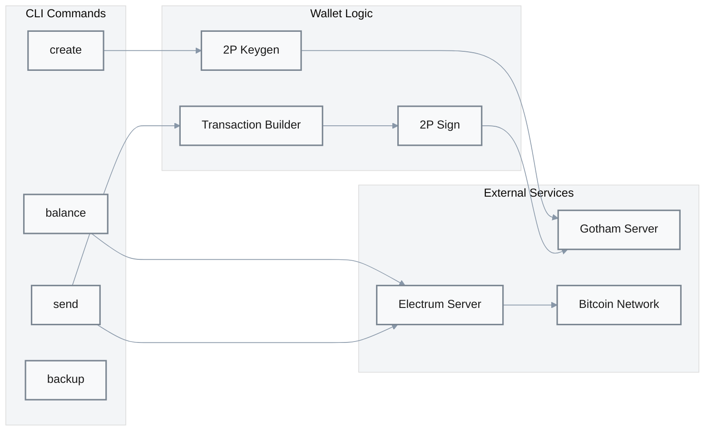
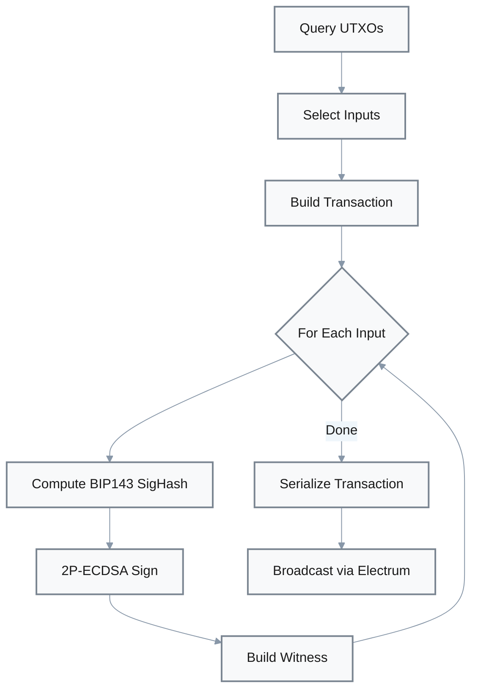

# Bitcoin Wallet Component [P2]

**Location**: [`demo-wallet/src/bitcoin/`](../../demo-wallet/src/bitcoin/)  
**Priority**: P2 — Demonstration of 2P-ECDSA integration with Bitcoin network  
**Purpose**: CLI wallet implementation for Bitcoin using gotham-client and Electrum API  
**Design**: SegWit P2WPKH addresses with Electrum backend — chosen for modern Bitcoin compatibility and lightweight indexing  
**Limitations**: Demo-quality code; Electrum dependency for UTXO queries; single-address wallet (non-HD address rotation)

## Overview

The Bitcoin wallet demonstrates practical integration of 2P-ECDSA with the Bitcoin network. It supports wallet creation, balance queries, and transaction signing/broadcasting via Electrum servers.



## CLI Commands

| Command | Purpose | Evidence |
|---------|---------|----------|
| `bitcoin create` | Generate new 2P-ECDSA wallet | [`main.rs:76`](../../demo-wallet/src/main.rs#L76) |
| `bitcoin balance` | Query wallet balance via Electrum | CLI implementation |
| `bitcoin send` | Sign and broadcast Bitcoin transaction | CLI implementation |
| `bitcoin backup` | Create encrypted key backup | CLI implementation |

## Configuration

Settings from `settings.toml` or environment:

| Setting | Purpose | Default | Evidence |
|---------|---------|---------|----------|
| `electrum_server_url` | Electrum server endpoint | Required | [`main.rs:51`](../../demo-wallet/src/main.rs#L51) |
| `wallet_file` | Path to wallet JSON | `wallet.json` | [`main.rs:70-72`](../../demo-wallet/src/main.rs#L70-L72) |
| `gotham_server_url` | Gotham server endpoint | `http://127.0.0.1:8000` | [`main.rs:66-68`](../../demo-wallet/src/main.rs#L66-L68) |

## Transaction Flow

### Signing Process



### Transaction Building

| Stage | Input | Transform | Output |
|-------|-------|-----------|--------|
| UTXO Query | Wallet addresses | Electrum `listunspent` | UTXO list with values |
| Selection | Amount, UTXOs | Greedy selection | Selected inputs |
| Build | UTXOs, recipient, change | BIP143 structure | Unsigned transaction |
| Sign | SigHash, master_key | 2P-ECDSA protocol | Witness data |
| Broadcast | Signed transaction | Electrum `broadcast` | TXID |

## Address Format

Uses **P2WPKH** (Pay-to-Witness-Public-Key-Hash) SegWit addresses:

- Prefix: `bc1` (mainnet) or `tb1` (testnet)
- Lower fees than legacy addresses
- BIP143 signature hash algorithm

## Key Derivation

BIP32-style hierarchical derivation:

```rust
// Derive child key for address index
let mk_child = master_key.get_child(vec![x_pos, y_pos]);
```

Where:
- `x_pos`: Account index (typically 0)
- `y_pos`: Address index

## Wallet Storage

Wallet data is stored as JSON:

```rust
struct Wallet {
    id: String,              // Session ID from keygen
    master_key: MasterKey2,  // Client's key share
    addresses: Vec<Address>, // Derived addresses
}
```

Storage location: `wallet_file` setting (default: `wallet.json`)

## Electrum Integration

The wallet uses Electrum protocol for:

| Operation | Electrum Method | Purpose |
|-----------|-----------------|---------|
| Balance query | `blockchain.scripthash.get_balance` | Get confirmed/unconfirmed balance |
| UTXO listing | `blockchain.scripthash.listunspent` | Get spendable outputs |
| Transaction broadcast | `blockchain.transaction.broadcast` | Submit signed transaction |
| Fee estimation | `blockchain.estimatefee` | Get fee rate |

## Key Backup (Centipede)

Encrypted backup using verifiable encryption:

| Parameter | Value | Purpose |
|-----------|-------|---------|
| Segment Size | 8 | Encryption granularity |
| Num Segments | 32 | Backup redundancy |

Evidence: Referenced in wiki-0 as `bitcoin/escrow.rs`

## Error Handling

| Error Type | Handling | Recovery |
|------------|----------|----------|
| Electrum connection | Return error | Retry or use different server |
| Insufficient funds | Return error | Add more UTXOs |
| Signing failure | Return error | Check server availability |
| Broadcast failure | Return error | Check transaction validity |

## Dependencies

| Crate | Purpose |
|-------|---------|
| `gotham-client` | 2P-ECDSA key/sign operations |
| `bitcoin` | Transaction structures, hashing |
| `electrum-client` | Electrum protocol client |
| `clap` | CLI argument parsing |
| `serde_json` | Wallet file serialization |
