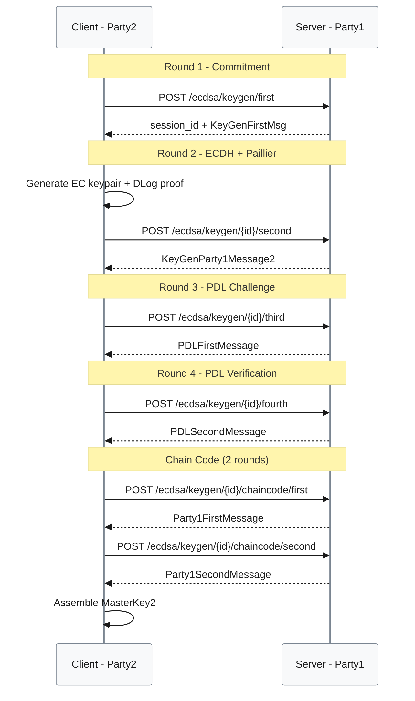

# ECDSA Keygen Component [P1]

**Location**: [`gotham-client/src/ecdsa/keygen.rs:1-242`](../../gotham-client/src/ecdsa/keygen.rs#L1-L242)  
**Priority**: P1 — Core functionality; all wallet operations depend on key generation  
**Purpose**: Implements the client side of the 4-round 2P-ECDSA key generation protocol based on Lindell's Crypto17 paper  
**Design**: Synchronous HTTP-based multi-round protocol — chosen over streaming (simpler error handling, stateless rounds) vs. single-round (protocol requirements)  
**Limitations**: Cannot resume partial keygen; network failure requires full restart; blocking I/O

## Overview

The keygen module executes a 4-round interactive protocol between client (Party2) and server (Party1) to generate a shared ECDSA key pair. Neither party learns the other's share, and the complete private key never exists in one location.



## Public API

| Method | Signature | Purpose | Evidence |
|--------|-----------|---------|----------|
| `get_master_key` | `fn get_master_key<C: Client>(client_shim: &ClientShim<C>) -> PrivateShare` | Execute full keygen protocol, return client key share | [`keygen.rs:37-121`](../../gotham-client/src/ecdsa/keygen.rs#L37-L121) |
| `get_client_master_key` | `unsafe extern "C" fn(endpoint: *const c_char, auth_token: *const c_char) -> *mut c_char` | C FFI binding for iOS | [`keygen.rs:128-155`](../../gotham-client/src/ecdsa/keygen.rs#L128-L155) |
| `Java_...getClientMasterKey` | JNI binding | Android JNI binding | [`keygen.rs:160-241`](../../gotham-client/src/ecdsa/keygen.rs#L160-L241) |

## Protocol Steps

| Step | Client Action | Server Action | Evidence |
|------|---------------|---------------|----------|
| 1 | Request session | Generate commitment, store in DB | [`keygen.rs:40-41`](../../gotham-client/src/ecdsa/keygen.rs#L40-L41) |
| 2 | Generate EC keypair, DLog proof | Verify proof, generate Paillier keys | [`keygen.rs:43-57`](../../gotham-client/src/ecdsa/keygen.rs#L43-L57) |
| 3 | Send PDL challenge | Generate PDL response | [`keygen.rs:59-63`](../../gotham-client/src/ecdsa/keygen.rs#L59-L63) |
| 4 | Verify PDL response | Store final key share | [`keygen.rs:65-80`](../../gotham-client/src/ecdsa/keygen.rs#L65-L80) |
| 5 | Chain code round 1 | Generate CC commitment | [`keygen.rs:82-93`](../../gotham-client/src/ecdsa/keygen.rs#L82-L93) |
| 6 | Chain code round 2 | Reveal CC, verify | [`keygen.rs:95-106`](../../gotham-client/src/ecdsa/keygen.rs#L95-L106) |
| 7 | Assemble MasterKey2 | — | [`keygen.rs:108-120`](../../gotham-client/src/ecdsa/keygen.rs#L108-L120) |

## Dependencies

| Import | Purpose | Evidence |
|--------|---------|----------|
| `two_party_ecdsa::party_one` | Party1 message types | [`keygen.rs:13`](../../gotham-client/src/ecdsa/keygen.rs#L13) |
| `two_party_ecdsa::kms::ecdsa::two_party::MasterKey2` | Client key share container | [`keygen.rs:15`](../../gotham-client/src/ecdsa/keygen.rs#L15) |
| `two_party_ecdsa::kms::chain_code::two_party` | BIP32 chain code derivation | [`keygen.rs:14`](../../gotham-client/src/ecdsa/keygen.rs#L14) |
| `ClientShim` | HTTP client wrapper | [`keygen.rs:22`](../../gotham-client/src/ecdsa/keygen.rs#L22) |

## Output Type

```rust
pub struct PrivateShare {
    pub id: String,           // Session ID for subsequent signing
    pub master_key: MasterKey2, // Client's key share + public key
}
```

Evidence: [`types.rs`](../../gotham-client/src/ecdsa/types.rs)

## Error Handling

| Error Scenario | Handling | Recovery |
|----------------|----------|----------|
| Network timeout | `unwrap()` panics | Restart full keygen |
| Invalid server response | `unwrap()` panics | Check server logs, retry |
| PDL verification failure | `expect()` with message | Server bug or attack; abort |
| Chain code verification | `assert!()` | Protocol error; abort |

## Performance

| Metric | Value | Conditions | Evidence |
|--------|-------|------------|----------|
| Latency (p95) | 762ms | M2 MacBook, localhost | [`README.md:90`](../../README.md#L90) |
| Network Rounds | 6 | 4 keygen + 2 chain code | Protocol design |
| Cryptographic Operations | Paillier keygen (slow), EC operations, ZK proofs | Per execution | two-party-ecdsa crate |
