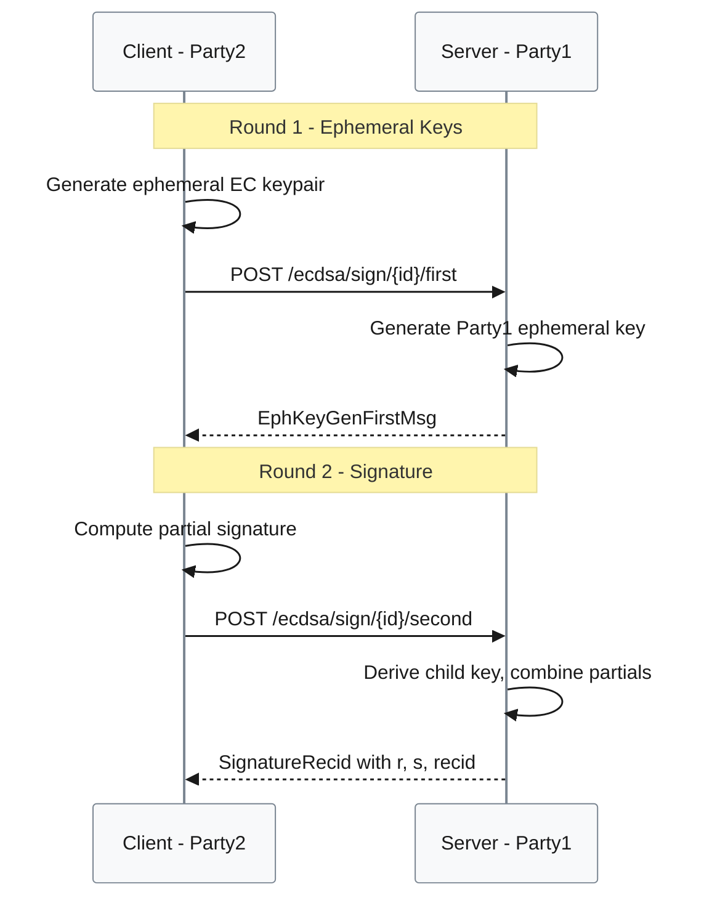

# ECDSA Sign Component [P1]

**Location**: [`gotham-client/src/ecdsa/sign.rs:1-340`](../../gotham-client/src/ecdsa/sign.rs#L1-L340)  
**Priority**: P1 — Core functionality; all transaction signing depends on this module  
**Purpose**: Implements the client side of the 2-round 2P-ECDSA signing protocol  
**Design**: Synchronous HTTP-based protocol with HD key derivation support — chosen for simplicity and mobile compatibility  
**Limitations**: Requires server availability; no offline signing; ~150ms latency per signature

## Overview

The sign module executes a 2-round interactive protocol to produce a valid ECDSA signature without either party possessing the complete private key. Supports BIP32-style hierarchical derivation via `x_pos` and `y_pos` parameters.



## Public API

| Method | Signature | Purpose | Evidence |
|--------|-----------|---------|----------|
| `sign` | `fn sign<C: Client>(client_shim, message, mk, x_pos, y_pos, id) -> Result<SignatureRecid>` | Execute 2-round signing protocol | [`sign.rs:28-66`](../../gotham-client/src/ecdsa/sign.rs#L28-L66) |
| `sign_message` | `unsafe extern "C" fn(...) -> *mut c_char` | C FFI binding for iOS | [`sign.rs:102-178`](../../gotham-client/src/ecdsa/sign.rs#L102-L178) |
| `Java_...signMessage` | JNI binding | Android JNI binding | [`sign.rs:183-339`](../../gotham-client/src/ecdsa/sign.rs#L183-L339) |

## Protocol Steps

| Step | Client Action | Server Action | Evidence |
|------|---------------|---------------|----------|
| 1 | Generate ephemeral keypair + commitment | Retrieve stored key share, generate ephemeral | [`sign.rs:36-44`](../../gotham-client/src/ecdsa/sign.rs#L36-L44) |
| 2 | Compute partial signature | Derive child key, combine partials, return (r, s, recid) | [`sign.rs:46-65`](../../gotham-client/src/ecdsa/sign.rs#L46-L65) |

## Request Types

### SignSecondMsgRequest

```rust
pub struct SignSecondMsgRequest {
    pub message: BigInt,                    // Hash of message to sign
    pub party_two_sign_message: SignMessage, // Client's partial signature
    pub x_pos_child_key: BigInt,            // BIP32 x derivation index
    pub y_pos_child_key: BigInt,            // BIP32 y derivation index
}
```

Evidence: [`sign.rs:20-26`](../../gotham-client/src/ecdsa/sign.rs#L20-L26)

## Dependencies

| Import | Purpose | Evidence |
|--------|---------|----------|
| `two_party_ecdsa::kms::ecdsa::two_party::MasterKey2` | Client key share operations | [`sign.rs:3`](../../gotham-client/src/ecdsa/sign.rs#L3) |
| `two_party_ecdsa::party_one::SignatureRecid` | Signature output type | [`sign.rs:4`](../../gotham-client/src/ecdsa/sign.rs#L4) |
| `two_party_ecdsa::party_two` | Party2 signing operations | [`sign.rs:4`](../../gotham-client/src/ecdsa/sign.rs#L4) |

## Output Type

```rust
pub struct SignatureRecid {
    pub r: BigInt,    // ECDSA r component
    pub s: BigInt,    // ECDSA s component  
    pub recid: u8,    // Recovery ID for public key recovery
}
```

The output is a standard ECDSA signature compatible with Bitcoin (BIP-143) and Ethereum (EIP-155) transaction formats.

## Error Handling

| Error Scenario | Handling | Recovery |
|----------------|----------|----------|
| Invalid session ID | Returns `None`, wrapped as `Err` | Re-keygen or check ID |
| Server unavailable | Returns `None`, wrapped as `Err` | Retry with backoff |
| Invalid message format | JSON deserialization fails | Check message encoding |
| Key not found on server | HTTP 400 | Re-keygen required |

## HD Key Derivation

Child keys are derived using BIP32-style parameters:

```rust
// In FFI bindings
let mk_child: MasterKey2 = mk.get_child(vec![x.clone(), y.clone()]);
```

Evidence: [`sign.rs:151`](../../gotham-client/src/ecdsa/sign.rs#L151)

- `x_pos`: Typically account index
- `y_pos`: Typically address index within account

## Performance

| Metric | Value | Conditions | Evidence |
|--------|-------|------------|----------|
| Latency (p95) | 151ms | M2 MacBook, localhost | [`README.md:91`](../../README.md#L91) |
| Network Rounds | 2 | Fixed by protocol | Protocol design |
| Parallelization | Safe | Each sign uses fresh ephemeral keys | Protocol design |

## Security Considerations

| Consideration | Implementation | Evidence |
|---------------|----------------|----------|
| Ephemeral key reuse | Fresh keypair per signature | [`sign.rs:36-37`](../../gotham-client/src/ecdsa/sign.rs#L36-L37) |
| Message binding | Message hash included in protocol | [`sign.rs:46-51`](../../gotham-client/src/ecdsa/sign.rs#L46-L51) |
| Authorization | Delegated to `Db::granted()` on server | Server-side enforcement |
