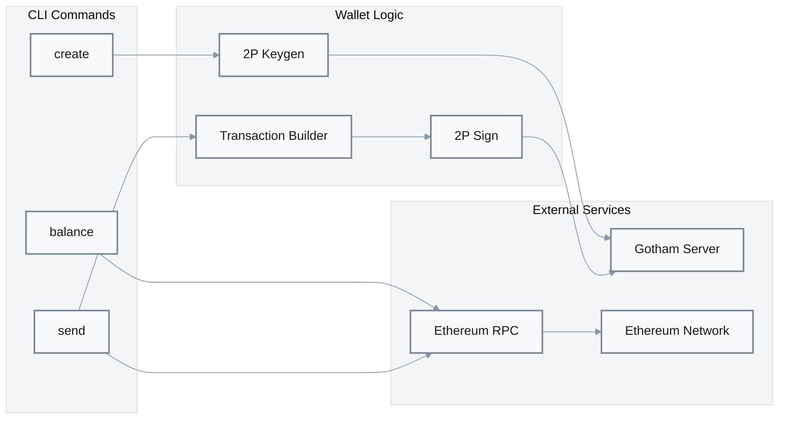
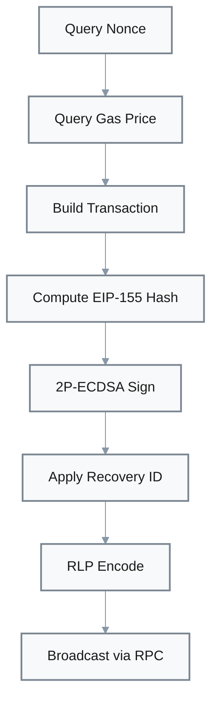

# Ethereum Wallet Component [P2]

**Location**: [`demo-wallet/src/ethereum/`](../../demo-wallet/src/ethereum/)  
**Priority**: P2 — Demonstration of 2P-ECDSA integration with EVM-compatible networks  
**Purpose**: CLI wallet implementation for Ethereum using gotham-client and JSON-RPC API  
**Design**: EIP-155 replay-protected signatures with standard JSON-RPC backend  
**Limitations**: Demo-quality code; basic ETH transfers only; no ERC-20/smart contract support

## Overview

The Ethereum wallet demonstrates practical integration of 2P-ECDSA with EVM-compatible networks (Ethereum, Polygon, BSC, etc.). It supports wallet creation, balance queries, and transaction signing/broadcasting via JSON-RPC.



## CLI Commands

| Command | Purpose | Evidence |
|---------|---------|----------|
| `evm create` | Generate new 2P-ECDSA wallet | [`main.rs:75`](../../demo-wallet/src/main.rs#L75) |
| `evm balance` | Query ETH balance via RPC | CLI implementation |
| `evm send` | Sign and broadcast ETH transaction | CLI implementation |

## Configuration

Settings from `settings.toml` or environment (prefixed with `GOTHAM_`):

| Setting | Purpose | Default | Evidence |
|---------|---------|---------|----------|
| `rpc_url` | Ethereum JSON-RPC endpoint | Required | [`main.rs:45`](../../demo-wallet/src/main.rs#L45) |
| `wallet_file` | Path to wallet JSON | `wallet.json` | [`main.rs:70-72`](../../demo-wallet/src/main.rs#L70-L72) |
| `gotham_server_url` | Gotham server endpoint | `http://127.0.0.1:8000` | [`main.rs:66-68`](../../demo-wallet/src/main.rs#L66-L68) |
| `chain_id` | EIP-155 chain ID | Required for signing | [`main.rs:49`](../../demo-wallet/src/main.rs#L49) |

## Transaction Flow

### Signing Process



### Transaction Building

| Stage | Input | Transform | Output |
|-------|-------|-----------|--------|
| Nonce Query | Sender address | `eth_getTransactionCount` | Account nonce |
| Gas Estimation | Transaction | `eth_estimateGas` or fixed | Gas limit |
| Gas Price | Network state | `eth_gasPrice` | Gas price in wei |
| Build | Nonce, gas, to, value | EIP-155 format | Unsigned transaction |
| Hash | Unsigned tx, chain_id | Keccak256 with v=chain_id | Signing hash |
| Sign | Hash, master_key | 2P-ECDSA protocol | (r, s, recid) |
| Encode | Signed tx | RLP encoding | Raw transaction bytes |
| Broadcast | Raw tx hex | `eth_sendRawTransaction` | Transaction hash |

## EIP-155 Signature

Replay protection via chain ID encoding:

```
v = chain_id * 2 + 35 + recovery_id
```

| Chain | Chain ID | v Values |
|-------|----------|----------|
| Ethereum Mainnet | 1 | 37, 38 |
| Sepolia Testnet | 11155111 | 22310257, 22310258 |
| Polygon | 137 | 309, 310 |

## Address Derivation

Ethereum addresses are derived from the public key:

```
address = keccak256(public_key)[12..32]
```

The public key is extracted from the shared `MasterKey2` after key generation.

## Key Derivation

BIP32-style hierarchical derivation (same as Bitcoin):

```rust
let mk_child = master_key.get_child(vec![x_pos, y_pos]);
```

Standard derivation path: `m/44'/60'/0'/0/{index}` semantics

## Wallet Storage

Wallet data is stored as JSON (same format as Bitcoin):

```rust
struct Wallet {
    id: String,              // Session ID from keygen
    master_key: MasterKey2,  // Client's key share
    address: String,         // Derived Ethereum address
}
```

## JSON-RPC Methods

| Method | Purpose |
|--------|---------|
| `eth_getBalance` | Query ETH balance |
| `eth_getTransactionCount` | Get account nonce |
| `eth_gasPrice` | Current gas price |
| `eth_estimateGas` | Estimate gas for transaction |
| `eth_sendRawTransaction` | Broadcast signed transaction |
| `eth_getTransactionReceipt` | Check transaction status |

## Error Handling

| Error Type | Handling | Recovery |
|------------|----------|----------|
| RPC connection | Return error | Use different endpoint |
| Insufficient balance | Return error | Add funds |
| Nonce too low | Return error | Query fresh nonce |
| Gas estimation failed | Return error | Increase gas limit |
| Signing failure | Return error | Check server |

## Multi-Chain Support

The wallet supports any EVM-compatible chain by configuring:

1. `rpc_url`: Chain's RPC endpoint
2. `chain_id`: EIP-155 chain identifier

| Network | RPC Example | Chain ID |
|---------|-------------|----------|
| Ethereum | `https://eth.llamarpc.com` | 1 |
| Polygon | `https://polygon-rpc.com` | 137 |
| Arbitrum | `https://arb1.arbitrum.io/rpc` | 42161 |
| Sepolia | `https://rpc.sepolia.org` | 11155111 |

## Dependencies

| Crate | Purpose |
|-------|---------|
| `gotham-client` | 2P-ECDSA key/sign operations |
| `web3` or `ethers` | Ethereum transaction types |
| `rlp` | RLP encoding for transactions |
| `keccak-hash` | Address derivation, tx hashing |
| `clap` | CLI argument parsing |
| `serde_json` | Wallet file serialization |
