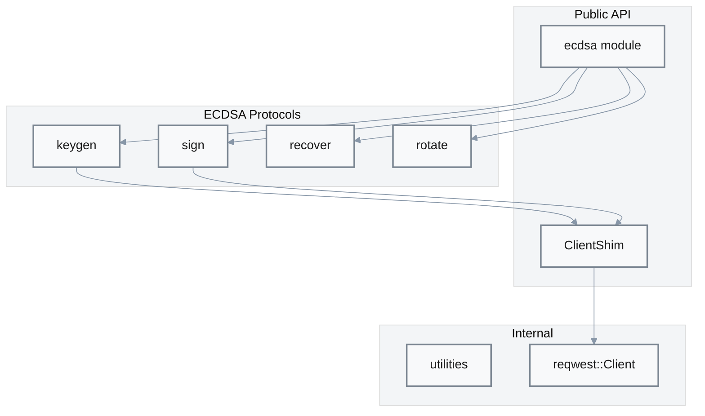

# Gotham Client Component [P1]

**Location**: [`gotham-client/src/lib.rs:1-102`](../../gotham-client/src/lib.rs#L1-L102)  
**Priority**: P1 — Core library; all wallet applications depend on this client  
**Purpose**: HTTP client wrapper and protocol entry points for 2P-ECDSA operations  
**Design**: Generic over `Client` trait for testability — allows mock HTTP clients in tests  
**Limitations**: Synchronous blocking HTTP; no connection pooling; reqwest 0.9.x (older API)

## Overview

The Gotham Client library provides the `ClientShim` wrapper that handles HTTP communication with the Gotham Server. It re-exports the ECDSA protocol modules for key generation, signing, recovery, and rotation.



## ClientShim Structure

```rust
pub struct ClientShim<C: Client> {
    pub client: C,                    // HTTP client implementation
    pub auth_token: Option<String>,   // Bearer token for authorization
    pub endpoint: String,             // Server base URL
}
```

Evidence: [`lib.rs:19-24`](../../gotham-client/src/lib.rs#L19-L24)

## Public API

| Method | Signature | Purpose | Evidence |
|--------|-----------|---------|----------|
| `new` | `fn new(endpoint: String, auth_token: Option<String>) -> ClientShim<reqwest::Client>` | Create with default reqwest client | [`lib.rs:26-34`](../../gotham-client/src/lib.rs#L26-L34) |
| `new_with_client` | `fn new_with_client<C: Client>(endpoint, auth_token, client) -> ClientShim<C>` | Create with custom client (testing) | [`lib.rs:38-44`](../../gotham-client/src/lib.rs#L38-L44) |
| `post` | `fn post<V>(&self, path: &str) -> Option<V>` | POST with empty body | [`lib.rs:45-55`](../../gotham-client/src/lib.rs#L45-L55) |
| `postb` | `fn postb<T, V>(&self, path: &str, body: T) -> Option<V>` | POST with JSON body | [`lib.rs:57-68`](../../gotham-client/src/lib.rs#L57-L68) |

## Client Trait

The `Client` trait abstracts HTTP communication for testability:

```rust
pub trait Client: Sized {
    fn post<V: DeserializeOwned, T: Serialize>(
        &self,
        endpoint: &str,
        uri: &str,
        bearer_token: Option<String>,
        body: T,
    ) -> Option<V>;
}
```

Evidence: [`lib.rs:71-79`](../../gotham-client/src/lib.rs#L71-L79)

### reqwest Implementation

```rust
impl Client for reqwest::Client {
    fn post<V: DeserializeOwned, T: Serialize>(...) -> Option<V> {
        let mut b = self.post(&format!("{}/{}", endpoint, uri));
        if let Some(token) = bearer_token {
            b = b.bearer_auth(token);
        }
        let value = b.json(&body).send().ok()?.text().ok()?;
        serde_json::from_str(value.as_str()).ok()
    }
}
```

Evidence: [`lib.rs:81-96`](../../gotham-client/src/lib.rs#L81-L96)

## Module Exports

| Module | Purpose | Evidence |
|--------|---------|----------|
| `ecdsa` | ECDSA protocol implementations | [`lib.rs:13`](../../gotham-client/src/lib.rs#L13) |
| `utilities` | Helper functions (error handling) | [`lib.rs:15`](../../gotham-client/src/lib.rs#L15) |

### ECDSA Submodules

| Submodule | Purpose | Evidence |
|-----------|---------|----------|
| `keygen` | 4-round key generation | [`ecdsa/keygen.rs`](../../gotham-client/src/ecdsa/keygen.rs) |
| `sign` | 2-round signing | [`ecdsa/sign.rs`](../../gotham-client/src/ecdsa/sign.rs) |
| `recover` | Key recovery via Centipede | [`ecdsa/recover.rs`](../../gotham-client/src/ecdsa/recover.rs) |
| `rotate` | Key share rotation | [`ecdsa/rotate.rs`](../../gotham-client/src/ecdsa/rotate.rs) |
| `types` | PrivateShare type | [`ecdsa/types.rs`](../../gotham-client/src/ecdsa/types.rs) |

## Re-exports

Curve primitives are re-exported for consumer convenience:

```rust
pub use two_party_ecdsa::curv::{
    arithmetic::traits::Converter, 
    elliptic::curves::traits::*, 
    BigInt,
};
```

Evidence: [`lib.rs:98-100`](../../gotham-client/src/lib.rs#L98-L100)

## Logging

Request timing is logged via the `log` crate:

```rust
info!("(req {}, took: {:?})", path, TimeFormat(start.elapsed()));
```

Evidence: [`lib.rs:53`](../../gotham-client/src/lib.rs#L53), [`lib.rs:66`](../../gotham-client/src/lib.rs#L66)

## Error Handling

| Pattern | Usage | Evidence |
|---------|-------|----------|
| `Result<T>` type alias | `type Result<T> = std::result::Result<T, failure::Error>` | [`lib.rs:17`](../../gotham-client/src/lib.rs#L17) |
| `Option` returns | HTTP methods return `None` on failure | [`lib.rs:94`](../../gotham-client/src/lib.rs#L94) |
| `failure` crate | Error chaining and context | [`lib.rs:17`](../../gotham-client/src/lib.rs#L17) |

## Usage Example

```rust
use gotham_client::{ClientShim, ecdsa::keygen};

// Create client
let client = ClientShim::new(
    "http://127.0.0.1:8000".to_string(),
    Some("auth_token".to_string()),
);

// Generate key
let private_share = keygen::get_master_key(&client);

// Use for signing
let sig = ecdsa::sign::sign(
    &client,
    message_hash,
    &private_share.master_key,
    x_pos,
    y_pos,
    &private_share.id,
)?;
```

## Dependencies

| Crate | Purpose | Evidence |
|-------|---------|----------|
| `reqwest` | HTTP client | [`Cargo.toml:15`](../../Cargo.toml#L15) |
| `serde` | JSON serialization | [`lib.rs:11`](../../gotham-client/src/lib.rs#L11) |
| `log` | Request logging | [`lib.rs:10`](../../gotham-client/src/lib.rs#L10) |
| `floating_duration` | Time formatting | [`lib.rs:9`](../../gotham-client/src/lib.rs#L9) |
| `two_party_ecdsa` | MPC protocol | [`lib.rs:98`](../../gotham-client/src/lib.rs#L98) |
