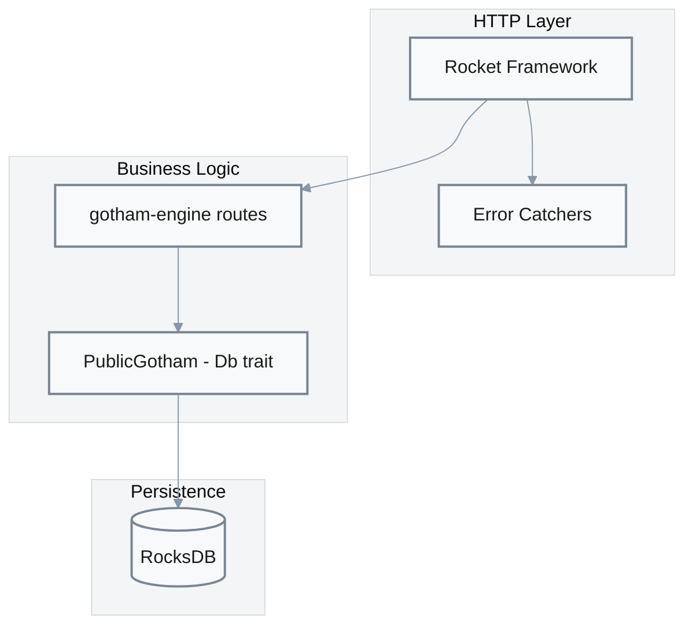

# Gotham Server Component [P1]

**Location**: [`gotham-server/src/`](../../gotham-server/src/)  
**Priority**: P1 — Core infrastructure; all MPC operations require server availability  
**Purpose**: HTTP server implementing Party1 of the 2P-ECDSA protocol with persistent key share storage  
**Design**: Rocket async framework with RocksDB embedded storage — chosen for Rust ecosystem maturity and zero external dependencies  
**Limitations**: Single-instance; no built-in replication; authorization always grants by default

## Overview

The Gotham Server hosts the Party1 side of the MPC protocol, handling key generation and signing requests via RESTful endpoints. Key shares are persisted in RocksDB keyed by `{customer_id}_{session_id}_{table_name}`.



## Components

### Main Entry Point

**Location**: [`main.rs:1-5`](../../gotham-server/src/main.rs#L1-L5)

```rust
#[launch]
fn rocket() -> _ {
    server::get_server()
}
```

### Server Configuration

**Location**: [`server.rs:21-39`](../../gotham-server/src/server.rs#L21-L39)

| Component | Configuration | Evidence |
|-----------|---------------|----------|
| Routes | 8 endpoints from gotham-engine | [`server.rs:27-36`](../../gotham-server/src/server.rs#L27-L36) |
| Error Catchers | 400, 404, 500 handlers | [`server.rs:6-19`](../../gotham-server/src/server.rs#L6-L19) |
| State | `Mutex<Box<dyn Db>>` shared state | [`server.rs:38`](../../gotham-server/src/server.rs#L38) |

### PublicGotham (Db Implementation)

**Location**: [`public_gotham.rs:14-99`](../../gotham-server/src/public_gotham.rs#L14-L99)

| Method | Signature | Purpose | Evidence |
|--------|-----------|---------|----------|
| `new` | `fn new() -> Self` | Initialize RocksDB connection | [`public_gotham.rs:35-44`](../../gotham-server/src/public_gotham.rs#L35-L44) |
| `insert` | `async fn insert(&self, key, table_name, value) -> Result<()>` | Store MPC state | [`public_gotham.rs:58-68`](../../gotham-server/src/public_gotham.rs#L58-L68) |
| `get` | `async fn get(&self, key, table_name) -> Result<Option<Value>>` | Retrieve MPC state | [`public_gotham.rs:70-91`](../../gotham-server/src/public_gotham.rs#L70-L91) |
| `granted` | `fn granted(&self, message, customer_id) -> Result<bool>` | Authorization check (⚠️ always true) | [`public_gotham.rs:93-95`](../../gotham-server/src/public_gotham.rs#L93-L95) |
| `has_active_share` | `async fn has_active_share(&self, user_id) -> Result<bool>` | Check existing share | [`public_gotham.rs:96-98`](../../gotham-server/src/public_gotham.rs#L96-L98) |

### Key Indexing

Keys are composed using the `idify` helper:

```rust
fn idify(user_id: String, id: String, name: &dyn MPCStruct) -> String {
    format!("{}_{}_{}", user_id, id, name.to_string())
}
```

Evidence: [`public_gotham.rs:52-54`](../../gotham-server/src/public_gotham.rs#L52-L54)

## API Endpoints

Routes are provided by the `gotham-engine` crate:

| Endpoint | Method | Purpose | Evidence |
|----------|--------|---------|----------|
| `/ecdsa/keygen/first` | POST | Keygen round 1 | [`server.rs:28`](../../gotham-server/src/server.rs#L28) |
| `/ecdsa/keygen/{id}/second` | POST | Keygen round 2 | [`server.rs:29`](../../gotham-server/src/server.rs#L29) |
| `/ecdsa/keygen/{id}/third` | POST | Keygen round 3 | [`server.rs:30`](../../gotham-server/src/server.rs#L30) |
| `/ecdsa/keygen/{id}/fourth` | POST | Keygen round 4 | [`server.rs:31`](../../gotham-server/src/server.rs#L31) |
| `/ecdsa/keygen/{id}/chaincode/first` | POST | Chain code round 1 | [`server.rs:32`](../../gotham-server/src/server.rs#L32) |
| `/ecdsa/keygen/{id}/chaincode/second` | POST | Chain code round 2 | [`server.rs:33`](../../gotham-server/src/server.rs#L33) |
| `/ecdsa/sign/{id}/first` | POST | Sign round 1 | [`server.rs:34`](../../gotham-server/src/server.rs#L34) |
| `/ecdsa/sign/{id}/second` | POST | Sign round 2 | [`server.rs:35`](../../gotham-server/src/server.rs#L35) |

## Configuration

**Location**: [`Settings.toml`](../../gotham-server/Settings.toml)

| Setting | Type | Default | Purpose | Evidence |
|---------|------|---------|---------|----------|
| `db` | String | "local" | Storage backend ("local" or "aws") | [`Settings.toml:2`](../../gotham-server/Settings.toml#L2) |
| `db_name` | String | "db" | RocksDB directory name | [`public_gotham.rs:37`](../../gotham-server/src/public_gotham.rs#L37) |
| `region` | String | "" | AWS region (if db=aws) | [`Settings.toml:6`](../../gotham-server/Settings.toml#L6) |
| `pool_id` | String | "" | Cognito pool ID (auth) | [`Settings.toml:7`](../../gotham-server/Settings.toml#L7) |
| `issuer` | String | "" | JWT issuer (auth) | [`Settings.toml:8`](../../gotham-server/Settings.toml#L8) |
| `audience` | String | "" | JWT audience (auth) | [`Settings.toml:9`](../../gotham-server/Settings.toml#L9) |

## Error Handling

| HTTP Code | Handler | Response | Evidence |
|-----------|---------|----------|----------|
| 400 | `bad_request` | "Bad request" | [`server.rs:11-14`](../../gotham-server/src/server.rs#L11-L14) |
| 404 | `not_found` | "Unknown route '{uri}'" | [`server.rs:16-19`](../../gotham-server/src/server.rs#L16-L19) |
| 500 | `internal_error` | "Internal server error" | [`server.rs:6-9`](../../gotham-server/src/server.rs#L6-L9) |

## Security Warning

⚠️ **Authorization is disabled by default**:

```rust
fn granted(&self, message: &str, customer_id: &str) -> Result<bool, DatabaseError> {
    Ok(true)  // ALWAYS GRANTS - PRODUCTION MUST OVERRIDE
}
```

Evidence: [`public_gotham.rs:93-95`](../../gotham-server/src/public_gotham.rs#L93-L95)

**Production deployments MUST**:
1. Implement proper token validation in `granted()`
2. Enable HTTPS via reverse proxy or Rocket TLS
3. Restrict network access to authorized clients

## Dependencies

| Crate | Version | Purpose | Evidence |
|-------|---------|---------|----------|
| rocket | 0.5.0-rc.1 | Async HTTP framework | [`Cargo.toml:18`](../../Cargo.toml#L18) |
| gotham-engine | Git | MPC protocol routes | [`Cargo.toml:26`](../../Cargo.toml#L26) |
| rocksdb | (engine dep) | Embedded key-value storage | Transitive via gotham-engine |
| config | 0.9.2 | Settings file parsing | [`Cargo.toml:19`](../../Cargo.toml#L19) |
