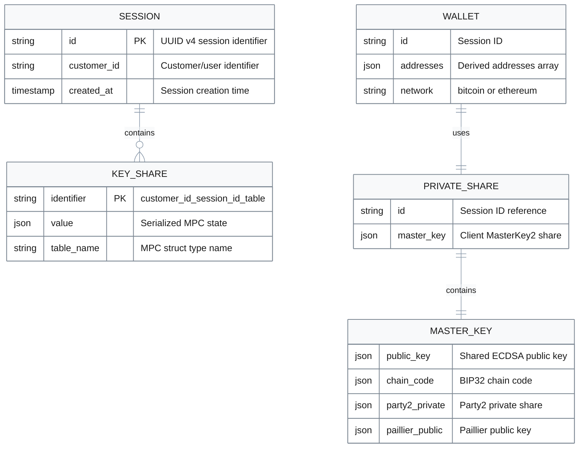

# Data & APIs

## Data Model

### Entity Relationships



### Entity Descriptions

| Priority | Entity | Purpose | Storage | Evidence |
|----------|--------|---------|---------|----------|
| P1 | **Session** | Identifies a keygen/sign session | Server RocksDB | [`public_gotham.rs:52-54`](../gotham-server/src/public_gotham.rs#L52-L54) |
| P1 | **KeyShare** | Server-side MPC state (Party1) | Server RocksDB | [`public_gotham.rs:58-68`](../gotham-server/src/public_gotham.rs#L58-L68) |
| P1 | **PrivateShare** | Client-side key share (Party2) | Client JSON file | [`ecdsa/types.rs`](../gotham-client/src/ecdsa/types.rs) |
| P1 | **MasterKey2** | Complete client key material | In PrivateShare | [`keygen.rs:108-120`](../gotham-client/src/ecdsa/keygen.rs#L108-L120) |
| P2 | **Wallet** | Application-level wallet state | Client JSON file | [`demo-wallet/`](../demo-wallet/) |

### Key Indexing Schema

Server key shares are stored with composite keys:

```
{customer_id}_{session_id}_{table_name}
```

| Component | Source | Example |
|-----------|--------|---------|
| `customer_id` | Request header or default | `user123` |
| `session_id` | Generated UUID v4 | `550e8400-e29b-41d4-a716-446655440000` |
| `table_name` | MPC protocol step | `kg_party_one_first_message` |

Evidence: [`public_gotham.rs:52-54`](../gotham-server/src/public_gotham.rs#L52-L54)

### Table Names (MPC States)

| Table Name | Protocol Phase | Content |
|------------|----------------|---------|
| `kg_party_one_first_message` | Keygen Round 1 | Party1 commitment |
| `kg_party_one_second_message` | Keygen Round 2 | ECDH + Paillier keys |
| `kg_party_one_third_message` | Keygen Round 3 | PDL first message |
| `kg_party_one_fourth_message` | Keygen Round 4 | PDL second message |
| `cc_party_one_first_message` | Chain Code Round 1 | Chain code commitment |
| `cc_party_one_second_message` | Chain Code Round 2 | Chain code reveal |
| `sign_party_one_first_message` | Sign Round 1 | Ephemeral key |

---

## API Contract

### Base URL

```
http://{host}:8000
```

Default: `http://127.0.0.1:8000`

### Authentication

| Header | Value | Required | Evidence |
|--------|-------|----------|----------|
| `Authorization` | `Bearer {token}` | Optional | [`lib.rs:90-92`](../gotham-client/src/lib.rs#L90-L92) |

**Note**: Authorization is checked via `Db::granted()` which returns `true` by default. Production deployments must implement proper validation.

### Endpoints

#### Key Generation

| Priority | Method | Endpoint | Purpose | Evidence |
|----------|--------|----------|---------|----------|
| P1 | POST | `/ecdsa/keygen/first` | Initialize keygen session | [`server.rs:28`](../gotham-server/src/server.rs#L28) |
| P1 | POST | `/ecdsa/keygen/{id}/second` | ECDH + Paillier exchange | [`server.rs:29`](../gotham-server/src/server.rs#L29) |
| P1 | POST | `/ecdsa/keygen/{id}/third` | PDL challenge | [`server.rs:30`](../gotham-server/src/server.rs#L30) |
| P1 | POST | `/ecdsa/keygen/{id}/fourth` | PDL verification | [`server.rs:31`](../gotham-server/src/server.rs#L31) |
| P1 | POST | `/ecdsa/keygen/{id}/chaincode/first` | Chain code round 1 | [`server.rs:32`](../gotham-server/src/server.rs#L32) |
| P1 | POST | `/ecdsa/keygen/{id}/chaincode/second` | Chain code round 2 | [`server.rs:33`](../gotham-server/src/server.rs#L33) |

#### Signing

| Priority | Method | Endpoint | Purpose | Evidence |
|----------|--------|----------|---------|----------|
| P1 | POST | `/ecdsa/sign/{id}/first` | Ephemeral key exchange | [`server.rs:34`](../gotham-server/src/server.rs#L34) |
| P1 | POST | `/ecdsa/sign/{id}/second` | Signature completion | [`server.rs:35`](../gotham-server/src/server.rs#L35) |

### Request/Response Schemas

#### POST /ecdsa/keygen/first

**Request**: Empty body `{}`

**Response**:
```json
{
  "0": "session-uuid-string",
  "1": {
    "pk_commitment": "hex-encoded-commitment",
    "zk_pok_commitment": "hex-encoded-proof"
  }
}
```

| Field | Type | Description |
|-------|------|-------------|
| `0` | String | Session ID (UUID v4) for subsequent requests |
| `1` | KeyGenFirstMsg | Party1's commitment message |

Evidence: [`keygen.rs:40-41`](../gotham-client/src/ecdsa/keygen.rs#L40-L41)

#### POST /ecdsa/keygen/{id}/second

**Request**:
```json
{
  "pk": "hex-public-key",
  "pk_t_rand_commitment": "hex-commitment",
  "challenge_response": "hex-proof"
}
```

**Response**: `KeyGenParty1Message2` containing ECDH message and Paillier public key

Evidence: [`keygen.rs:47-49`](../gotham-client/src/ecdsa/keygen.rs#L47-L49)

#### POST /ecdsa/sign/{id}/first

**Request**:
```json
{
  "d_log_proof": "hex-proof",
  "public_share": "hex-public-key"
}
```

**Response**: `EphKeyGenFirstMsg` with Party1's ephemeral public key

Evidence: [`sign.rs:40-44`](../gotham-client/src/ecdsa/sign.rs#L40-L44)

#### POST /ecdsa/sign/{id}/second

**Request**:
```json
{
  "message": "hex-message-hash",
  "party_two_sign_message": {
    "partial_sig": {...}
  },
  "x_pos_child_key": "derivation-x",
  "y_pos_child_key": "derivation-y"
}
```

**Response**:
```json
{
  "r": "hex-r-component",
  "s": "hex-s-component",
  "recid": 0
}
```

| Field | Type | Description |
|-------|------|-------------|
| `r` | BigInt (hex) | ECDSA signature r component |
| `s` | BigInt (hex) | ECDSA signature s component |
| `recid` | u8 | Recovery ID (0 or 1) |

Evidence: [`sign.rs:76-93`](../gotham-client/src/ecdsa/sign.rs#L76-L93)

### Error Responses

| HTTP Code | Meaning | Response Body | Evidence |
|-----------|---------|---------------|----------|
| 400 | Bad Request | `"Bad request"` | [`server.rs:11-14`](../gotham-server/src/server.rs#L11-L14) |
| 404 | Not Found | `"Unknown route '{uri}'"` | [`server.rs:16-19`](../gotham-server/src/server.rs#L16-L19) |
| 500 | Internal Error | `"Internal server error"` | [`server.rs:6-9`](../gotham-server/src/server.rs#L6-L9) |

### Content Types

| Direction | Content-Type | Evidence |
|-----------|--------------|----------|
| Request | `application/json` | [`lib.rs:93`](../gotham-client/src/lib.rs#L93) |
| Response | `application/json` | Rocket default |

### Protocol Flow Example

```bash
# 1. Start keygen
curl -X POST http://localhost:8000/ecdsa/keygen/first \
  -H "Content-Type: application/json" \
  -d '{}'
# Returns: ["session-id", {...}]

# 2. Continue with session ID
curl -X POST http://localhost:8000/ecdsa/keygen/session-id/second \
  -H "Content-Type: application/json" \
  -d '{"pk": "...", "pk_t_rand_commitment": "...", "challenge_response": "..."}'

# ... rounds 3-4, chaincode rounds ...

# 3. Sign with established session
curl -X POST http://localhost:8000/ecdsa/sign/session-id/first \
  -H "Content-Type: application/json" \
  -d '{"d_log_proof": "...", "public_share": "..."}'

curl -X POST http://localhost:8000/ecdsa/sign/session-id/second \
  -H "Content-Type: application/json" \
  -d '{"message": "...", "party_two_sign_message": {...}, "x_pos_child_key": "0", "y_pos_child_key": "0"}'
# Returns: {"r": "...", "s": "...", "recid": 0}
```

---

## Wire Format

All messages use JSON serialization via `serde`:

| Aspect | Format | Evidence |
|--------|--------|----------|
| Serialization | JSON | [`Cargo.toml:12-13`](../Cargo.toml#L12-L13) |
| BigInt encoding | Hex string | serde_json default |
| Byte arrays | Hex string | serde_json default |
| Structs | Object with named fields | serde derive |

### Cryptographic Types

| Type | JSON Representation |
|------|---------------------|
| `BigInt` | Hex-encoded string |
| `GE` (Group Element) | Object with x, y coordinates |
| `FE` (Field Element) | Hex-encoded scalar |
| `EncryptedValue` | Object with ciphertext |
