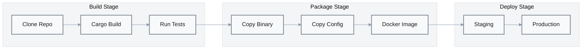

# Deployment

## Build

### Prerequisites

| Tool | Version | Verify | Install |
|------|---------|--------|---------|
| Rust | ≥1.70 | `rustc --version` | [rustup.rs](https://rustup.rs) |
| Cargo | ≥1.70 | `cargo --version` | Included with Rust |

### Build Commands

```bash
# Development build
cargo build --workspace

# Release build (optimized)
cargo build --workspace --release

# Build specific crate
cargo build -p gotham-server --release
cargo build -p gotham-client --release
cargo build -p demo-wallet --release
```

### Build Artifacts

| Artifact | Location | Purpose |
|----------|----------|---------|
| `gotham-server` | `target/release/gotham-server` | MPC server binary |
| `libgotham_client.so` | `target/release/libgotham_client.so` | Client shared library |
| `demo-wallet` | `target/release/demo-wallet` | CLI wallet binary |

---

## Deployment Pipeline



| Stage | Trigger | Actions | Rollback | Evidence |
|-------|---------|---------|----------|----------|
| Build | Push/PR | Compile, test | N/A | Manual |
| Package | Merge to main | Create Docker image | N/A | Manual |
| Staging | Package complete | Deploy to staging | Revert image tag | Manual |
| Production | Manual approval | Deploy to production | Revert image tag | Manual |

---

## Infrastructure Requirements

### Compute Requirements

| Resource | Minimum | Recommended | Production | Evidence |
|----------|---------|-------------|------------|----------|
| CPU | 1 core | 2 cores | 4+ cores | Cryptographic operations |
| Memory | 512 MB | 1 GB | 2+ GB | Paillier operations |
| Storage | 1 GB | 5 GB | 50+ GB | RocksDB growth |
| Network | 1 Mbps | 10 Mbps | 100 Mbps | API traffic |

### Runtime Dependencies

| Dependency | Version | Purpose | Evidence |
|------------|---------|---------|----------|
| Linux (glibc) | ≥2.17 | Runtime | Binary compatibility |
| OpenSSL | ≥1.1 | TLS (if enabled) | Rocket TLS |

---

## Server Deployment

### Direct Binary

```bash
# 1. Build release binary
cargo build -p gotham-server --release

# 2. Copy to deployment location
cp target/release/gotham-server /opt/gotham/
cp gotham-server/Settings.toml /opt/gotham/
cp gotham-server/Rocket.toml /opt/gotham/

# 3. Configure
cd /opt/gotham
# Edit Settings.toml and Rocket.toml

# 4. Run
./gotham-server
```

### Docker

```dockerfile
# Dockerfile
FROM rust:1.70 as builder
WORKDIR /app
COPY . .
RUN cargo build -p gotham-server --release

FROM debian:bullseye-slim
RUN apt-get update && apt-get install -y libssl1.1 && rm -rf /var/lib/apt/lists/*
COPY --from=builder /app/target/release/gotham-server /usr/local/bin/
COPY --from=builder /app/gotham-server/Settings.toml /etc/gotham/
COPY --from=builder /app/gotham-server/Rocket.toml /etc/gotham/
WORKDIR /etc/gotham
EXPOSE 8000
CMD ["gotham-server"]
```

```bash
# Build and run
docker build -t gotham-server .
docker run -p 8000:8000 -v gotham-db:/data gotham-server
```

### Systemd Service

```ini
# /etc/systemd/system/gotham-server.service
[Unit]
Description=Gotham City MPC Server
After=network.target

[Service]
Type=simple
User=gotham
WorkingDirectory=/opt/gotham
ExecStart=/opt/gotham/gotham-server
Restart=always
RestartSec=5
Environment=ROCKET_ADDRESS=0.0.0.0
Environment=ROCKET_PORT=8000

[Install]
WantedBy=multi-user.target
```

```bash
sudo systemctl enable gotham-server
sudo systemctl start gotham-server
```

---

## Production Hardening

### Security Checklist

- [ ] **HTTPS**: Deploy behind reverse proxy (nginx/Caddy) with TLS
- [ ] **Authorization**: Implement `Db::granted()` with proper token validation
- [ ] **Firewall**: Restrict API access to authorized clients
- [ ] **Filesystem**: Set restrictive permissions on DB directory
- [ ] **Updates**: Regular security updates for OS and dependencies

### Reverse Proxy (nginx)

```nginx
server {
    listen 443 ssl http2;
    server_name mpc.example.com;
    
    ssl_certificate /etc/letsencrypt/live/mpc.example.com/fullchain.pem;
    ssl_certificate_key /etc/letsencrypt/live/mpc.example.com/privkey.pem;
    
    location / {
        proxy_pass http://127.0.0.1:8000;
        proxy_set_header Host $host;
        proxy_set_header X-Real-IP $remote_addr;
        proxy_set_header X-Forwarded-For $proxy_add_x_forwarded_for;
        proxy_set_header X-Forwarded-Proto $scheme;
    }
}
```

---

## Rollback Procedures

### Kubernetes Rollback

```bash
# Check deployment history
kubectl rollout history deployment/gotham-server

# Rollback to previous version
kubectl rollout undo deployment/gotham-server

# Rollback to specific revision
kubectl rollout undo deployment/gotham-server --to-revision=2
```

### Docker Rollback

```bash
# Tag previous image as current
docker tag gotham-server:previous gotham-server:current

# Restart container
docker-compose down && docker-compose up -d
```

### Binary Rollback

```bash
# Keep previous binary
cp /opt/gotham/gotham-server /opt/gotham/gotham-server.backup

# Rollback
cp /opt/gotham/gotham-server.backup /opt/gotham/gotham-server
systemctl restart gotham-server
```

### Database Considerations

⚠️ **Key shares are persistent**: Rolling back the binary does not roll back RocksDB data. If protocol changes are incompatible:

1. Stop server
2. Backup RocksDB directory
3. Deploy compatible version
4. If needed, restore from backup

---

## Monitoring

### Health Check

```bash
# Simple connectivity test
curl -f http://localhost:8000/ecdsa/keygen/first -d '{}' || exit 1
```

### Metrics (Recommended)

| Metric | Source | Purpose |
|--------|--------|---------|
| Request latency | Rocket metrics or proxy | SLI |
| Request count | Proxy logs | Traffic |
| Error rate | Proxy logs | SLI |
| DB size | Filesystem | Capacity |

---

## Scaling

### Vertical Scaling

Increase CPU/memory for single instance:
- More CPU cores → faster crypto operations
- More memory → larger key share cache

### Horizontal Scaling (Not Supported)

⚠️ **Gotham Server is stateful**: Each server has its own RocksDB with key shares. Horizontal scaling requires:

1. **Sticky sessions**: Route client to same server
2. **Shared storage**: Move to DynamoDB (`db=aws`) or external database
3. **Session affinity**: Keygen and sign must hit same server

**Recommendation**: Use vertical scaling or implement shared storage for production.
