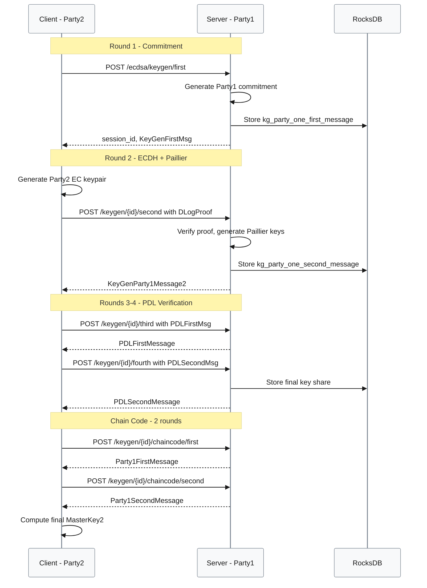
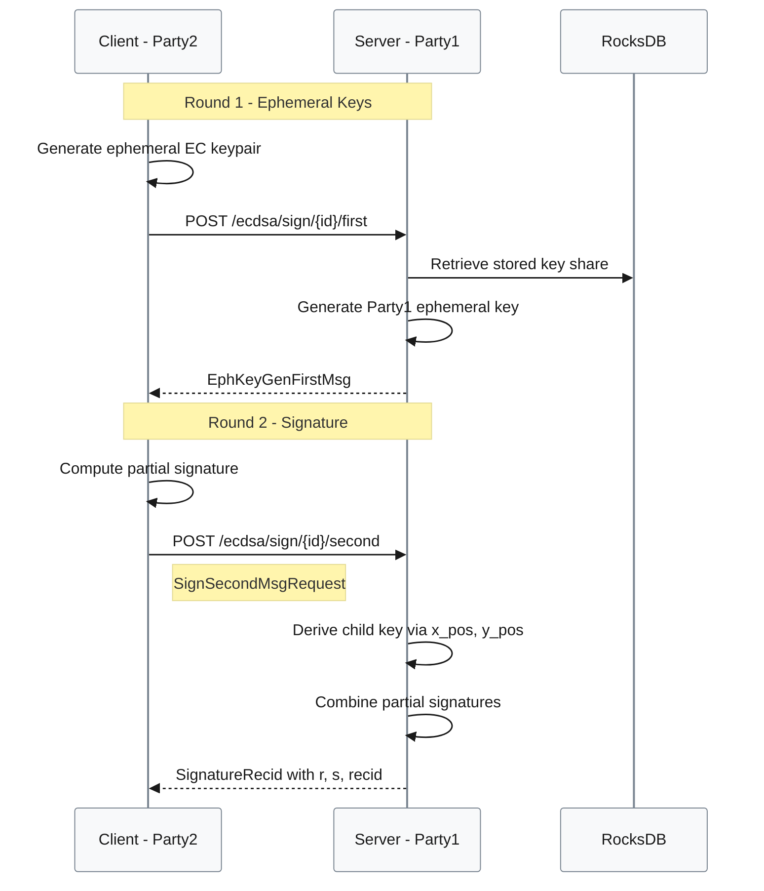
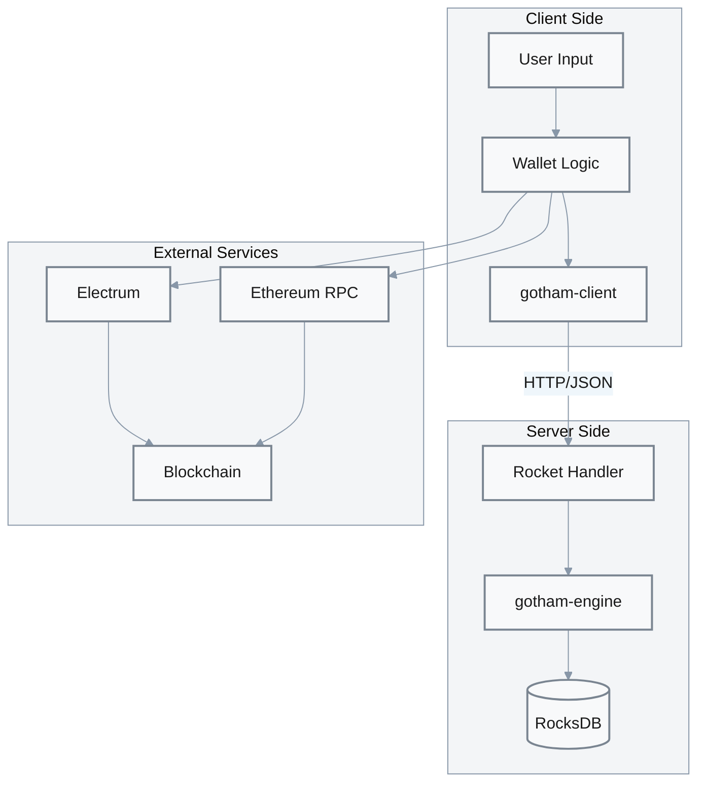
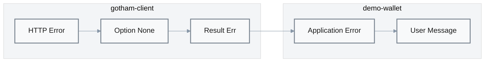

# Implementation

## Key Generation Process [P1]

**Entry Point**: [`gotham-client/src/ecdsa/keygen.rs:37`](../gotham-client/src/ecdsa/keygen.rs#L37)  
**Trigger**: Client application initiates wallet creation  
**Performance**: p95 = 762ms (localhost, M2 MacBook)  
**Traffic Share**: Primary operation for new wallet creation



| Step | Action | Evidence |
|------|--------|----------|
| 1 | Client requests session, server generates commitment | [`keygen.rs:40-41`](../gotham-client/src/ecdsa/keygen.rs#L40-L41) |
| 2 | Client generates EC keypair with DLog proof | [`keygen.rs:43-44`](../gotham-client/src/ecdsa/keygen.rs#L43-L44) |
| 3 | Server verifies proof, returns ECDH + Paillier keys | [`keygen.rs:47-57`](../gotham-client/src/ecdsa/keygen.rs#L47-L57) |
| 4 | PDL protocol verifies Paillier correctness | [`keygen.rs:59-80`](../gotham-client/src/ecdsa/keygen.rs#L59-L80) |
| 5 | Chain code derivation for HD support | [`keygen.rs:82-106`](../gotham-client/src/ecdsa/keygen.rs#L82-L106) |
| 6 | Client assembles MasterKey2 | [`keygen.rs:108-120`](../gotham-client/src/ecdsa/keygen.rs#L108-L120) |

**Edge Cases**:
- **Network timeout**: Client must retry full protocol (no partial resumption)
- **Server restart**: Session state persisted; can resume if session ID retained
- **Invalid proof**: Server returns 400, client must regenerate keypair
- **Concurrent keygen**: Safe; each session isolated by UUID

---

## Signing Process [P1]

**Entry Point**: [`gotham-client/src/ecdsa/sign.rs:28`](../gotham-client/src/ecdsa/sign.rs#L28)  
**Trigger**: Transaction signing request  
**Performance**: p95 = 151ms (localhost, M2 MacBook)  
**Traffic Share**: Most frequent operation (multiple signs per wallet)



| Step | Action | Evidence |
|------|--------|----------|
| 1 | Client generates ephemeral commitment | [`sign.rs:36-37`](../gotham-client/src/ecdsa/sign.rs#L36-L37) |
| 2 | Server returns its ephemeral public key | [`sign.rs:40-44`](../gotham-client/src/ecdsa/sign.rs#L40-L44) |
| 3 | Client computes partial signature | [`sign.rs:46-51`](../gotham-client/src/ecdsa/sign.rs#L46-L51) |
| 4 | Server combines, returns final (r, s, recid) | [`sign.rs:53-65`](../gotham-client/src/ecdsa/sign.rs#L53-L65) |

**Edge Cases**:
- **Invalid session ID**: Server returns 400 (key not found)
- **Concurrent signing**: Safe — each sign uses fresh ephemeral keys
- **Message replay**: Not prevented at protocol level (application responsibility)
- **HD derivation**: Child key computed on server from `x_pos`, `y_pos`

---

## Core Algorithms

### 2P-ECDSA Protocol (Lindell 2017)

| Priority | Algorithm | Use Case | Time Complexity | Space Complexity | Evidence |
|----------|-----------|----------|-----------------|------------------|----------|
| P1 | Paillier Key Generation | Keygen Round 2 | O(k³) for k-bit modulus | O(k) | two-party-ecdsa crate |
| P1 | PDL (Paillier DLog) Verification | Keygen Rounds 3-4 | O(k²) | O(k) | two-party-ecdsa crate |
| P1 | ECDSA Partial Signing | Sign Round 2 | O(1) EC operations | O(1) | two-party-ecdsa crate |
| P1 | BIP32 Child Derivation | Sign with HD | O(1) HMAC-SHA512 | O(1) | two-party-ecdsa crate |

### Algorithm Selection Rationale

| Algorithm | Chosen Over | Reason | Evidence |
|-----------|-------------|--------|----------|
| Lindell 2P-ECDSA | Threshold ECDSA (GG18) | Simpler 2-party case; lower latency | Protocol design |
| Paillier 2048-bit | Paillier 3072-bit | Performance vs. security tradeoff | two-party-ecdsa defaults |
| secp256k1 | P-256 | Bitcoin/Ethereum compatibility | [`Cargo.toml:23`](../Cargo.toml#L23) |

### Cryptographic Primitives

| Primitive | Library | Purpose | Evidence |
|-----------|---------|---------|----------|
| ECDSA | rust-secp256k1 | Signature operations | [`Cargo.toml:23`](../Cargo.toml#L23) |
| Paillier | two-party-ecdsa | Homomorphic encryption | [`Cargo.toml:25`](../Cargo.toml#L25) |
| SHA-256 | two-party-ecdsa | Commitment hashing | Transitive |
| HMAC-SHA512 | two-party-ecdsa | BIP32 derivation | Transitive |

---

## Data Flow



| Stage | Input | Transform | Output | Evidence |
|-------|-------|-----------|--------|----------|
| User Request | CLI command | Parse arguments | Wallet operation | [`main.rs:54-77`](../demo-wallet/src/main.rs#L54-L77) |
| Key Generation | Endpoint URL | 6-round MPC | PrivateShare | [`keygen.rs:37-121`](../gotham-client/src/ecdsa/keygen.rs#L37-L121) |
| Message Signing | Hash + MasterKey | 2-round MPC | SignatureRecid | [`sign.rs:28-66`](../gotham-client/src/ecdsa/sign.rs#L28-L66) |
| Transaction Build | Signature + UTXO | BIP143/EIP-155 | Signed TX | demo-wallet |
| Broadcast | Signed TX | Network submit | TXID | demo-wallet |

---

## Error Handling Patterns

### Error Taxonomy

| Category | Error Type | HTTP Code | Retry | User Message | Evidence |
|----------|------------|-----------|-------|--------------|----------|
| Network | Connection refused | N/A | Yes | "Server unavailable" | reqwest timeout |
| Network | HTTP timeout | N/A | Yes | "Request timed out" | reqwest default |
| Protocol | Invalid proof | 400 | No | "Protocol error" | [`server.rs:11-14`](../gotham-server/src/server.rs#L11-L14) |
| Protocol | Session not found | 400 | No | "Invalid session" | Server logic |
| Storage | DB read failure | 500 | Yes | "Server error" | [`server.rs:6-9`](../gotham-server/src/server.rs#L6-L9) |
| Crypto | Verification failure | N/A | No | "Cryptographic error" | `expect()` panic |

### Error Propagation



| Layer | Error Type | Transform | Evidence |
|-------|------------|-----------|----------|
| reqwest | HTTP error | → `None` | [`lib.rs:93-94`](../gotham-client/src/lib.rs#L93-L94) |
| ClientShim | `Option<V>` | → `Result<V, Error>` | Protocol modules |
| Protocol | `Result<T>` | → Application error | `failure` crate |
| Application | Application error | → User message | CLI output |

### Recovery Mechanisms

| Mechanism | Trigger | Config | Fallback | Evidence |
|-----------|---------|--------|----------|----------|
| HTTP Retry | Connection failure | reqwest defaults | Return error | reqwest crate |
| Protocol Restart | Invalid state | Application logic | Full re-keygen | Application |
| DB Recovery | RocksDB corruption | Manual | Restore from backup | Operations |

---

## Cross-Cutting Concerns

| Priority | Concern | Implementation | Evidence |
|----------|---------|----------------|----------|
| P1 | Error Handling | `failure::Error` with `Result` type | [`lib.rs:17`](../gotham-client/src/lib.rs#L17) |
| P1 | Serialization | serde JSON for all wire formats | [`Cargo.toml:12-13`](../Cargo.toml#L12-L13) |
| P2 | Logging | `log` crate with `info!` for timing | [`lib.rs:53`](../gotham-client/src/lib.rs#L53) |
| P2 | Timing | `floating_duration::TimeFormat` | [`keygen.rs:118`](../gotham-client/src/ecdsa/keygen.rs#L118) |
| P3 | Configuration | `config` crate with TOML + env | [`public_gotham.rs:19-31`](../gotham-server/src/public_gotham.rs#L19-L31) |

### Logging Patterns

```rust
// Request timing (client-side)
info!("(req {}, took: {:?})", path, TimeFormat(start.elapsed()));

// Keygen completion
println!("(id: {}) Took: {:?}", id, TimeFormat(start.elapsed()));
```

Evidence: [`lib.rs:53`](../gotham-client/src/lib.rs#L53), [`keygen.rs:118`](../gotham-client/src/ecdsa/keygen.rs#L118)

---

## State Management

| Component | State Location | Persistence | Evidence |
|-----------|----------------|-------------|----------|
| Server key shares | RocksDB | Durable | [`public_gotham.rs:41`](../gotham-server/src/public_gotham.rs#L41) |
| Client key shares | In-memory / JSON file | Application-managed | Application |
| Session state | Server DB (keyed by session ID) | Durable | [`public_gotham.rs:52-54`](../gotham-server/src/public_gotham.rs#L52-L54) |
| Derived addresses | Client wallet JSON | Application-managed | demo-wallet |

---

## Code Quality

### Design Patterns

| Pattern | Purpose | Location | Evidence |
|---------|---------|----------|----------|
| Trait Object | Abstract DB implementation | `Db` trait | [`public_gotham.rs:57`](../gotham-server/src/public_gotham.rs#L57) |
| Generic Client | Testable HTTP layer | `Client` trait | [`lib.rs:71-79`](../gotham-client/src/lib.rs#L71-L79) |
| Builder Pattern | Configuration loading | `config` crate | [`public_gotham.rs:19-31`](../gotham-server/src/public_gotham.rs#L19-L31) |
| FFI Exports | Mobile integration | C ABI + JNI | [`keygen.rs:128-241`](../gotham-client/src/ecdsa/keygen.rs#L128-L241) |

### Coding Conventions

| Convention | Tool | Config | Enforcement | Evidence |
|------------|------|--------|-------------|----------|
| Rust formatting | rustfmt | Default | Manual | Cargo.toml |
| Linting | clippy | Default | Manual | Cargo.toml |
| Documentation | rustdoc | Inline | Partial | Source comments |

### Technical Debt

| Priority | Debt Item | Impact | Effort | Location | Evidence |
|----------|-----------|--------|--------|----------|----------|
| P1 | `unwrap()` on HTTP responses | Panics on network errors | Medium | Client library | [`keygen.rs:41`](../gotham-client/src/ecdsa/keygen.rs#L41) |
| P1 | Authorization always grants | Security vulnerability | Low | Server | [`public_gotham.rs:93-95`](../gotham-server/src/public_gotham.rs#L93-L95) |
| P2 | Old reqwest version (0.9.5) | Missing features, security | Medium | Dependencies | [`Cargo.toml:15`](../Cargo.toml#L15) |
| P2 | No connection pooling | Performance | Medium | Client | HTTP client |
| P3 | Hardcoded Paillier parameters | Flexibility | Low | two-party-ecdsa | External crate |
