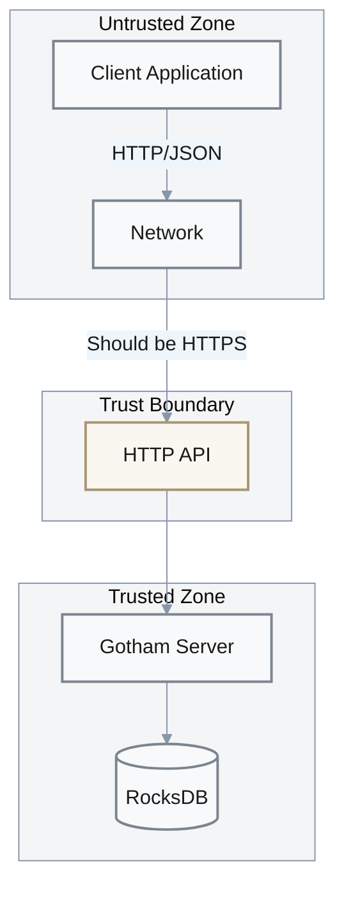

# Security

## Threat Model

**Attack Surface**:
- HTTP API endpoints (unauthenticated by default)
- RocksDB storage (local filesystem)
- Network communication (client ↔ server)
- Client key share storage (JSON files)

**Trust Boundaries**:
- Client application ↔ Gotham Server (HTTP/HTTPS)
- Gotham Server ↔ RocksDB (local filesystem)
- Client ↔ External services (Electrum, Ethereum RPC)



---

## Threat Analysis

| Priority | Threat | Vector | Impact | Mitigation | Status | Evidence |
|----------|--------|--------|--------|------------|--------|----------|
| P1 | **Key Share Theft (Server)** | DB access, server compromise | Full key compromise when combined with client share | Encryption at rest, access controls | ⚠️ Not implemented | [`public_gotham.rs:41`](../gotham-server/src/public_gotham.rs#L41) |
| P1 | **Key Share Theft (Client)** | Filesystem access | Full key compromise when combined with server share | File encryption, secure storage | ⚠️ App responsibility | Application |
| P1 | **MITM Attack** | Network interception | Protocol message tampering | HTTPS required | ⚠️ App responsibility | — |
| P1 | **Unauthorized Signing** | API access without auth | Fraudulent signatures | Authorization hook | ⚠️ Always grants | [`public_gotham.rs:93-95`](../gotham-server/src/public_gotham.rs#L93-L95) |
| P2 | **Session Hijacking** | Session ID prediction | Impersonation | UUID v4 (cryptographically random) | ✅ Mitigated | gotham-engine |
| P2 | **DoS Attack** | Resource exhaustion | Service unavailability | Rate limiting | ⚠️ Not implemented | — |
| P2 | **Protocol Manipulation** | Invalid crypto parameters | Protocol failure | ZK proofs verify correctness | ✅ Mitigated | [`keygen.rs:75-80`](../gotham-client/src/ecdsa/keygen.rs#L75-L80) |
| P3 | **Information Disclosure** | Error messages | Internal details leaked | Generic error handlers | ✅ Mitigated | [`server.rs:6-19`](../gotham-server/src/server.rs#L6-L19) |

---

## Cryptographic Security

### Protocol Security

The 2P-ECDSA implementation is based on Lindell's Crypto17 paper with proven security under standard cryptographic assumptions:

| Property | Mechanism | Security Guarantee | Evidence |
|----------|-----------|-------------------|----------|
| **Unforgeability** | 2-of-2 threshold | Neither party alone can sign | Protocol design |
| **Key Privacy** | Paillier encryption | Server learns nothing about client's share | ZK proofs |
| **Correctness** | PDL verification | Valid ECDSA signatures produced | [`keygen.rs:75-80`](../gotham-client/src/ecdsa/keygen.rs#L75-L80) |
| **Non-malleability** | Commitment scheme | Cannot modify protocol messages | Protocol design |

**Reference**: [Fast Secure Two-Party ECDSA Signing](https://eprint.iacr.org/2017/552) (Lindell, 2017)

### Cryptographic Primitives

| Priority | Primitive | Implementation | Key Size | Security Level | Evidence |
|----------|-----------|----------------|----------|----------------|----------|
| P1 | **ECDSA** | secp256k1 curve | 256-bit | 128-bit | [`Cargo.toml:23`](../Cargo.toml#L23) |
| P1 | **Paillier** | two-party-ecdsa | 2048-bit modulus | ~112-bit | two-party-ecdsa |
| P1 | **Random Generation** | OS entropy (rand crate) | N/A | CSPRNG | [`Cargo.toml:24`](../Cargo.toml#L24) |
| P2 | **SHA-256** | two-party-ecdsa | 256-bit | 128-bit | Transitive |
| P2 | **HMAC-SHA512** | BIP32 derivation | 512-bit | 256-bit | Transitive |

### Key Management

| Key Type | Generation | Storage | Rotation | Destruction | Evidence |
|----------|------------|---------|----------|-------------|----------|
| Server key shares | MPC protocol | RocksDB (plaintext) | Partial support | Manual delete | [`public_gotham.rs:58-68`](../gotham-server/src/public_gotham.rs#L58-L68) |
| Client key shares | MPC protocol | JSON file (plaintext) | Partial support | Application | demo-wallet |
| Session IDs | UUID v4 | In-memory + DB | Per keygen | Automatic | gotham-engine |
| Ephemeral keys | CSPRNG | Memory only | Per signature | GC | Protocol |

---

## Authentication & Authorization

### Current Implementation

| Mechanism | Implementation | Status | Evidence |
|-----------|----------------|--------|----------|
| **Bearer Token** | Optional header | ✅ Supported | [`lib.rs:22`](../gotham-client/src/lib.rs#L22) |
| **Authorization** | `Db::granted()` | ⚠️ Always true | [`public_gotham.rs:93-95`](../gotham-server/src/public_gotham.rs#L93-L95) |

**⚠️ CRITICAL WARNING**: Default implementation has no authorization:

```rust
fn granted(&self, message: &str, customer_id: &str) -> Result<bool, DatabaseError> {
    Ok(true)  // ALWAYS GRANTS - PRODUCTION MUST OVERRIDE
}
```

Evidence: [`public_gotham.rs:93-95`](../gotham-server/src/public_gotham.rs#L93-L95)

### Production Requirements

For production deployments, implement `granted()` to:

1. Validate bearer token against identity provider (Cognito, Auth0, etc.)
2. Check transaction authorization policy (amount limits, whitelists)
3. Implement rate limiting per customer
4. Log all authorization decisions

| Resource | Permission Model | Enforcement Point | Evidence |
|----------|------------------|-------------------|----------|
| `/ecdsa/keygen/*` | Customer ID match | `Db::granted()` | [`public_gotham.rs:93`](../gotham-server/src/public_gotham.rs#L93) |
| `/ecdsa/sign/*` | Customer ID + tx policy | `Db::granted()` | [`public_gotham.rs:93`](../gotham-server/src/public_gotham.rs#L93) |

---

## Secrets Management

| Secret Type | Storage | Rotation | Access Control | Risk | Evidence |
|-------------|---------|----------|----------------|------|----------|
| Server key shares | RocksDB (plaintext) | N/A | Filesystem | **HIGH** | [`public_gotham.rs:41`](../gotham-server/src/public_gotham.rs#L41) |
| Client key shares | JSON file (plaintext) | N/A | Filesystem | **HIGH** | demo-wallet |
| Auth tokens | Environment / config | Manual | OS controls | Medium | [`lib.rs:22`](../gotham-client/src/lib.rs#L22) |
| AWS credentials | Environment | AWS rotation | IAM policies | Medium | AWS SDK |

### Recommended Improvements

| Priority | Improvement | Effort | Impact |
|----------|-------------|--------|--------|
| P1 | **Encryption at rest**: Encrypt RocksDB with master key | Medium | Protects stored key shares |
| P1 | **HSM integration**: Store server shares in hardware security module | High | Hardware-backed protection |
| P2 | **Secure enclave**: Run server in TEE (SGX, TrustZone) | High | Memory protection |
| P2 | **Key rotation**: Implement full key share rotation protocol | Medium | Limits exposure window |
| P3 | **Audit logging**: Log all key operations | Low | Forensics, compliance |

---

## Key Backup & Recovery

The Bitcoin wallet includes an escrow backup system using Centipede verifiable encryption:

| Feature | Implementation | Evidence |
|---------|----------------|----------|
| Backup encryption | Centipede protocol | [`recover.rs`](../gotham-client/src/ecdsa/recover.rs) |
| Verification | Zero-knowledge proof | Protocol design |
| Recovery | Escrow decryption | [`recover.rs`](../gotham-client/src/ecdsa/recover.rs) |

### Escrow Parameters

```rust
pub const SEGMENT_SIZE: usize = 8;
pub const NUM_SEGMENTS: usize = 32;
```

---

## Incident Response

| Scenario | Detection | Response | Runbook |
|----------|-----------|----------|---------|
| Server key share compromise | External report / audit | Rotate all affected keys, notify users | [Database_Recovery.md](./Runbooks/Database_Recovery.md) |
| Client compromise | User report | Invalidate session, re-keygen | Application procedure |
| Protocol vulnerability | Security disclosure | Patch, rotate keys if needed | Emergency patch process |
| DoS attack | High latency / unavailability | Scale, rate limit, block IPs | Infrastructure runbook |

---

## Security Checklist

### Deployment Security

- [ ] Enable HTTPS (reverse proxy or Rocket TLS)
- [ ] Implement proper `granted()` authorization
- [ ] Set restrictive filesystem permissions on DB directory (chmod 700)
- [ ] Enable firewall, restrict API access to known clients
- [ ] Regular security updates for OS and dependencies
- [ ] Disable debug logging in production
- [ ] Configure secure headers (HSTS, X-Frame-Options, etc.)

### Operational Security

- [ ] Regular backup of RocksDB (encrypted)
- [ ] Audit logs for all signing operations
- [ ] Key rotation schedule (if implemented)
- [ ] Incident response plan documented and tested
- [ ] Access review for server administrators

### Code Security

- [ ] Dependency audit: `cargo audit`
- [ ] No hardcoded secrets in source
- [ ] Input validation on all endpoints
- [ ] Constant-time comparisons for crypto operations
- [ ] Memory zeroization for sensitive data

---

## Compliance Notes

> **Disclaimer**: Gotham City is provided as-is for educational/research purposes. Production deployments must implement additional controls for compliance.

| Standard | Requirement | Implementation Status | Gap |
|----------|-------------|----------------------|-----|
| SOC 2 | Access controls | ⚠️ Partial | Auth not implemented |
| PCI-DSS | Key management | ✅ Key splitting | Encryption at rest needed |
| GDPR | Data protection | ⚠️ App responsibility | Data residency controls needed |

**Risk Statement** from [`README.md:107-108`](../README.md#L107-L108):
> USE AT YOUR OWN RISK, we are not responsible for software/hardware and/or any transactional issues that may occur while using Gotham city.
