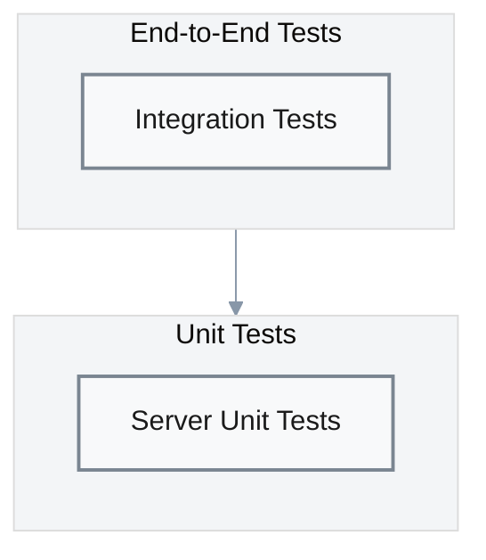

# Testing

## Test Strategy

### Test Pyramid



| Layer | Scope | Mocking Strategy | Test Files | Evidence |
|-------|-------|------------------|------------|----------|
| **Integration** | Full protocol (client + server) | None (real server) | `integration-tests/` | [`ecdsa.rs`](../integration-tests/tests/ecdsa.rs) |
| **Unit** | Server components | In-memory DB | `gotham-server/src/tests.rs` | [`tests.rs`](../gotham-server/src/tests.rs) |

---

## Test Types

### Integration Tests

**Location**: [`integration-tests/tests/ecdsa.rs`](../integration-tests/tests/ecdsa.rs)

| Test | Purpose | Coverage | Evidence |
|------|---------|----------|----------|
| Keygen + Sign | Full protocol flow | P1 critical path | [`ecdsa.rs`](../integration-tests/tests/ecdsa.rs) |

**Prerequisites**:
- Gotham server running at `http://127.0.0.1:8000`
- Network connectivity between test and server

**Execution**:
```bash
# Terminal 1: Start server
cd gotham-server && cargo run

# Terminal 2: Run integration tests
cd integration-tests && cargo test
```

### Unit Tests

**Location**: [`gotham-server/src/tests.rs`](../gotham-server/src/tests.rs)

| Test Area | Purpose | Evidence |
|-----------|---------|----------|
| DB operations | RocksDB read/write | [`tests.rs`](../gotham-server/src/tests.rs) |
| Configuration | Settings parsing | [`tests.rs`](../gotham-server/src/tests.rs) |

**Execution**:
```bash
cd gotham-server && cargo test
```

### Benchmark Tests

**Location**: [`gotham-server/benches/`](../gotham-server/benches/)

| Benchmark | Metric | Evidence |
|-----------|--------|----------|
| `keygen_bench` | Key generation latency | [`README.md:90`](../README.md#L90) |
| `sign_bench` | Signing latency | [`README.md:91`](../README.md#L91) |

**Execution**:
```bash
cd gotham-server && cargo bench --bench keygen_bench
cd gotham-server && cargo bench --bench sign_bench
```

---

## Test Commands

| Type | Command | Coverage | Duration | Evidence |
|------|---------|----------|----------|----------|
| Unit (server) | `cargo test -p gotham-server` | Server components | ~5s | Cargo.toml |
| Integration | `cargo test -p integration-tests` | Full protocol | ~10s | Cargo.toml |
| All | `cargo test --workspace` | Everything | ~15s | Cargo.toml |
| Benchmarks | `cargo bench` | Performance | ~60s | Cargo.toml |

---

## Test Data Strategy

### Key Generation

Tests generate fresh key pairs for each run:
- No pre-seeded test data
- Deterministic only within protocol (random nonces)
- Each test run creates new session IDs

### Signing

Tests use:
- Keys from preceding keygen step
- Random or fixed message hashes
- HD derivation with test indices

---

## Coverage

### Current State

| Component | Estimated Coverage | Notes |
|-----------|-------------------|-------|
| gotham-server | ~60% | Core DB operations tested |
| gotham-client | ~40% | Integration tests only |
| demo-wallet | ~10% | Manual testing primarily |

### Running Coverage

```bash
# Install cargo-tarpaulin
cargo install cargo-tarpaulin

# Generate coverage report
cargo tarpaulin --workspace --out Html
```

---

## CI Integration

### Recommended GitHub Actions

```yaml
# .github/workflows/test.yml
name: Test

on: [push, pull_request]

jobs:
  test:
    runs-on: ubuntu-latest
    steps:
      - uses: actions/checkout@v4
      - uses: dtolnay/rust-toolchain@stable
      
      - name: Build
        run: cargo build --workspace
        
      - name: Unit Tests
        run: cargo test -p gotham-server
        
      - name: Start Server
        run: |
          cd gotham-server
          cargo run &
          sleep 5  # Wait for server startup
          
      - name: Integration Tests
        run: cargo test -p integration-tests
        
      - name: Benchmarks (dry run)
        run: cargo bench --no-run
```

---

## Test Fixtures

### Configuration Fixtures

**Location**: Test-embedded or `test-assets/`

| Fixture | Purpose | Location |
|---------|---------|----------|
| Server settings | Test configuration | `gotham-server/Settings.toml` |
| Client settings | Test wallet config | `gotham-client/Settings.toml` |
| Test wallet | Pre-generated wallet | `gotham-client/test-assets/` |

---

## Known Limitations

| Limitation | Impact | Workaround |
|------------|--------|------------|
| No mocked server tests | Requires running server | Use integration tests |
| No concurrent test isolation | Tests share server state | Run sequentially |
| No network failure tests | Edge cases untested | Manual testing |
| No fuzzing | Input validation gaps | Static analysis |

---

## Test Improvement Roadmap

| Priority | Improvement | Effort | Impact |
|----------|-------------|--------|--------|
| P1 | Add `Client` trait mock tests | Medium | Faster unit tests |
| P2 | Increase server unit coverage | Medium | Better isolation |
| P2 | Add property-based tests for crypto | High | Security confidence |
| P3 | Add CI/CD pipeline | Low | Automated verification |
| P3 | Add fuzzing for API inputs | High | Security hardening |
